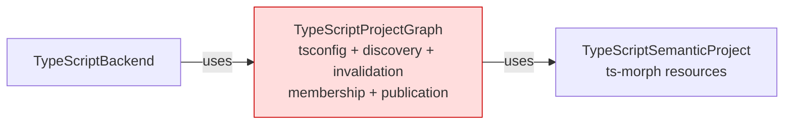
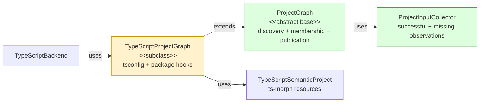

## Context

The [daemon architecture spec](https://github.com/mohasarc/symnav/blob/main/plans/005/daemon-architecture-functional-spec.md) assigns language-neutral project discovery, input invalidation, membership, and graph publication to core. TypeScript retains tsconfig parsing, package mapping, and `ts-morph` project construction without changing refresh or semantic lookup behavior.

## Shape

Before — TypeScript owned language rules and reusable graph mechanics:



After — core owns the graph transaction and TypeScript supplies hooks:



Legend: green = added; red = removed; yellow = changed; default = pre-existing and unchanged.

## Where it lives

```text
.
└── packages/
    ├── core/src/
    │   ├── ** index.ts
    │   └── workspace/
    │       ├── ++ project-graph.ts       # owns generic graph transactions
    │       └── ++ project-graph.test.ts  # proves discovery, validation, and rollback
    └── backend-typescript/src/typescript-backend/
        ├── ** typescript-project-graph.ts       # supplies TypeScript-specific hooks
        └── ** typescript-project-graph.test.ts  # preserves TypeScript edge behavior
```

## Public surface

Added to `@symnav/core`:

```ts
export interface ProjectInput {
  readonly path: string;
  readonly content: string;
}
export interface ProjectInputObservation {
  readonly path: string;
  readonly content: string | null;
}
export class ProjectInputCollector {
  constructor(fileSystem: FileSystem);
  read(path: string): string | undefined;
  observations(): readonly ProjectInputObservation[];
}
export interface ParsedProjectConfiguration<ConfigurationUnit> {
  readonly configuration: ConfigurationUnit;
  readonly referencedConfigurationPaths: readonly string[];
  readonly inputs: readonly ProjectInput[];
}
export interface ProjectConfigurationMembership<ConfigurationUnit> {
  readonly path: string;
  readonly configuration: ConfigurationUnit;
  readonly files: readonly WorkspaceFile[];
}
export interface ProjectGraphPreparationRequest<ConfigurationUnit> {
  readonly snapshot: WorkspaceSnapshot;
  readonly configurations: readonly ProjectConfigurationMembership<ConfigurationUnit>[];
  readonly inferredFiles: readonly WorkspaceFile[];
  readonly inputCollector: ProjectInputCollector;
}
export interface PreparedProjectGraph<Project> {
  readonly configuredProjects: readonly Project[];
  readonly inferredProject: Project;
  readonly inputs: readonly ProjectInput[];
}
export interface ProjectWithTransientResources {
  releaseTransientResources(): void | Promise<void>;
}
export interface ProjectGraphRefreshSummary {
  readonly root: string;
  readonly configuredProjectCount: number;
  readonly inferredFileCount: number;
  readonly changedInputCount: number;
}
export abstract class ProjectGraph<
  ConfigurationUnit,
  Project extends ProjectWithTransientResources,
> {
  protected constructor(fileSystem: FileSystem);
  protected refreshProjectGraph(snapshot: WorkspaceSnapshot): Promise<ProjectGraphRefreshSummary>;
  releaseTransientResources(): Promise<void>;
  protected primaryProjectFor(relativePath: string): Project | undefined;
  protected projectsFor(relativePath: string): readonly Project[];
  protected workspaceFile(relativePath: string): WorkspaceFile | undefined;
  protected abstract initialConfigurationPaths(root: string): readonly string[];
  protected abstract parseConfiguration(request: {
    readonly path: string;
    readonly content: string;
    readonly snapshot: WorkspaceSnapshot;
    readonly inputCollector: ProjectInputCollector;
  }): Promise<ParsedProjectConfiguration<ConfigurationUnit> | undefined>;
  protected abstract filesForConfiguration(
    configuration: ConfigurationUnit,
    snapshot: WorkspaceSnapshot,
  ): readonly WorkspaceFile[];
  protected abstract prepareProjects(
    request: ProjectGraphPreparationRequest<ConfigurationUnit>,
  ): Promise<PreparedProjectGraph<Project>>;
}
```

Changed:

```ts
export class TypeScriptProjectGraph
  extends ProjectGraph<ParsedTypeScriptConfiguration, TypeScriptSemanticProject>
  implements TypeScriptSemanticSourceProvider
```

## Decisions

- Chose a core abstract base over leaving reusable graph mechanics in TypeScript, because discovery, invalidation, membership, and publication have no TypeScript dependency.
- Chose one fresh collector per rebuild over retaining observations across graphs, because unreachable inputs must stop invalidating while missing inputs must trigger rediscovery when they appear.
- Chose exact active-input validation over an undocumented subclass precondition, because every published input must participate in the observation set that drives invalidation.
- Chose canonical snapshot members over relative-path-only membership, because project preparation must not receive a foreign path or revision identity.
- Chose complete validation followed by one state assignment over incremental mutation, because every candidate failure must preserve the prior graph.

## Look here

- `packages/core/src/workspace/project-graph.ts:99`
- `packages/core/src/workspace/project-graph.ts:253`
- `packages/core/src/workspace/project-graph.ts:271`
