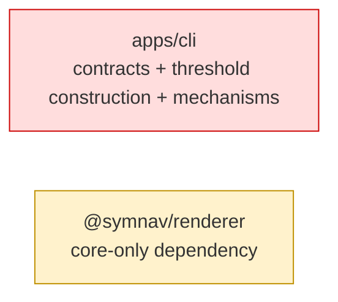
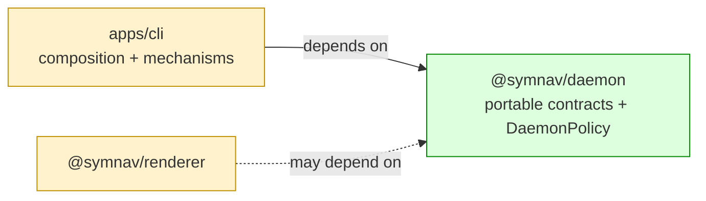

## Context

Daemon contracts and thresholds lived beside CLI mechanisms, so package rules could not enforce leaf ownership and detached processes received only reconstructed resource subsets. This layer establishes the leaf contract/policy owner and carries one complete snapshot through process and worker boundaries; operational consumer migration stays in the next stack layer.

## Shape

Before — CLI owned the portable boundary and policy inputs alongside mechanisms:



After — daemon contracts and the immutable snapshot have a leaf owner:



Legend: green = added ownership; red = removed ownership; yellow = changed responsibility or dependency permission.

- CLI creates one `DaemonPolicy` from system memory.
- Launch, process-entry, and worker-entry boundaries pass the complete versioned snapshot.
- Existing daemon mechanisms remain under `apps/cli` in this layer.

## Where it lives

```text
.
├── ** AGENTS.md                         # records daemon ownership and locked dependencies
├── ** eslint.config.mjs                 # registers daemon and test-only policy access
├── ** tsconfig.json                     # adds daemon to the root build graph
├── ** pnpm-lock.yaml                    # records workspace links
├── ** apps/cli/                         # 27 files compose and propagate one snapshot
├── ++ packages/daemon/
│   ├── ++ package.json                  # leaf ESM package with exact root/test exports
│   ├── ++ tsconfig*.json                # production leaf and test references
│   ├── ++ src/
│   │   ├── ++ ... 4 contract files      # executor, diagnostics, commands, lifecycle reports
│   │   ├── ++ daemon-policy.ts          # defaults, memory recipes, freezing, strict codec
│   │   ├── ++ index.ts                  # closed public root
│   │   ├── ++ policy-testing.ts         # temporary test-only override factory
│   │   └── ++ ... 2 test files          # exact type/declaration/runtime policy oracles
│   └── ++ test/public-import.test.ts     # package import surface proof
├── ** packages/renderer/                 # 2 files permit the future daemon-report edge
├── ** meta-tests/src/                    # 3 files enforce graph, exports, and policy docs
└── plans/
    ├── ** 000/symnav-stages.md           # records the contract-first migration milestone
    └── ++ 005/daemon-policy.md           # enumerates every value, recipe, and absence
```

Legend: `++` added, `**` changed, `~~` moved, `--` removed.

## Public surface

Added at `@symnav/daemon` root:

```ts
export interface DaemonExecutor {
  initialize(workspaceRoot: string): Promise<DaemonExecutorInitializationResult>;
  execute(request: DaemonExecutorRequest): Promise<DaemonExecutorExecutionResult>;
  releaseTransientResources(): Promise<void>;
}

export class DaemonPolicy {
  private constructor(values: DaemonPolicyValues);
  static currentSystem(): DaemonPolicy;
  static fromSystemMemory(memory: DaemonSystemMemory): DaemonPolicy;
  static fromSerialized(value: unknown): DaemonPolicy;
  readonly values: DaemonPolicyValues;
  toSerialized(): Readonly<{
    readonly schemaVersion: 1;
    readonly values: DaemonPolicyValues;
  }>;
}
```

The root also adds type-only command, diagnostic, executor request/output, activity, status, start, and stop contracts. Temporary `@symnav/daemon/policy-testing` exports only `DaemonPolicyTestFactory`; production imports are rejected.

## Decisions

- Chose a zero-internal-dependency package over keeping portable contracts in CLI, because future daemon mechanisms need an enforceable owner.
- Chose a complete versioned snapshot over partial per-hop options, because process and worker boundaries must preserve exact derived values.
- Chose a restricted `./policy-testing` subpath over root-level overrides, because tests need independent values without creating a user tuning surface.
- Chose AST, declaration, runtime, manifest, and dependency allowlists over documentation alone, because public-surface and package-graph drift must fail CI.
- Chose a cut after snapshot propagation over including operational consumer migration, because policy transport and threshold adoption are separate review concerns.

## Look here

- `packages/daemon/src/daemon-policy.ts:91`
- `packages/daemon/src/daemon-policy.ts:185`
- `apps/cli/src/daemon/daemon-process-launcher.ts:122`
