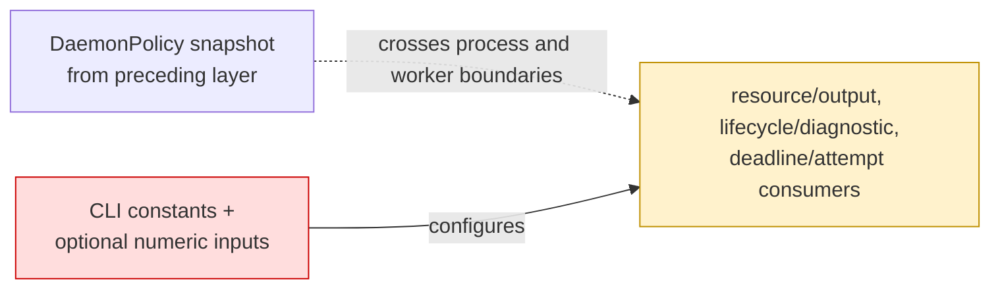
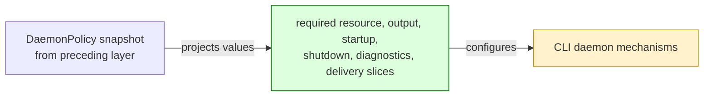

## Context

The preceding stack layer defines `DaemonPolicy` and carries one complete snapshot across process and worker boundaries. CLI daemon mechanisms still owned local defaults, optional numeric overrides, and hard-coded timeout/retry behavior, so runtime consumers could bypass that snapshot.

## Shape

Before — operational consumers retained their own threshold inputs:



After — each consumer receives its required policy section:



Legend: green = added policy input; red = removed local ownership; yellow = changed consumer.

- Output capture, completion spooling, framing, worker chunk validation, and resource supervision use required output/resource slices.
- Startup, shutdown, idle lifetime, process termination, acknowledgement polling, logging, and trace retention use required lifecycle/diagnostic slices.
- Status observation selects its 100 ms timeout by composition purpose; ordinary lifecycle and execution-status exchanges retain 250 ms.
- Result fetch resumes and post-accept execution reattachments consume independent numeric budgets.

## Where it lives

```text
.
├── apps/cli/
│   ├── src/
│   │   ├── ** cli-program-executor.ts              # supplies output policy to command capture
│   │   ├── ** command-execution-result.ts           # applies chunk, inline, and result capacities
│   │   ├── ** commands/daemon/                      # composes lifecycle policy and status timeout purpose
│   │   └── ** daemon/
│   │       ├── ** ... 16 implementation files      # consume required operational policy slices
│   │       └── ** ... 15 test files                # preserve threshold and retry behavior
│   └── test/
│       ├── ** ... 7 e2e/benchmark files            # retain process and output parity
│       └── helpers/
│           ├── ++ ... 7 files                      # adapt legacy test knobs to validated policies
│           └── ** ... 10 files                     # use policy-backed helpers
└── meta-tests/src/
    └── ** daemon-package.test.ts                    # rejects retired defaults and bypasses
```

Legend: `++` added, `**` changed, `~~` moved, `--` removed.

## Decisions

- Chose required policy slices over optional per-consumer numbers, because omitted composition must not recreate local defaults.
- Chose composition-purpose timeout selection over request-kind selection, because status observation and ordinary execution-status requests have distinct deadlines.
- Chose independent numeric resume and reattachment counters over one shared boolean, because each reattached execute attempt has its own fetch-resume allowance.
- Chose test-only adapters over production compatibility overloads, because tests need small thresholds without restoring runtime tuning seams.

## Look here

- `apps/cli/src/daemon/local-daemon-transport.ts:289`
- `apps/cli/src/daemon/local-daemon-transport.ts:402`
- `apps/cli/src/daemon/workspace-daemon.ts:113`
