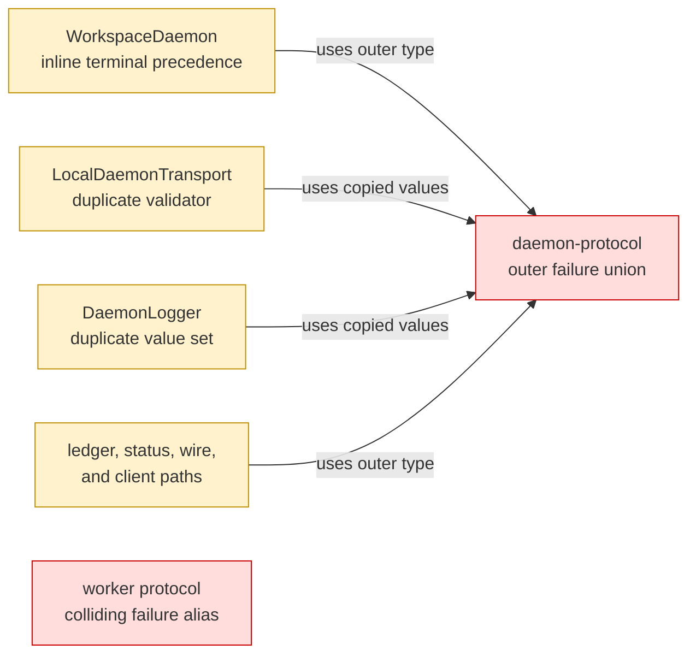
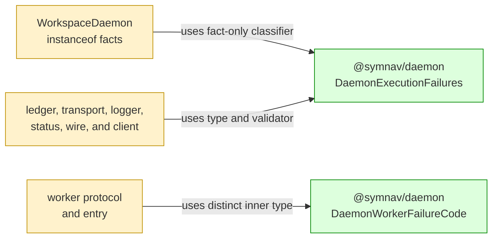

## Context

Execution failures previously used an app-owned outer union, a colliding worker-thread alias, and repeated validators and classification branches. This change gives `@symnav/daemon` one outer authority while preserving every serialized string and client outcome.

## Shape

Before — outer execution failures had several app-owned authorities, while worker failures reused the same type name:



After — daemon owns the closed outer vocabulary and precedence; the CLI supplies app-owned error identity facts:



Legend: green = added authority; red = removed authority or collision; yellow = changed path.

- Outer classification preserves resource, capacity, worker-exit, and shutdown precedence.
- Worker values remain `initialization`, `execution`, `protocol`, and `resource` on the wire.
- Accepted terminal failures retain their controlled client result and never replay work.

## Where it lives

```text
.
├── packages/daemon/
│   ├── src/
│   │   ├── ++ daemon-execution-failure.ts       # owns outer validation, precedence, and both vocabularies
│   │   ├── ++ daemon-execution-failure.test.ts  # locks closed sets and precedence
│   │   ├── ** host-contract.test.ts             # locks source and declaration exports
│   │   └── ** index.ts                          # exposes root runtime and type contracts
│   └── test/
│       └── ** public-import.test.ts              # verifies consumer-visible imports
└── apps/cli/src/daemon/
    ├── ** workspace-daemon.ts                   # derives app-owned identity facts
    ├── ** daemon-navigation-worker-protocol.ts  # adopts distinct worker failure type
    ├── ** daemon-navigation-worker-entry.ts     # emits unchanged worker values
    ├── ** ... 5 outer consumer files            # protocol, ledger, transport, logging, and client mapping
    └── ** ... 5 colocated test files             # lock boundaries, subtype behavior, and no replay
```

Legend: `++` added, `**` changed, `~~` moved, `--` removed.

## Public surface

Added at the `@symnav/daemon` root:

```ts
export type DaemonExecutionFailureCode = (typeof executionFailureCodes)[number];
export type DaemonWorkerFailureCode = "initialization" | "execution" | "protocol" | "resource";
export interface DaemonExecutionFailureContext {
  readonly resourceInterrupted: boolean;
  readonly responseCapacityExceeded: boolean;
  readonly workerExited: boolean;
  readonly shutdownFailureCode?: "stopping" | "controlled-resource";
  readonly shutdownStarted: boolean;
}
export class DaemonExecutionFailures {
  static isCode(value: unknown): value is DaemonExecutionFailureCode;
  static classify(context: DaemonExecutionFailureContext): DaemonExecutionFailureCode;
}
```

## Decisions

- Chose one private outer tuple with a derived union over repeated app-local unions, because runtime validation and compile-time vocabulary must change together.
- Chose a distinct worker type with no shared literals over retaining the colliding alias, because inner worker failures and outer request-completion failures are different domains.
- Chose a pure context classifier over lifecycle-specific branching at the call site, because precedence is exhaustively testable without constructing a workspace daemon.
- Chose app-owned `instanceof` fact derivation over constructor-name or `error.name` reflection, because it preserves subtype behavior without reversing package dependencies or accepting spoofed errors.

## Look here

- `packages/daemon/src/daemon-execution-failure.ts:26`
- `apps/cli/src/daemon/workspace-daemon.ts:641`
- `apps/cli/src/daemon/local-daemon-transport.ts:1347`
