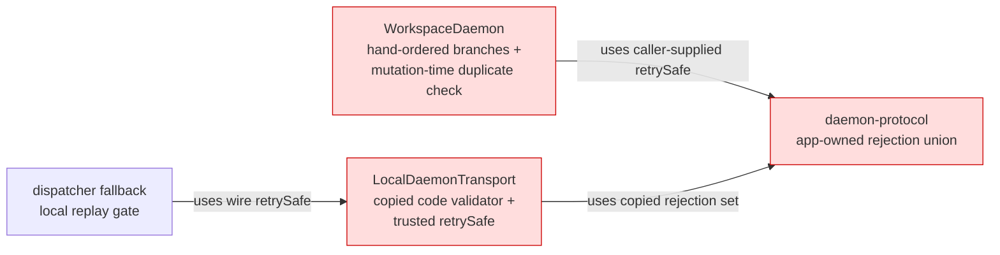
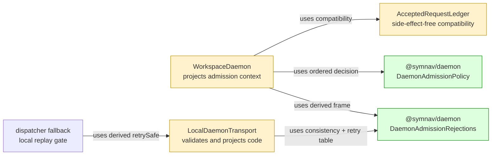

## Context

Execution admission mixed authentication, daemon state, duplicate compatibility, wire framing, and retry booleans in app-owned branches. `@symnav/daemon` now owns rejection order and retry meaning without changing disconnect, sampling, queue, duplicate, or fallback behavior.

## Shape

Before — app code owned admission order, rejection frames, and retry interpretation:



After — daemon contracts own first-failure decisions, frame consistency, and code-derived retry safety:



Legend: green = added authority; red = removed authority; yellow = changed path.

- Guard precedence is authentication, worker readiness, resource pressure, queue state, then duplicate compatibility.
- Authentication mismatch still disconnects without a rejection frame or resource sample.
- Authenticated `not-ready`, `resource-pressure`, and `draining` rejections remain replayable; `incompatible` does not.

## Where it lives

```text
.
├── packages/daemon/
│   ├── src/
│   │   ├── ++ daemon-admission.ts             # owns guards, frames, validation, and retry safety
│   │   ├── ++ daemon-admission.test.ts        # locks pairwise precedence and retry table
│   │   ├── ** host-contract.test.ts           # locks exact source and declaration surface
│   │   └── ** index.ts                        # exposes admission contracts at package root
│   └── test/
│       └── ** public-import.test.ts            # verifies consumer-visible imports
└── apps/cli/src/daemon/
    ├── ** workspace-daemon.ts                 # projects state into synchronous policy decisions
    ├── ** accepted-request-ledger.ts          # reports compatibility without mutation
    ├── ** local-daemon-transport.ts           # validates frames and derives retry projection
    ├── ** daemon-protocol.ts                  # reuses daemon-owned frame vocabulary
    ├── ** workspace-request-queue.ts          # reuses daemon-owned queue-state vocabulary
    └── ** ... 4 test files                    # preserve admission, wire, duplicate, and fallback behavior
```

Legend: `++` added, `**` changed, `~~` moved, `--` removed.

## Public surface

Added at the `@symnav/daemon` root:

```ts
export type DaemonExecuteRejectionCode =
  | "not-ready"
  | "draining"
  | "resource-pressure"
  | "incompatible";
export type AcceptedRequestCompatibility = "unseen" | "matching" | "conflicting";
export type WorkspaceRequestQueueState = "accepting" | "draining" | "closed";
export type DaemonExecutionCoordinates = {
  readonly instanceId: string;
  readonly processToken: string;
  readonly requestId: string;
};
export type DaemonRejectedExecutionFrame = {
  readonly kind: "rejected";
  readonly instanceId: string;
  readonly processToken: string;
  readonly requestId: string;
  readonly code: DaemonExecuteRejectionCode;
  readonly retrySafe: boolean;
};
export interface DaemonAdmissionContext {
  readonly request: unknown;
  readonly authenticated: boolean;
  readonly workerReady: boolean;
  readonly resourceAdmissionPaused: boolean;
  readonly queueState: WorkspaceRequestQueueState;
  readonly compatibility: AcceptedRequestCompatibility;
}
export interface DaemonAdmissionGuard {
  rejectionFor(context: DaemonAdmissionContext): DaemonAdmissionRejectionCode | undefined;
}
export type DaemonAdmissionRejectionCode = "authentication" | DaemonExecuteRejectionCode;
export type DaemonAdmissionDecision =
  | { readonly kind: "accept" }
  | { readonly kind: "disconnect"; readonly code: "authentication" }
  | { readonly kind: "reject"; readonly code: DaemonExecuteRejectionCode };
export class DaemonAdmissionPolicy {
  decide(context: DaemonAdmissionContext): DaemonAdmissionDecision;
}
export class DaemonAdmissionRejections {
  static retrySafe(code: DaemonExecuteRejectionCode): boolean;
  static frame(
    code: DaemonExecuteRejectionCode,
    coordinates: DaemonExecutionCoordinates,
  ): DaemonRejectedExecutionFrame;
  static assertConsistent(frame: DaemonRejectedExecutionFrame): void;
}
```

## Decisions

- Chose explicit guard classes over inline conditionals, because first-failure order is visible and exhaustively testable as one policy.
- Chose side-effect-free ledger compatibility over mutation-time corruption handling, because conflicts must reject without changing accepted state.
- Chose code-derived retry safety over trusting wire booleans, because contradictory frames must be corrupt rather than replayable.
- Chose `unknown` for the temporary request field over importing the CLI request type, because `@symnav/daemon` must remain dependency-free until the daemon-owned executor contract replaces it.

## Look here

- `packages/daemon/src/daemon-admission.ts:85`
- `apps/cli/src/daemon/workspace-daemon.ts:556`
- `apps/cli/src/daemon/local-daemon-transport.ts:1293`
