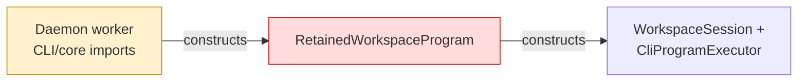

## Context

Daemon workers constructed CLI and core execution objects directly, despite `@symnav/daemon` needing to remain free of internal package dependencies. This range injects the CLI executor through an absolute module URL and preserves execution, output, diagnostics, readiness, and resource-reporting behavior.

## Shape

Before — worker code owned host-specific execution construction:



After — CLI supplies a validated host module through process and worker configuration:

```mermaid
flowchart LR
    Composition["CLI composition"]
    Configuration["daemon process +<br/>worker configuration"]
    Worker["Daemon worker<br/>daemon contracts only"]
    Loader["DaemonExecutorModuleLoader"]
    Executor["CLI DaemonExecutor"]
    Session["WorkspaceSession +<br/>CliProgramExecutor"]

    Composition -->|"absolute file URL"| Configuration
    Configuration -->|"worker data"| Worker
    Worker -->|"module URL + host options"| Loader
    Loader -->|"validated factory result"| Executor
    Executor -->|"retained session"| Session

    style Composition fill:#fff2cc,stroke:#bf9000
    style Configuration fill:#fff2cc,stroke:#bf9000
    style Worker fill:#fff2cc,stroke:#bf9000
    style Loader fill:#ddffdd,stroke:#008800
    style Executor fill:#ddffdd,stroke:#008800
```



Legend: green = added ownership; red = removed ownership; yellow = changed path.

- Worker output is sequenced and rechunked at the daemon policy cap before each acknowledgement.
- Recursive diagnostics remain opaque across the host boundary while known timing and refresh fields are projected defensively.
- The final test-only commit resolves Phase 12's material carry: deferred adapter sampling and a no-op worker callback now fail mutation-resistant request-local heap tests.

## Where it lives

```text
.
├── packages/daemon/
│   ├── ** src/daemon-diagnostics.ts                   # validates recursive JSON-like diagnostics
│   ├── ** src/daemon-executor.ts                      # owns host contracts and module loading
│   ├── ** src/index.ts                                # exposes the daemon package surface
│   └── ** ... 3 contract and public-import tests      # lock the dependency-free boundary
└── apps/cli/
    ├── ++ src/daemon-executor.ts                      # implements the injected host factory
    ├── ++ src/daemon-executor.test.ts                 # proves synchronous phase sampling
    ├── ** src/commands/daemon/register-daemon-command.ts # supplies the executor module URL
    ├── ** src/daemon/
    │   ├── ** daemon-navigation-worker-entry.ts       # loads, validates, executes, and samples
    │   ├── ** daemon-navigation-worker-protocol.ts    # carries daemon-owned messages
    │   ├── ** daemon-process-launcher.ts              # propagates strict process configuration
    │   ├── ++ local-daemon-output.ts                  # bridges daemon output to CLI storage
    │   ├── -- retained-workspace-program.ts           # superseded worker-local adapter
    │   └── ** ... 20 files                            # preserve lifecycle and transport behavior
    └── test/
        ├── ++ helpers/injected-daemon-executor-fixture.mjs
        ├── ++ helpers/resource-sampling-daemon-executor-fixture.mjs
        └── ** ... 7 files                             # preserve process, parity, and lifecycle behavior
```

Legend: `++` added, `**` changed, `~~` moved, `--` removed.

## Public surface

Added at the `@symnav/daemon` root and CLI executor module:

```ts
export class DaemonDiagnosticValues {
  static isDiagnostics(value: unknown): value is DaemonDiagnostics;
}
export interface DaemonSequencedOutputRecord extends DaemonOutputRecord { readonly sequence: number; }
export interface DaemonOutputSink { append(record: DaemonSequencedOutputRecord): Promise<void>; }
export class DaemonExecutorModuleLoader {
  static load(moduleUrl: DaemonExecutorModuleUrl, options: DaemonExecutorFactoryOptions): Promise<DaemonExecutor>;
}
export function createDaemonExecutor(options: DaemonExecutorFactoryOptions): DaemonExecutor;
export function daemonExecutorModuleUrl(): DaemonExecutorModuleUrl;
```

Changed:

```ts
export interface DaemonExecutorFactoryOptions {
  readonly stateDirectory: string;
  readonly productVersion: string;
  readonly sampleResources: () => void;
}
```

## Decisions

- Chose an absolute injected file URL over importing CLI code from daemon mechanisms, because the daemon package must keep zero internal dependencies.
- Chose recursive JSON-like diagnostics over a CLI refresh-summary contract, because worker telemetry can project known fields without owning host-specific diagnostics.
- Chose worker-side rechunking and sequencing over transport metadata in executor output, because chunk limits and acknowledgement flow belong to the worker protocol.
- Chose runtime validation over trusting dynamically imported TypeScript shapes, because invalid host modules must retain existing initialization and execution failure handling.
- Chose a daemon-owned no-payload sampling callback over sharing CLI command-phase types, because synchronous phase boundaries must update the active request's heap high-water without reversing dependency direction.

## Look here

- `packages/daemon/src/daemon-executor.ts:105`
- `apps/cli/src/daemon/daemon-navigation-worker-entry.ts:89`
- `apps/cli/src/daemon-executor.ts:53`
