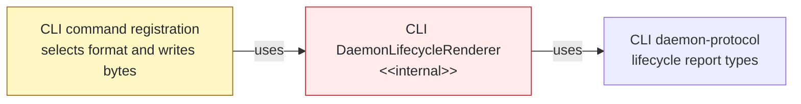
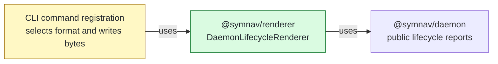

## Context

The [daemon architecture contract](plans/005/daemon-architecture-functional-spec.md#lifecycle-rendering) assigns lifecycle formatting to `@symnav/renderer`, but CLI daemon internals still owned start, status, and stop output bytes. The move must preserve every text/JSON byte and leave format selection, writes, and existing error wrappers in CLI.

## Shape

Before — CLI command registration depended on an app-internal formatter and app-owned report types:



After — renderer owns formatting against public daemon reports; CLI retains selection and terminal effects:



Legend: green = added ownership; red = removed ownership; yellow = changed dependency; default = unchanged.

## Where it lives

```text
.
├── packages/renderer/src/
│   ├── ** index.ts                                      # exports lifecycle rendering at package root
│   └── lifecycle/
│       ├── ~~ daemon-lifecycle-renderer.ts              # moved from apps/cli/src/daemon/
│       └── ++ daemon-lifecycle-renderer.test.ts         # locks lifecycle bytes at their owner
├── apps/cli/src/
│   ├── commands/daemon/
│   │   ├── ** register-daemon-command.ts                # consumes the public renderer
│   │   └── ++ register-daemon-command.test.ts           # locks selection and unchanged forwarding
│   └── daemon/
│       └── -- daemon-lifecycle-renderer.test.ts         # superseded CLI-owned coverage
└── meta-tests/src/
    └── ++ renderer-package.test.ts                      # enforces dependency and import boundaries
```

Legend: `++` added, `**` changed, `~~` moved, `--` removed.

## Public surface

Added at the `@symnav/renderer` root:

```ts
export class DaemonLifecycleRenderer {
  static renderStartText(result: DaemonStartResult): string;
  static renderStartJson(result: DaemonStartResult): string;
  static renderStatusText(results: readonly RunningDaemonStatus[]): string;
  static renderStatusJson(results: readonly RunningDaemonStatus[]): string;
  static renderStopText(result: DaemonStopResult): string;
  static renderStopJson(result: DaemonStopResult): string;
}
```

## Decisions

- Chose one stateless renderer class over command-specific formatter functions, because start, status, and stop bytes form one cohesive public rendering unit.
- Chose public `@symnav/daemon` report imports over daemon internal subpaths, because renderer depends on daemon contracts rather than their source layout.

## Look here

- `packages/renderer/src/lifecycle/daemon-lifecycle-renderer.ts:41`
- `apps/cli/src/commands/daemon/register-daemon-command.test.ts:85`
- `meta-tests/src/renderer-package.test.ts:19`
