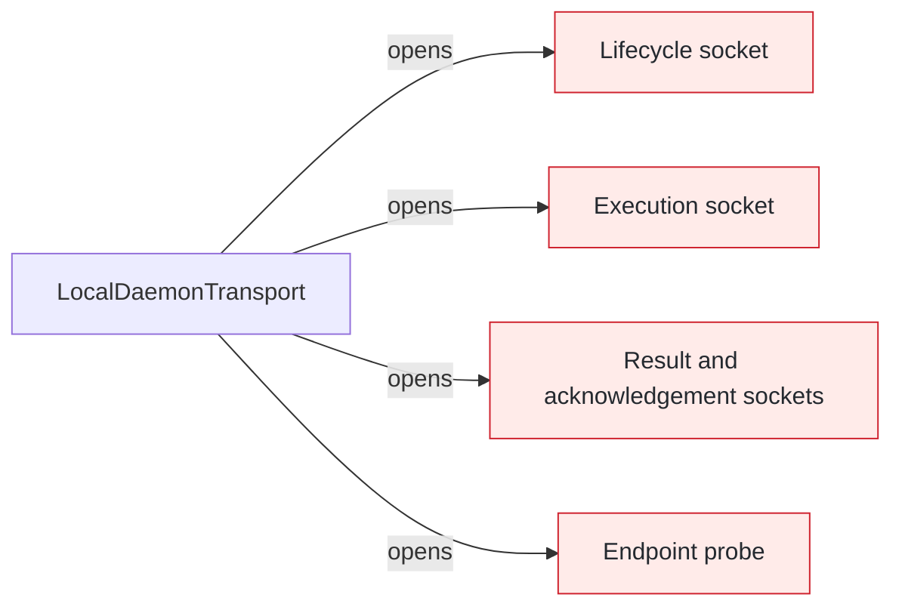
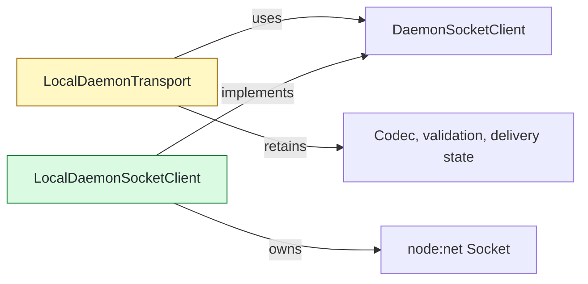

## Context

`LocalDaemonTransport` repeated Node socket connection, timeout, read-flow, write-backpressure, and closure mechanics across five outbound paths. One low-level client now owns those mechanics while protocol and delivery decisions remain in the transport façade.

## Shape

Before — each outbound exchange managed a raw socket:



After — all outbound paths consume one byte-connection port:



Legend: green = added; yellow = changed; red = removed; default = unchanged.

## Where it lives

```text
.
└── apps/cli/src/daemon/
    ├── ++ local-daemon-socket-client.ts                 # sole outbound Node socket owner
    ├── ++ local-daemon-socket-client.test.ts            # byte flow, timeout, backpressure, and closure
    ├── ++ local-daemon-transport-socket-client.test.ts  # delegation across five outbound paths
    ├── ** local-daemon-transport.ts                     # retains protocol and delivery semantics
    └── ** ... 2 transport test files                    # remove superseded private helper coverage
```

Legend: `++` added, `**` changed, `~~` moved, `--` removed.

## Public surface

```ts
export class LocalDaemonSocketClient implements DaemonSocketClient {
  connect(endpoint: string, timeoutMs?: number): Promise<DaemonSocketConnection>;
}
```

## Decisions

- Chose a pull-driven async iterator over forwarded `data` events, because consumer demand now controls socket resume and each delivered chunk pauses reads again.
- Chose a connection-owned FIFO over façade-owned drain handling, because frames must preserve write-call order across backpressure.
- Kept protocol decoding and delivery-state translation in `LocalDaemonTransport` over moving them into the socket client, because raw EOF and errors cannot classify request correlation or retry safety.
- Kept inbound server sockets in `LocalDaemonTransport` over extracting both directions together, because server binding and shutdown form the separate Phase 18 boundary.

## Look here

- `apps/cli/src/daemon/local-daemon-socket-client.ts:25`
- `apps/cli/src/daemon/local-daemon-socket-client.ts:51`
- `apps/cli/src/daemon/local-daemon-transport.ts:270`
