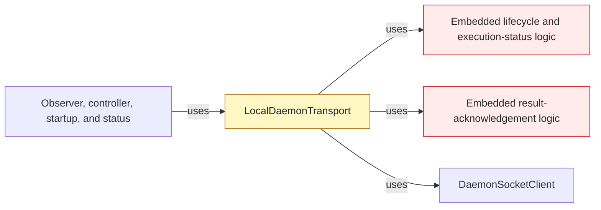
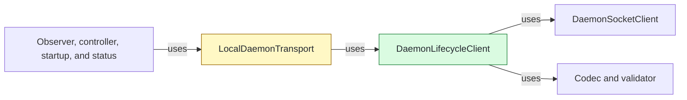

## Context

Part 16 separated raw outbound socket mechanics, but `LocalDaemonTransport` still owned protocol-level lifecycle and acknowledgement state machines. This part gives those bounded exchanges one owner while preserving existing timeout and delivery-classification contracts.

## Shape

Before — the transport façade implemented each one-response exchange:



After — the façade delegates bounded exchanges to one lifecycle client:



Legend: green = added; yellow = changed; red = removed; default = unchanged.

## Where it lives

```text
.
└── apps/cli/src/
    ├── commands/daemon/
    │   └── ** register-daemon-command.ts          # injects daemon-status response timeout
    └── daemon/
        ├── ++ daemon-lifecycle-client.ts           # owns bounded one-response exchanges
        ├── ++ daemon-lifecycle-client.test.ts      # locks correlation, cleanup, and delivery states
        ├── ++ daemon-transport-error.ts             # owns shared transport failure classification
        ├── ** local-daemon-transport.ts             # composes and delegates lifecycle requests
        └── ** ... 7 files                           # update imports and composition oracles
```

Legend: `++` added, `**` changed, `~~` moved, `--` removed.

## Public surface

```ts
export class DaemonLifecycleClient implements DaemonLifecycleRequester {
  constructor(options: DaemonLifecycleClientOptions);
  request(endpoint: string, request: DaemonLifecycleRequest): Promise<DaemonLifecycleResponse>;
  executionStatus(
    endpoint: string,
    request: DaemonExecutionStatusRequest,
  ): Promise<DaemonExecutionStatus>;
  acknowledgeResult(
    endpoint: string,
    request: Pick<DaemonExecuteRequest, "protocolVersion" | "instanceId" | "processToken" | "requestId">,
    transferId: string,
  ): Promise<void>;
}
```

## Decisions

- Chose one client for lifecycle, execution-status, and result-acknowledgement exchanges over separate request-specific clients, because all three share bounded response, correlation, timeout, and cleanup semantics.
- Kept result acknowledgement off `DaemonLifecycleRequester` over widening the port, because only result completion needs that exchange.
- Chose timeout injection at composition over request-kind selection, because daemon status and ordinary routing both send `ping` with different deadlines.
- Chose semantic validation before assigning `accepted` over treating every decoded frame as accepted, because malformed shapes and authenticated protocol errors have distinct existing delivery states.
- Chose a shared transport-error module over lifecycle-client ownership, because execution routing and record observation still consume the same failure classification.

## Look here

- `apps/cli/src/daemon/daemon-lifecycle-client.ts:94`
- `apps/cli/src/daemon/daemon-lifecycle-client.ts:159`
- `apps/cli/src/commands/daemon/register-daemon-command.ts:110`
