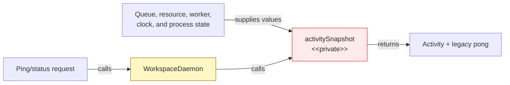
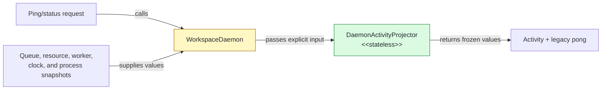

## Context

`WorkspaceDaemon` derived lifecycle detail and legacy pong fields inline from process, queue, resource, and worker state. The next worker-generation extraction needs the same worker snapshot contract without inheriting process-owned formatting.

## Shape

Before — the process shell owned snapshot capture and projection:



After — the process shell captures values and one pure projector owns output shape:



Legend: green = added; yellow = changed; red = removed; default = unchanged.

## Where it lives

```text
.
└── apps/cli/src/daemon/
    ├── ++ daemon-activity-projector.ts       # owns activity and pong projection
    ├── ++ daemon-activity-projector.test.ts  # locks precedence, optionality, sampling, and freezing
    ├── ** workspace-daemon.ts                # supplies explicit snapshot values
    └── ** workspace-daemon-requests.test.ts  # proves runtime adoption and output identity
```

Legend: `++` added, `**` changed, `~~` moved, `--` removed.

## Public surface

```ts
export interface DaemonWorkerGenerationSnapshot {
  readonly generation: number; readonly ready: boolean; readonly fileCount?: number;
}
export interface DaemonActivityProjectionInput {
  readonly nowMonotonicMs: number; readonly pid: number; readonly processRssBytes: number;
  readonly startedAt: number; readonly startedMonotonicAt: number;
  readonly lastNavigationAt?: number; readonly lastCompletedMonotonicAt?: number;
  readonly productVersion: string; readonly instanceId: string; readonly hardProcessRssBytes: number;
  readonly queue: WorkspaceRequestQueueSnapshot; readonly resources: DaemonResourceSnapshot;
  readonly worker: DaemonWorkerGenerationSnapshot;
}
export interface DaemonActivityProjection { readonly activity: DaemonActivitySnapshot; readonly pong: DaemonPong; }
export class DaemonActivityProjector {
  static project(input: DaemonActivityProjectionInput): DaemonActivityProjection;
}
```

## Decisions

- Chose a static projector over an injected service, because projection depends only on explicit snapshot values.
- Chose explicit clock and process values over callbacks, because the projector must remain deterministic and own no mutable dependency.
- Chose worker snapshot generation over resource snapshot generation, because replacement status exposes the in-progress generation before resource readiness publication.
- Chose sampled `resources.spoolBytes` over a completion-store read, because status reports the resource supervisor's last observation.
- Kept legacy pong `fileCount` independent of worker readiness over matching activity optionality, because existing pong output retains the last supplied count during startup and replacement.

## Look here

- `apps/cli/src/daemon/daemon-activity-projector.ts:37`
- `apps/cli/src/daemon/daemon-activity-projector.test.ts:127`
- `apps/cli/src/daemon/workspace-daemon.ts:449`
