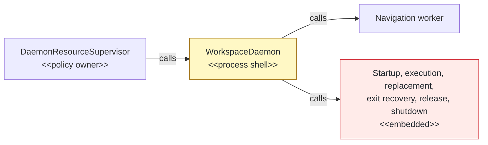
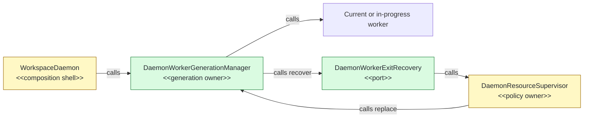

## Context

`WorkspaceDaemon` mixed worker-generation mechanics with process coordination, which blocked the planned daemon-package move. This Phase 22 stack layer follows activity-projector PR #144; the exact local CI-parity sequence passed 2,396 tests with eight expected skips, while focused mutation oracles lock lifecycle parity.

## Shape

Before — the process shell owned worker generations and their lifecycle:



After — one manager owns mechanics behind a policy-neutral recovery port:



Legend: green = added; yellow = changed; red = removed; default = unchanged.

## Where it lives

```text
.
└── apps/cli/src/daemon/
    ├── ++ daemon-worker-generation-manager.ts       # owns worker lifecycle and snapshot state
    ├── ++ daemon-worker-generation-manager.test.ts  # locks transitions, fencing, and shutdown
    ├── ** daemon-resource-monitor.ts                 # implements exit-recovery policy port
    ├── ** daemon-resource-monitor.test.ts            # locks recovery-port delegation
    ├── ** daemon-activity-projector.ts               # consumes single worker snapshot contract
    ├── ** daemon-activity-projector.test.ts          # prevents duplicate snapshot ownership
    ├── ** workspace-daemon.ts                        # composes and delegates worker mechanics
    └── ** workspace-daemon-requests.test.ts          # preserves process-level behavior
```

Legend: `++` added, `**` changed, `~~` moved, `--` removed.

## Public surface

```ts
export type DaemonWorkerReadyReport = Extract<DaemonNavigationWorkerResponse, { readonly kind: "ready" }>;
export type DaemonWorkerExecutionReport = Extract<DaemonNavigationWorkerResponse, { readonly kind: "result" }>;
export type DaemonWorkerResourceReport = Extract<DaemonNavigationWorkerResponse, { readonly kind: "heap" }>;
export interface DaemonWorkerExecuteRequest { readonly commandName: DaemonCommandName; readonly request: DaemonExecutorRequest; }
export interface DaemonWorkerExitRecovery { recover(exit: DaemonNavigationWorkerExit): Promise<void>; }
export interface DaemonWorkerGenerationSnapshot { readonly generation: number; readonly ready: boolean; readonly fileCount?: number; }
export interface DaemonWorkerGenerationManagerOptions {
  readonly workspaceRoot: string;
  readonly createWorker: (generation: number) => DaemonNavigationWorker;
  readonly initialWorker?: DaemonNavigationWorker;
  readonly exitRecovery: DaemonWorkerExitRecovery;
  readonly onActiveResourceInterruption: (cause: DaemonWorkerReplacementCause) => void;
  readonly onDiagnostic: (diagnostic: DaemonWorkerDiagnostic) => void;
}
export class DaemonWorkerGenerationManager {
  constructor(options: DaemonWorkerGenerationManagerOptions);
  get snapshot(): DaemonWorkerGenerationSnapshot;
  start(): Promise<DaemonWorkerReadyReport>;
  activateReadiness(): void;
  execute(requestId: string, request: DaemonWorkerExecuteRequest, output: DaemonOutputSink): Promise<DaemonWorkerExecutionReport>;
  replace(cause: DaemonWorkerReplacementCause): Promise<DaemonWorkerReadyReport>;
  releaseTransientResources(): Promise<DaemonWorkerResourceReport>;
  close(): Promise<void>;
  terminate(): Promise<void>;
}
```

## Decisions

- Chose one generation manager over process-shell worker fields, because startup, execution, replacement, fencing, release, and shutdown share one lifecycle state.
- Chose a recovery port over importing the resource supervisor, because replacement-window and circuit decisions remain resource policy.
- Chose explicit readiness activation over publishing readiness with the worker report, because warm-up sampling remains the admission and activity barrier.
- Chose one stored replacement operation over parallel transitions, because concurrent callers must share one generation handoff.
- Chose separate close and termination operations over one shutdown promise, because forced termination can interrupt a blocked graceful close while repeated calls retain promise identity.

## Look here

- `apps/cli/src/daemon/daemon-worker-generation-manager.ts:80`
- `apps/cli/src/daemon/daemon-worker-generation-manager.ts:122`
- `apps/cli/src/daemon/workspace-daemon.ts:223`
