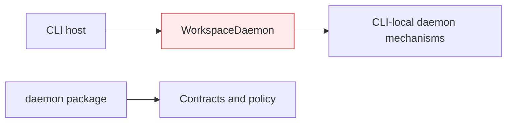
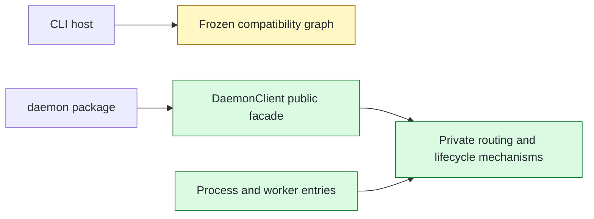

## Context

Daemon process ownership still lived in CLI-local mechanisms, and hosts needed registry, transport, startup, and lifecycle knowledge to compose daemon execution. This group establishes the package-owned process and client boundary while leaving the active CLI consumer switch to the next PR.

## Shape

Before — CLI-local mechanisms own process coordination and expose their composition burden to the host:



After — package entries and a public client compose package-local mechanisms; the shipped CLI still follows its frozen compatibility graph:



Legend: green = added; red = removed; yellow = changed; unfilled = pre-existing and unchanged.

## Where it lives

```text
.
├── apps/cli/src/daemon/
│   ├── ~~ daemon-process-coordinator.ts # renamed from workspace-daemon.ts; owns process lifecycle
│   ├── ** daemon-clock.ts               # owns wall and monotonic time sources
│   ├── ** daemon-registry.ts            # owns startup-lock equality
│   └── ** ... 9 files                   # coordinated compatibility mechanisms, then frozen
├── packages/daemon/
│   ├── ** package.json                  # exposes real process and worker entry subpaths
│   ├── src/
│   │   ├── ++ client/ ... 8 files       # public facade and private routing/runtime composition
│   │   ├── ++ delivery/, diagnostics/, execution/, lifecycle/
│   │   ├── ++ process/, registry/, resources/, transport/, worker/ # package mechanism owners
│   │   ├── ~~ ... 37 test files         # moved from apps/cli/src/daemon/
│   │   ├── ++ process-entry.ts
│   │   ├── ++ worker-entry.ts
│   │   └── ** index.ts                  # exports the host-facing client surface
│   └── ++ test/ ... 24 files            # generic executor and built-entry integration fixtures
├── meta-tests/src/
│   └── ++ daemon-compatibility-copy.test.ts # freezes 38 app-local production copies
└── plans/005/
    └── ** daemon-follow-ups-functional-spec.md # records deferred idle-accounting changes
```

## Public surface

```ts
export type {
  DaemonClientExecuteRequest,
  DaemonClientExecuteResult,
  DaemonClientOptions,
  DaemonControlRequest,
} from "./client/daemon-client-contracts.js";
export { DaemonClient } from "./client/daemon-client.js";

export class DaemonClient {
  constructor(options: DaemonClientOptions);
  execute(request: DaemonClientExecuteRequest): Promise<DaemonClientExecuteResult>;
  control(
    request: Extract<DaemonControlRequest, { readonly action: "start" }>,
  ): Promise<DaemonStartResult>;
  control(
    request: Extract<DaemonControlRequest, { readonly action: "status" }>,
  ): Promise<readonly RunningDaemonStatus[]>;
  control(
    request: Extract<DaemonControlRequest, { readonly action: "stop" }>,
  ): Promise<DaemonStopResult>;
}
```

## Decisions

- Chose a Node-free public façade with a dynamically loaded internal runtime over exposing Node-backed mechanisms, because host declarations must not acquire Node ambient dependencies.
- Chose ordered lazy routing guards over eager registry and transport observation, because the first routing decision must prevent every later side effect.
- Chose package staging with a frozen CLI compatibility graph over switching production consumers during relocation, because mechanism ownership and host invocation coordination need separate review boundaries.
- Chose package-owned result capture and controlled failure outputs over host-provided storage or output factories, because warm transfer cleanup and replay safety belong to the daemon client.
- Chose to preserve acceptance-based idle timing over correcting it during extraction, because readiness- and completion-based lifetime changes are explicitly deferred behavior.

## Look here

- `packages/daemon/src/process/process-coordinator.ts:84`
- `packages/daemon/src/client/daemon-client-runtime.ts:139`
- `packages/daemon/src/client/daemon-client.ts:20`
