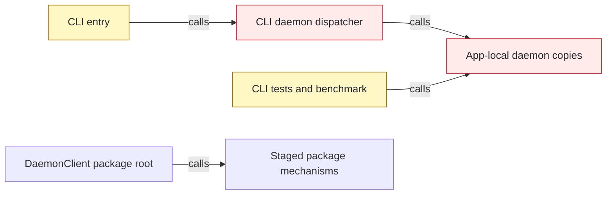
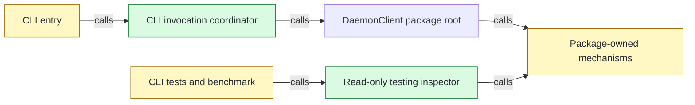

## Context

[PR #148](https://github.com/mohasarc/symnav/pull/148) establishes the package `DaemonClient` and stages daemon mechanisms, but the shipped CLI and external test consumers still retain app-local ownership paths. This PR makes `@symnav/daemon` the sole mechanism owner while preserving command output, telemetry, execution modes, and lifecycle behavior.

## Shape

Before — CLI runtime and external tests still cross the app-local daemon boundary:



After — CLI coordinates invocations through the package root, and tests observe package state through a read-only subpath:



Legend: green = added; red = removed; yellow = changed; unfilled = pre-existing and unchanged.

- Atomic frozen install, build, 2,696 tests with 8 expected skips, lint, and typecheck pass at the exact head.
- Explicit cold and warm suites each pass 355 tests with 8 expected skips.
- Scale-1 daemon benchmark passes parity, freshness, responsiveness, continuity, telemetry, resource, and spool-cleanup gates.

## Where it lives

```text
.
├── apps/cli/
│   ├── src/
│   │   ├── ++ cli-invocation-coordinator.ts       # owns local/control/workspace routing
│   │   ├── ~~ invocation-workspace-selector.ts   # moved from src/daemon/
│   │   ├── ** cli.ts                              # composes one public daemon client
│   │   ├── ** commands/daemon/register-daemon-command.ts # calls public lifecycle controls
│   │   └── -- daemon/ ... 45 files                # removes app-owned mechanism copies
│   └── ** test/ ... 34 files                      # uses public behavior or testing inspector
├── packages/daemon/
│   ├── ** package.json                            # exposes exactly four package paths
│   ├── ++ src/testing/ ... 3 files                # read-only state inspection boundary
│   ├── ** src/transport/ ... 16 files             # replaces compatibility facade
│   ├── ++ test/actors/daemon-accepted-caller.ts   # package-owned accepted caller
│   └── ~~ test/actors/ ... 6 files                # moved from apps/cli/test/helpers/
├── meta-tests/src/
│   ├── ++ cli-daemon-reachability.test.ts         # locks production import graph
│   ├── ++ daemon-storage-boundary.test.ts         # locks testing storage boundary
│   └── ** ... 3 files                             # locks exports, deletion, and lint rules
├── ** AGENTS.md                                   # records final package ownership
└── ** plans/000/symnav-stages.md                  # records completed architecture milestone
```

## Public surface

```ts
export class DaemonTestingInspector {
  constructor(canonicalStateDirectory: string);
  listInstances(): readonly DaemonTestingInstance[];
  hasStateArtifacts(): boolean;
  readDiagnostics(canonicalWorkspaceRoot: string, cursor?: number): DaemonTestingDiagnosticPage;
  completionSpoolUsage(canonicalWorkspaceRoot: string): DaemonTestingSpoolUsage;
}

// Removed from DaemonPolicy:
static fromSerialized(value: unknown): DaemonPolicy;
toSerialized(): Readonly<SerializedDaemonPolicy>;
```

## Decisions

- Chose a CLI invocation coordinator over the app-local daemon dispatcher, because argv classification and workspace discovery remain host responsibilities while execution belongs behind `DaemonClient`.
- Chose a read-only testing inspector over exposing registry, diagnostic, or spool paths, because external assertions need observability without storage or mutation authority.
- Chose package-owned actors with an injected executor URL over package tests naming CLI build artifacts, because daemon tests must not depend on app layout.
- Chose focused package transport composition over retaining `LocalDaemonTransport`, because lifecycle, execution, result transfer, and socket owners now have one package boundary.
- Chose exact compiler-backed import, export, clock, and storage inventories over regex or compatibility aliases, because ordinary TypeScript syntax must not bypass final ownership rules.

## Look here

- `apps/cli/src/cli-invocation-coordinator.ts:17`
- `packages/daemon/src/testing/daemon-testing-inspector.ts:35`
- `meta-tests/src/daemon-storage-boundary.test.ts:215`
