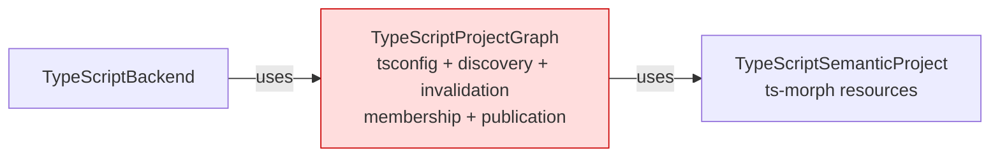
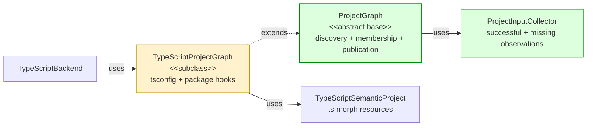

## Context

The [daemon architecture spec](https://github.com/mohasarc/symnav/blob/main/plans/005/daemon-architecture-functional-spec.md) assigns language-neutral project discovery, input invalidation, membership, and graph publication to core. TypeScript retains tsconfig parsing, package mapping, and `ts-morph` project construction without changing refresh or semantic lookup behavior.

## Shape

Before — TypeScript owned language rules and reusable graph mechanics:



After — core owns the graph transaction and TypeScript supplies hooks:



Legend: green = added; red = removed; yellow = changed; default = pre-existing and unchanged.

## Where it lives

```text
.
└── packages/
    ├── core/src/
    │   ├── ** index.ts
    │   └── workspace/
    │       ├── ++ project-graph.ts       # owns generic graph transactions
    │       └── ++ project-graph.test.ts  # proves discovery, validation, and rollback
    └── backend-typescript/src/typescript-backend/
        ├── ** typescript-project-graph.ts       # supplies TypeScript-specific hooks
        └── ** typescript-project-graph.test.ts  # preserves TypeScript edge behavior
```

## Public surface

Added to `@symnav/core`:

```ts
export interface ProjectInput {
  readonly path: string;
  readonly content: string;
}
export interface ProjectInputObservation {
  readonly path: string;
  readonly content: string | null;
}
export class ProjectInputCollector {
  constructor(fileSystem: FileSystem);
  read(path: string): string | undefined;
  observations(): readonly ProjectInputObservation[];
}
export interface ParsedProjectConfiguration<ConfigurationUnit> {
  readonly configuration: ConfigurationUnit;
  readonly referencedConfigurationPaths: readonly string[];
  readonly inputs: readonly ProjectInput[];
}
export interface ProjectConfigurationMembership<ConfigurationUnit> {
  readonly path: string;
  readonly configuration: ConfigurationUnit;
  readonly files: readonly WorkspaceFile[];
}
export interface ProjectGraphPreparationRequest<ConfigurationUnit> {
  readonly snapshot: WorkspaceSnapshot;
  readonly configurations: readonly ProjectConfigurationMembership<ConfigurationUnit>[];
  readonly inferredFiles: readonly WorkspaceFile[];
  readonly inputCollector: ProjectInputCollector;
}
export interface PreparedProjectGraph<Project> {
  readonly configuredProjects: readonly Project[];
  readonly inferredProject: Project;
  readonly inputs: readonly ProjectInput[];
}
export interface ProjectWithTransientResources {
  releaseTransientResources(): void | Promise<void>;
}
export interface ProjectGraphRefreshSummary {
  readonly root: string;
  readonly configuredProjectCount: number;
  readonly inferredFileCount: number;
  readonly changedInputCount: number;
}
export abstract class ProjectGraph<
  ConfigurationUnit,
  Project extends ProjectWithTransientResources,
> {
  protected constructor(fileSystem: FileSystem);
  protected refreshProjectGraph(snapshot: WorkspaceSnapshot): Promise<ProjectGraphRefreshSummary>;
  releaseTransientResources(): Promise<void>;
  protected primaryProjectFor(relativePath: string): Project | undefined;
  protected projectsFor(relativePath: string): readonly Project[];
  protected workspaceFile(relativePath: string): WorkspaceFile | undefined;
  protected abstract initialConfigurationPaths(root: string): readonly string[];
  protected abstract parseConfiguration(request: {
    readonly path: string;
    readonly content: string;
    readonly snapshot: WorkspaceSnapshot;
    readonly inputCollector: ProjectInputCollector;
  }): Promise<ParsedProjectConfiguration<ConfigurationUnit> | undefined>;
  protected abstract filesForConfiguration(
    configuration: ConfigurationUnit,
    snapshot: WorkspaceSnapshot,
  ): readonly WorkspaceFile[];
  protected abstract prepareProjects(
    request: ProjectGraphPreparationRequest<ConfigurationUnit>,
  ): Promise<PreparedProjectGraph<Project>>;
}
```

Changed:

```ts
export class TypeScriptProjectGraph
  extends ProjectGraph<ParsedTypeScriptConfiguration, TypeScriptSemanticProject>
  implements TypeScriptSemanticSourceProvider
```

## Decisions

- Chose a core abstract base over leaving reusable graph mechanics in TypeScript, because discovery, invalidation, membership, and publication have no TypeScript dependency.
- Chose one fresh collector per rebuild over retaining observations across graphs, because unreachable inputs must stop invalidating while missing inputs must trigger rediscovery when they appear.
- Chose exact active-input validation over an undocumented subclass precondition, because every published input must participate in the observation set that drives invalidation.
- Chose canonical snapshot members over relative-path-only membership, because project preparation must not receive a foreign path or revision identity.
- Chose complete validation followed by one state assignment over incremental mutation, because every candidate failure must preserve the prior graph.

## Look here

- `packages/core/src/workspace/project-graph.ts:99`
- `packages/core/src/workspace/project-graph.ts:253`
- `packages/core/src/workspace/project-graph.ts:271`

## Commits

- 84103e8bd42261484edc6b893de5d40e61a6ec0a Define project membership contracts
- 96b5cfb9a1eab6dd329e8a2e19d08c5bec5e14e8 Specify project input observations
- 3e144cb8732fcae96e3b5f570a9d95c115b4c43c Collect exact project input observations
- fd24badd460f5f8abfdf1a90137d560590a65c26 Define project graph preparation request
- 75ffe51dec8c29bdf646aeca23f11f5300c24cff Specify FIFO project discovery
- f45898c40ee65e724a276dc3e445a8a8b9f3a9b2 Discover project configurations FIFO
- 469903241a50c8df5f60d6b737bb72ecbde327e1 Specify ordered project ownership
- 7067648a3e3d1807a6f977f755cccaf057b05ae8 Publish ordered project ownership
- 1f975ad367e0737e2dfc7fad81570943592ee594 Specify inferred project fallback
- 64f3d96a6f5c66a3da69a118a85a3cc712d0108b Use inferred project for unowned files
- c7d1560bac7b647c21525f0c2960f61956ffd8c7 Specify exact project graph invalidation
- f3d5e55e3213593b7cb8c8fa99b1abf4e87d5ec1 Invalidate project graphs from exact inputs
- 8866a537053751d3457b66baafb4effadb08463f Specify active project input validation
- c4249a533a369f75ccb5a55b0a81b23d7385c7f3 Validate active project input observations
- b516ef8dd5fa4ca8f0bd203f977ef62aa32fc52e Specify canonical project membership
- 5ca43d4b87153d86cf8301dc8203b5ff09e8cabe Canonicalize project membership files
- f1b48edee22b5d7338bd2aa7fcc5c4fc75efb379 Specify prepared project count validation
- 4bd89aa0e110810094afee13fdceedc7f834b1c0 Validate prepared project counts
- 6c6c7b62fd619e496fc518c6cf68f6d07e330da7 Characterize failed project preparation
- 882238c3609f91e46756595b3735d27d61b8f056 Specify sequential project resource release
- d01ab95d2bfbad5fc5994ae745e79bc7f129883c Release project resources sequentially
- 0ee6b37999e1df338af21d554f8b4c78f4c8a881 Characterize missing TypeScript package inputs
- 10ab5f56100b923016ab20792d2c16389cceaccd Characterize unreachable TypeScript inputs
- e8843a2c104319785c893322fb15e721a4b711c8 Characterize TypeScript multi-project ownership
- a1e325a5ff979bdfa25babc5554621c8c0f20497 Adopt core project graph in TypeScript