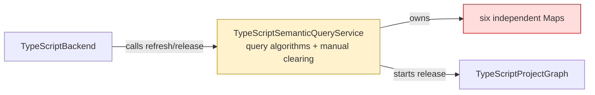
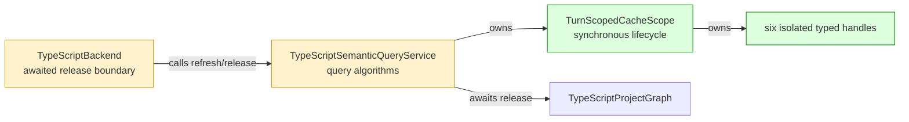

## Context

The [daemon architecture spec](https://github.com/mohasarc/symnav/blob/main/plans/005/daemon-architecture-functional-spec.md) assigns turn-scoped semantic-cache lifetime to core. Building on #126, this layer moves only cache lifetime out of TypeScript while preserving all six algorithms, key spaces, promise/value identities, and failure behavior.

## Shape

Before — TypeScript owned each cache and its clearing sequence:



After — core owns cache lifetime and the backend is the release barrier:



Legend: green = added ownership; red = removed ownership; yellow = changed responsibility.

## Where it lives

```text
.
└── packages/
    ├── core/src/
    │   ├── ** index.ts
    │   └── backend/
    │       ├── ++ turn-scoped-cache-scope.ts       # owns generic cache lifetime
    │       └── ++ turn-scoped-cache-scope.test.ts  # locks identity, error, and clearing contracts
    └── backend-typescript/src/typescript-backend/
        ├── ** typescript-semantic-query-service.ts       # adopts six isolated cache handles
        ├── ** typescript-semantic-query-service.test.ts  # characterizes TypeScript cache behavior
        └── ** typescript-backend.ts                      # owns successful-turn and release barriers
```

## Public surface

Added to `@symnav/core`:

```ts
export interface TurnScopedCache<Key, Value> {
  getOrCreate(key: Key, createValue: () => Value): Value;
}

export class TurnScopedCacheScope {
  createCache<Key, Value>(): TurnScopedCache<Key, Value>;
  beginTurn(): void;
  releaseTransientResources(): void;
}
```

Changed on exported `TypeScriptSemanticQueryService`:

```ts
// before: beginTurn(snapshot: WorkspaceSnapshot): void
beginTurn(files: readonly WorkspaceFile[]): void;

// before: releaseTransientResources(): void
releaseTransientResources(): Promise<void>;
```

## Decisions

- Chose one scope with six handles over one shared map, because the existing queries have independent key and value spaces.
- Chose `Map.has` before `Map.get` over truthiness checks, because `undefined` is a valid cached value.
- Chose synchronous cache clearing before project release over clearing after the await, because released semantics must be unavailable while release is pending or rejecting.
- Chose to begin the next turn only after refresh succeeds over clearing at refresh entry, because failed refresh must preserve the current successful turn.

## Look here

- `packages/core/src/backend/turn-scoped-cache-scope.ts:14`
- `packages/backend-typescript/src/typescript-backend/typescript-semantic-query-service.ts:129`
- `packages/backend-typescript/src/typescript-backend/typescript-backend.ts:79`

## Commits

- 44de06c631863ac27d78545d7cb9570b2ce19165 Characterize TypeScript semantic cache identities
- 67df0279bdf4d40bdfa05f813ab56475a9ffbf9c Define turn-scoped cache handles
- f515f73e93ae678f75189d02f184829e4ab895a9 Specify turn-scoped cache lifecycle
- 471a46653a6f381e4a6c7960a4f1094e2217fe3e Implement turn-scoped cache lifecycle
- 9e656518954d8e6b81966d768badce82738d4efc Specify awaited semantic resource release
- 64919bcbcf7fcc8202779b78c5f069b24662bb18 Adopt turn-scoped TypeScript query caches