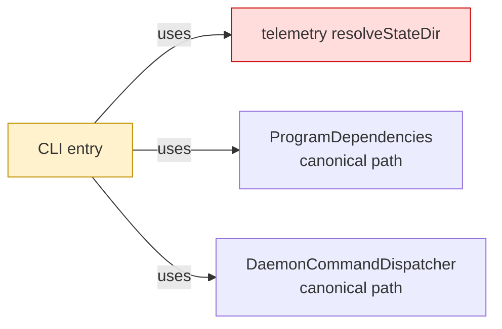
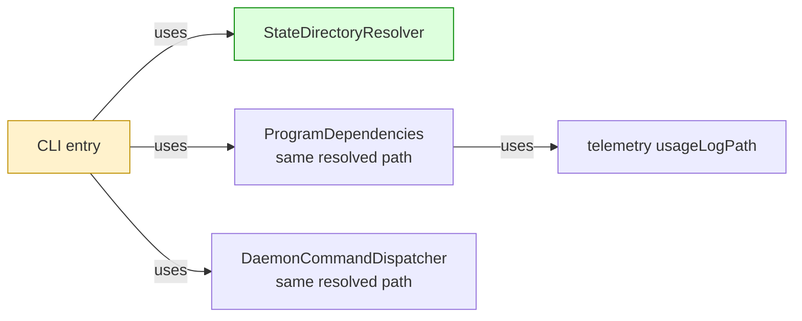

## Context

The [daemon architecture spec](https://github.com/mohasarc/symnav/blob/main/plans/005/daemon-architecture-functional-spec.md) assigns environment resolution to CLI and keeps telemetry as a zero-internal-dependency leaf. Building on #128, this layer moves the existing path algorithm without changing state layout, daemon routing, or lifecycle behavior.

## Shape

Before — telemetry selected and canonicalized the shared state path:



After — CLI resolves once and passes the same value through composition:



Legend: green = added ownership; red = removed ownership; yellow = changed responsibility; default = pre-existing and unchanged.

## Where it lives

```text
.
├── apps/cli/src/
│   ├── ++ state-directory-resolver.ts       # owns selection and canonicalization
│   ├── ++ state-directory-resolver.test.ts  # locks environment, path, and symlink behavior
│   ├── ** cli.ts                            # resolves once for top-level composition
│   └── ** program.ts                        # consumes the path and retains direct-build fallback
└── packages/telemetry/src/
    ├── ** index.ts                          # removes shared resolver exports
    ├── ** state-dir.ts                      # retains usage-log path derivation only
    └── ** state-dir.test.ts                 # locks the reduced telemetry surface
```

## Public surface

Added inside `apps/cli`:

```ts
export class StateDirectoryResolver {
  constructor(environment?: NodeJS.ProcessEnv, homeDirectory?: string);
  resolve(): string;
  static canonicalize(stateDirectory: string): string;
}
```

Removed from `@symnav/telemetry`:

```ts
export function canonicalStateDir(stateDirectory: string): string;
export function resolveStateDir(env?: NodeJS.ProcessEnv, homedir?: string): string;
```

## Decisions

- Chose a CLI-owned class over renamed telemetry functions, because CLI composes both telemetry and daemon state consumers.
- Chose one top-level resolved value over per-consumer resolution, because telemetry identity, usage writes, and daemon process paths must retain the same canonical string.
- Chose longest-existing-ancestor canonicalization over requiring the final directory to exist, because configured and default paths may contain missing tail segments.
- Chose constructor-injected environment and home values over test-time global mutation, because path selection needs deterministic isolated tests.

## Look here

- `apps/cli/src/state-directory-resolver.ts:11`
- `apps/cli/src/cli.ts:7`
- `apps/cli/src/program.ts:44`

## Commits

- f2699586a1f40a775bb47f60ee53e46c5b562715 Specify CLI state directory resolution
- c68fac83313fb2f0132ccdd50f041fb5ced1ae24 Move state directory resolution to CLI
- f773f9cd3dd46af6f620c81b4fec9028aac4c0cc Resolve the state directory at CLI composition
- 7a9ae5ca512011dac3af594712cd930d08f3f6c3 Remove shared state resolution from telemetry
- d3a3d80f24c5df2a65249ebd003222773e528d98 Stabilize controlled worker fixture synchronization
- 1fc179cef3dcb417b0f5aab2f4431919b23f0a5f Reproduce transient daemon owner reads
- b0a6ce67e50f0356138c658e149a269731c75d5b Stabilize daemon startup ownership oracle