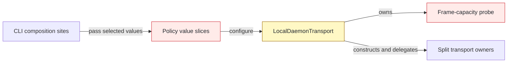
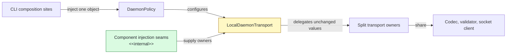

## Context

Lifecycle, execution, and socket behavior already had dedicated owners, but `LocalDaemonTransport` still accepted selected policy values and retained a frame-capacity probe. The compatibility facade remains until package composition replaces it later in the stack.

## Shape

Before — the facade retained legacy construction and framing seams:



After — one policy drives composition and the facade only delegates:



Legend: green = added; yellow = changed; red = removed; default = unchanged.

## Where it lives

```text
.
└── apps/cli/
    ├── src/
    │   ├── commands/daemon/
    │   │   └── ** register-daemon-command.ts             # passes one policy into lifecycle composition
    │   └── daemon/
    │       ├── ** local-daemon-transport.ts               # composes and delegates to split owners
    │       ├── ++ local-daemon-transport-composition.test.ts # locks wiring, identity, and ownership
    │       ├── ** ... 2 transport tests                    # use policy-based construction
    │       └── ** ... 2 daemon composition sites           # pass the runtime policy object
    └── test/helpers/
        └── ** local-daemon-transport.ts                    # keeps policy overrides test-only
```

Legend: `++` added, `**` changed, `~~` moved, `--` removed.

## Public surface

```ts
// before: constructor(policy: LocalDaemonTransportPolicy, options?: LocalDaemonTransportOptions)
constructor(options: LocalDaemonTransportOptions);

// removed
export type LocalDaemonTransportPolicy = Pick<DaemonPolicyValues, "transport" | "delivery" | "output">;
canFrame(value: unknown): boolean;
```

## Decisions

- Chose one required `DaemonPolicy` over an optional system-policy fallback, because production composition must not bypass the injected policy snapshot.
- Chose direct component injection over module mocking, because delegation tests compare returned promises and values by identity.
- Chose to remove `canFrame` over delegating the probe, because `DaemonWireCodec` already owns and tests capacity behavior.
- Chose a source architecture oracle over a line-count limit, because prohibited coordination mechanics are the boundary that must remain absent.

## Look here

- `apps/cli/src/daemon/local-daemon-transport.ts:51`
- `apps/cli/src/daemon/local-daemon-transport-composition.test.ts:31`
- `apps/cli/src/daemon/local-daemon-transport-composition.test.ts:85`

## Commits

- d1c7264be142204c6b0f3ed97e2dd630cb2cac47 Define split transport component options
- dc4043e57d051c11fddd96ebee7baa148438ba75 Specify split transport delegation
- c0263b1d003ab0b5d59682bbbb243e38ec0dc125 Delegate split transport components
- 85eb00a0cf8ac0a93ef031192a3177f17111fa50 Define split transport composition options
- f2caa0e5bd2564f02b09cfa5c448f5f28eb941e8 Specify default split transport composition
- e91023ac2b7bac39f9edc7dcf5d9cf0b490d0b8f Compose split transport from one policy
- 669e970bfa60dea28752a6b10f9c64e5dbb98480 Forbid transport mechanics in the facade
- e3fa3d8e2833454740b756ba3aecbd48bc1fe995 Keep the transport facade composition-only