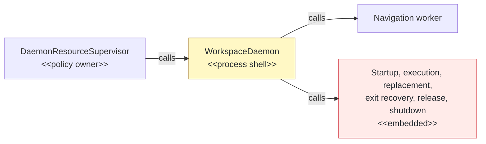
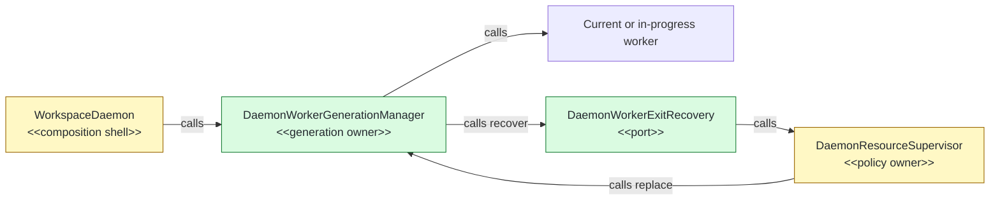

## Context

`WorkspaceDaemon` mixed worker-generation mechanics with process coordination, which blocked the planned daemon-package move. This Phase 22 stack layer follows activity-projector PR #144; the exact local CI-parity sequence passed 2,396 tests with eight expected skips, while focused mutation oracles lock lifecycle parity.

## Shape

Before — the process shell owned worker generations and their lifecycle:



After — one manager owns mechanics behind a policy-neutral recovery port:



Legend: green = added; yellow = changed; red = removed; default = unchanged.

## Where it lives

```text
.
└── apps/cli/src/daemon/
    ├── ++ daemon-worker-generation-manager.ts       # owns worker lifecycle and snapshot state
    ├── ++ daemon-worker-generation-manager.test.ts  # locks transitions, fencing, and shutdown
    ├── ** daemon-resource-monitor.ts                 # implements exit-recovery policy port
    ├── ** daemon-resource-monitor.test.ts            # locks recovery-port delegation
    ├── ** daemon-activity-projector.ts               # consumes single worker snapshot contract
    ├── ** daemon-activity-projector.test.ts          # prevents duplicate snapshot ownership
    ├── ** workspace-daemon.ts                        # composes and delegates worker mechanics
    └── ** workspace-daemon-requests.test.ts          # preserves process-level behavior
```

Legend: `++` added, `**` changed, `~~` moved, `--` removed.

## Public surface

```ts
export type DaemonWorkerReadyReport = Extract<DaemonNavigationWorkerResponse, { readonly kind: "ready" }>;
export type DaemonWorkerExecutionReport = Extract<DaemonNavigationWorkerResponse, { readonly kind: "result" }>;
export type DaemonWorkerResourceReport = Extract<DaemonNavigationWorkerResponse, { readonly kind: "heap" }>;
export interface DaemonWorkerExecuteRequest { readonly commandName: DaemonCommandName; readonly request: DaemonExecutorRequest; }
export interface DaemonWorkerExitRecovery { recover(exit: DaemonNavigationWorkerExit): Promise<void>; }
export interface DaemonWorkerGenerationSnapshot { readonly generation: number; readonly ready: boolean; readonly fileCount?: number; }
export interface DaemonWorkerGenerationManagerOptions {
  readonly workspaceRoot: string;
  readonly createWorker: (generation: number) => DaemonNavigationWorker;
  readonly initialWorker?: DaemonNavigationWorker;
  readonly exitRecovery: DaemonWorkerExitRecovery;
  readonly onActiveResourceInterruption: (cause: DaemonWorkerReplacementCause) => void;
  readonly onDiagnostic: (diagnostic: DaemonWorkerDiagnostic) => void;
}
export class DaemonWorkerGenerationManager {
  constructor(options: DaemonWorkerGenerationManagerOptions);
  get snapshot(): DaemonWorkerGenerationSnapshot;
  start(): Promise<DaemonWorkerReadyReport>;
  activateReadiness(): void;
  execute(requestId: string, request: DaemonWorkerExecuteRequest, output: DaemonOutputSink): Promise<DaemonWorkerExecutionReport>;
  replace(cause: DaemonWorkerReplacementCause): Promise<DaemonWorkerReadyReport>;
  releaseTransientResources(): Promise<DaemonWorkerResourceReport>;
  close(): Promise<void>;
  terminate(): Promise<void>;
}
```

## Decisions

- Chose one generation manager over process-shell worker fields, because startup, execution, replacement, fencing, release, and shutdown share one lifecycle state.
- Chose a recovery port over importing the resource supervisor, because replacement-window and circuit decisions remain resource policy.
- Chose explicit readiness activation over publishing readiness with the worker report, because warm-up sampling remains the admission and activity barrier.
- Chose one stored replacement operation over parallel transitions, because concurrent callers must share one generation handoff.
- Chose separate close and termination operations over one shutdown promise, because forced termination can interrupt a blocked graceful close while repeated calls retain promise identity.

## Look here

- `apps/cli/src/daemon/daemon-worker-generation-manager.ts:80`
- `apps/cli/src/daemon/daemon-worker-generation-manager.ts:122`
- `apps/cli/src/daemon/workspace-daemon.ts:223`

## Commits

- 15995e65bd9ef2caa027800b77d527e4dd316f03 Characterize worker replacement order
- 246be5c0847c76f0e01e2ffc3f1ab2f9cbc87788 Define worker generation manager contracts
- bda67590b3207ab48e433b270ae278452e5a4d0c Specify worker generation startup
- 7a5e35a21622c02401c3ef34993ec2035db17b96 Manage worker generation startup
- ebb12798f10fef247d26342af505dda09fd5bf9f Specify worker generation execution
- 38d88f314468acfd90f929f158b7e3639f388514 Delegate worker generation execution
- b69c177e643b7579d16384c64faf24d7f06ddd6e Specify worker generation replacement
- a9d438a2dcca01960e04b9ac81f5ac6716af7dac Manage worker generation replacement
- 6e3804527ed388c15e4793a5365b216a7a33ad81 Specify worker generation exit recovery
- f13cadfa84f6f6461faed8f7cc2b051d40ef7aa1 Fence worker generation exit recovery
- 377a5c7cf00b4b354661ef3eb35cc44613b47ef4 Specify worker generation resource release
- 75527597c0db35a6f932840df12694d448526328 Release current worker resources
- f5e8c4437eeff32a24ea71bde82518a8691bb95e Specify worker generation shutdown
- 03da22271244e900059ab27d66b3459e992b0658 Make worker generation shutdown idempotent
- dfd7e5c6a54d2fd879277c2e46149c1857051273 Specify worker exit recovery port
- dcfeaa7710b7d6866456d04bfe3d75bf157f24d1 Route worker exits through recovery port
- 14b7a9ea88b1814000f3b8e23230363e4a2173bb Delegate worker generation ownership
- 69da4d4a55c3dfcb9945222b19f55e2f2be4f7ac Remove embedded worker generation mechanics
- 3017637c2f7c6fc551e09739342163b62494b89c Lock active worker exit classification
- e4aee7e066f9331b4dec184117ff77958bc1d52f Lock resource interruption causes
- 7c6d9088f754ec6bc231b10d385822b2897de87d Colocate worker generation contracts
- 222d350555208733d90db93eaba4144a57809845 Specify retained worker file counts
- 6fd3decb0a3697cadb667b6ae6097349a6cde250 Retain worker file counts during transitions
- 20b214516f307c75872f8f09ffad60c862263e44 Specify warm-up readiness activation
- ce2a7489b46a3fb4b5e35082ddb4803bffe7467f Activate worker readiness after warm-up
- 7e090445074069d0b814a0b7b16d233a70650fc3 Specify worker snapshot contract ownership
- b8e8b7b85fe0e5fd0cb5784895ee090be015afa1 Reuse worker generation snapshot contract