######## PR #123 — Move workspace source caching to core
base main head agent/daemon-architecture-refactor-part-01-source-cache

## Context

Daemon workers and future hosts need source-byte caching without depending on the TypeScript backend. Moving ownership must preserve current snapshot-replacement behavior, including selection refreshes evicting omitted bytes.

## Shape

Before — TypeScript owned the reusable cache:

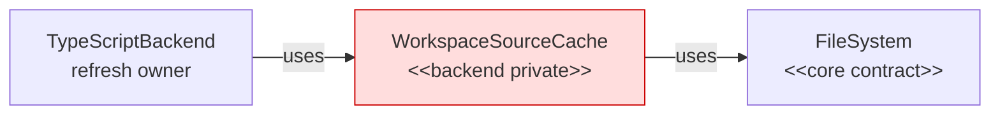

After — core owns the cache and TypeScript consumes its export:

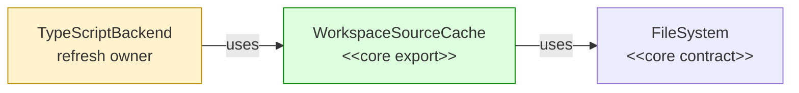

Legend: green = added; red = removed; yellow = changed.

## Where it lives

```text
.
├── ** .github/PULL_REQUEST_TEMPLATE.md               # defines context/shape-based PR descriptions
├── apps/cli/test/integration/commands/overview/
│   └── ** overview-command.test.ts                   # guards selected-file isolation across 4,000 siblings
├── packages/
│   ├── core/src/
│   │   ├── ** index.ts                               # exports the cache
│   │   └── workspace/
│   │       ├── ~~ workspace-source-cache.ts          # moved from packages/backend-typescript/src/typescript-backend/
│   │       └── ++ workspace-source-cache.test.ts     # locks replacement and delegation
│   └── backend-typescript/
│       ├── src/typescript-backend/
│       │   └── ** typescript-backend.ts              # consumes the core cache
│       └── test/integration/
│           └── ** typescript-backend.test.ts         # locks selection eviction
└── plans/005/
    └── ** daemon-follow-ups-functional-spec.md       # defers selection-aware retention
```

## Public surface

Added:

```ts
export class WorkspaceSourceCache implements FileSystem {
  constructor(fileSystem: FileSystem);
  refresh(snapshot: WorkspaceSnapshot): void;
  readFile(absPath: string): Promise<string>;
  readFileSync(absPath: string): string;
  exists(absPath: string): Promise<boolean>;
  listDir(absPath: string): Promise<readonly string[]>;
  isDirectory(absPath: string): Promise<boolean>;
  metadata(absPath: string): Promise<FileMetadata>;
  existsSync(absPath: string): boolean;
  listDirSync(absPath: string): readonly string[];
  isDirectorySync(absPath: string): boolean;
  metadataSync(absPath: string): FileMetadata;
}
```

## Decisions

- Chose core ownership over TypeScript-backend ownership, because daemon workers and future hosts need the cache without importing TypeScript code.
- Chose snapshot replacement over coverage-aware merging, because this refactor preserves current selection-eviction behavior and defers retention changes.
- Chose a `FileSystem` facade over cache-specific reads, because existing TypeScript services already consume filesystem injection.

## Look here

- `packages/core/src/workspace/workspace-source-cache.ts:10`
- `packages/backend-typescript/src/typescript-backend/typescript-backend.ts:79`
- `apps/cli/test/integration/commands/overview/overview-command.test.ts:224`


--- commits ---
* eded8cdc Characterize backend selection replacement
* e1339da2 Characterize overview selection isolation
* b1f46e6a Add core source-cache replacement
* a4e39eda Guard cached source path replacement
* 4519202d Invalidate changed cached revisions
* 3556a9cd Guard unchanged cached revisions
* 4d17681b Share cached synchronous source reads
* 15dda7be Delegate uncached filesystem operations
* f9b705cf Use core WorkspaceSourceCache in TypeScript
* 4f37b9c2 Record selection-aware source-cache follow-up
* 78dd77de Update pull request template


######## PR #124 — Publish revisioned backend state transactionally
base agent/daemon-architecture-refactor-part-01-source-cache head agent/daemon-architecture-refactor-part-02-transactional-backend-state

## Context

The daemon architecture spec assigns reusable revision comparison, prepared-file indexing, and publication to core, but TypeScript still owned them after #123 moved source caching. This layer moves those mechanics into core while preserving selection retention, TypeScript source/node identity, and `LanguageBackend` results and errors.

## Shape

Before — TypeScript state mixed portable indexes with toolchain mutation:

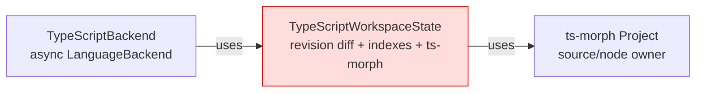

After — core publishes portable candidate state; TypeScript supplies one mutation transaction:

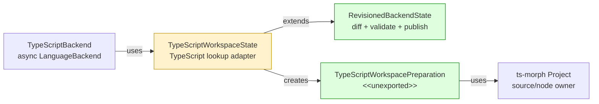

Legend: green = added ownership; red = removed ownership; yellow = changed responsibility.

## Where it lives

```text
.
└── packages/
    ├── core/src/
    │   ├── ** index.ts
    │   └── backend/
    │       ├── ++ revisioned-backend-state.ts       # owns revision/index transactions
    │       └── ++ revisioned-backend-state.test.ts  # fake incremental/full backends
    └── backend-typescript/src/
        ├── ** index.ts                               # removes backend-owned revision exports
        ├── ** ... 4 query/index consumer files      # await on-demand preparation
        └── typescript-backend/
            ├── ** typescript-backend.ts              # awaits state publication
            ├── ** typescript-workspace-state.ts      # owns ts-morph mutation journal
            └── ** ... 2 colocated tests              # async adoption and rollback boundaries
```

## Public surface

Added to `@symnav/core`:

```ts
export interface RevisionedBackendPreparedFile<PreparedDetails> {
  readonly file: WorkspaceFile;
  readonly entries: OverviewFileEntries;
  readonly details: PreparedDetails;
}

export type RevisionedBackendFileChange<PreparedDetails> =
  | { readonly kind: "added"; readonly file: WorkspaceFile }
  | {
      readonly kind: "changed";
      readonly file: WorkspaceFile;
      readonly previous: RevisionedBackendPreparedFile<PreparedDetails>;
    };

export interface RevisionedBackendPreparationRequest<PreparedDetails> {
  readonly coverage: BackendRefreshCoverage;
  readonly changes: readonly RevisionedBackendFileChange<PreparedDetails>[];
  readonly removedFiles: readonly RevisionedBackendPreparedFile<PreparedDetails>[];
  readonly effectiveFiles: readonly WorkspaceFile[];
}

export abstract class RevisionedBackendPreparation<PreparedDetails> {
  abstract prepare(): Promise<readonly RevisionedBackendPreparedFile<PreparedDetails>[]>;
  abstract commit(): Promise<void>;
  abstract rollback(): Promise<void>;
}

export interface IndexedBackendDeclaration {
  readonly declaration: SymbolOverviewNode;
  readonly file: ResolvedPath;
}

export abstract class RevisionedBackendState<PreparedDetails> {
  protected constructor(fileSystem: FileSystem);
  refresh(files: readonly WorkspaceFile[], coverage?: BackendRefreshCoverage): Promise<BackendRefreshSummary>;
  ensureFiles(files: readonly ResolvedPath[]): Promise<void>;
  fileEntries(file: ResolvedPath): Promise<OverviewFileEntries>;
  declarations(files: readonly ResolvedPath[]): Promise<readonly SymbolOverviewNode[]>;
  diagnostics(file: ResolvedPath): readonly NavigationDiagnostic[];
  declarationsIn(relativePath: string): readonly SymbolOverviewNode[] | undefined;
  declarationForIdentity(identity: SymbolIdentity): IndexedBackendDeclaration | undefined;
  currentFileCount(): number;
  protected preparedFile(relativePath: string): RevisionedBackendPreparedFile<PreparedDetails> | undefined;
  protected preparedFiles(): readonly RevisionedBackendPreparedFile<PreparedDetails>[];
  protected relativePathForAbsolute(absolutePath: string): string | undefined;
  protected abstract createPreparation(request: RevisionedBackendPreparationRequest<PreparedDetails>): RevisionedBackendPreparation<PreparedDetails>;
}
```

Changed in `@symnav/backend-typescript`:

```ts
export class TypeScriptWorkspaceState extends RevisionedBackendState<TypeScriptPreparedFileDetails> {
  // before: fileEntries(file: ResolvedPath, diagnostics?: DiagnosticSink): OverviewFileEntries
  fileEntries(file: ResolvedPath, diagnostics?: DiagnosticSink): Promise<OverviewFileEntries>;
}
```

Removed from `@symnav/backend-typescript` root:

```ts
type PreparedFileIndex;
type PreparedFileRevision;
type TypeScriptFileRevision;
```

## Decisions

- Chose an incremental overlay candidate over requiring complete preparation output, because another language backend may prepare only changed files.
- Chose candidate validation before subclass commit over post-commit validation, because malformed output must leave portable and toolchain state unpublished.
- Chose one-file selection transactions for `ensureFiles` over one aggregate transaction, because existing behavior retains earlier progress when a later file fails.
- Chose a TypeScript-owned mutation journal over core mutation callbacks, because source files and node restoration are `ts-morph` concerns.
- Chose reversible path staging before source removal over recreating removed sources, because published lookups retain exact `SourceFile` handles.

## Look here

- `packages/core/src/backend/revisioned-backend-state.ts:65`
- `packages/core/src/backend/revisioned-backend-state.ts:181`
- `packages/backend-typescript/src/typescript-backend/typescript-workspace-state.ts:159`


--- commits ---
* b0fa20d7 Define revisioned backend state contracts
* 294ca79f Diff revisioned backend files
* 0ae50165 Validate revisioned backend candidates
* a1a9a2a9 Roll back failed backend preparations
* 144f7746 Accept full backend preparation results
* f142e0bb Ensure missing backend files sequentially
* 4a70bcc8 Adopt revisioned TypeScript state preparation
* 23edd420 Preserve sequential TypeScript preparation progress
* cf0107c1 Verify TypeScript source mutation rollback
* 9643fac8 Make obsolete TypeScript removals transactional


######## PR #126 — Publish project membership transactionally
base agent/daemon-architecture-refactor-part-02-transactional-backend-state head agent/daemon-architecture-refactor-part-03-project-membership-graph

## Context

The [daemon architecture spec](https://github.com/mohasarc/symnav/blob/main/plans/005/daemon-architecture-functional-spec.md) assigns language-neutral project discovery, input invalidation, membership, and graph publication to core. TypeScript retains tsconfig parsing, package mapping, and `ts-morph` project construction without changing refresh or semantic lookup behavior.

## Shape

Before — TypeScript owned language rules and reusable graph mechanics:

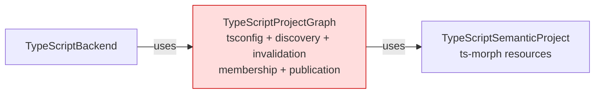

After — core owns the graph transaction and TypeScript supplies hooks:

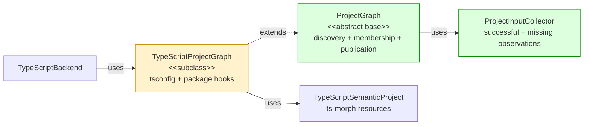

Legend: green = added; red = removed; yellow = changed; default = pre-existing and unchanged.

## Where it lives

```text
.
└── packages/
    ├── core/src/
    │   ├── ** index.ts
    │   └── workspace/
    │       ├── ++ project-graph.ts       # owns generic graph transactions
    │       └── ++ project-graph.test.ts  # proves discovery, validation, and rollback
    └── backend-typescript/src/typescript-backend/
        ├── ** typescript-project-graph.ts       # supplies TypeScript-specific hooks
        └── ** typescript-project-graph.test.ts  # preserves TypeScript edge behavior
```

## Public surface

Added to `@symnav/core`:

```ts
export interface ProjectInput {
  readonly path: string;
  readonly content: string;
}
export interface ProjectInputObservation {
  readonly path: string;
  readonly content: string | null;
}
export class ProjectInputCollector {
  constructor(fileSystem: FileSystem);
  read(path: string): string | undefined;
  observations(): readonly ProjectInputObservation[];
}
export interface ParsedProjectConfiguration<ConfigurationUnit> {
  readonly configuration: ConfigurationUnit;
  readonly referencedConfigurationPaths: readonly string[];
  readonly inputs: readonly ProjectInput[];
}
export interface ProjectConfigurationMembership<ConfigurationUnit> {
  readonly path: string;
  readonly configuration: ConfigurationUnit;
  readonly files: readonly WorkspaceFile[];
}
export interface ProjectGraphPreparationRequest<ConfigurationUnit> {
  readonly snapshot: WorkspaceSnapshot;
  readonly configurations: readonly ProjectConfigurationMembership<ConfigurationUnit>[];
  readonly inferredFiles: readonly WorkspaceFile[];
  readonly inputCollector: ProjectInputCollector;
}
export interface PreparedProjectGraph<Project> {
  readonly configuredProjects: readonly Project[];
  readonly inferredProject: Project;
  readonly inputs: readonly ProjectInput[];
}
export interface ProjectWithTransientResources {
  releaseTransientResources(): void | Promise<void>;
}
export interface ProjectGraphRefreshSummary {
  readonly root: string;
  readonly configuredProjectCount: number;
  readonly inferredFileCount: number;
  readonly changedInputCount: number;
}
export abstract class ProjectGraph<
  ConfigurationUnit,
  Project extends ProjectWithTransientResources,
> {
  protected constructor(fileSystem: FileSystem);
  protected refreshProjectGraph(snapshot: WorkspaceSnapshot): Promise<ProjectGraphRefreshSummary>;
  releaseTransientResources(): Promise<void>;
  protected primaryProjectFor(relativePath: string): Project | undefined;
  protected projectsFor(relativePath: string): readonly Project[];
  protected workspaceFile(relativePath: string): WorkspaceFile | undefined;
  protected abstract initialConfigurationPaths(root: string): readonly string[];
  protected abstract parseConfiguration(request: {
    readonly path: string;
    readonly content: string;
    readonly snapshot: WorkspaceSnapshot;
    readonly inputCollector: ProjectInputCollector;
  }): Promise<ParsedProjectConfiguration<ConfigurationUnit> | undefined>;
  protected abstract filesForConfiguration(
    configuration: ConfigurationUnit,
    snapshot: WorkspaceSnapshot,
  ): readonly WorkspaceFile[];
  protected abstract prepareProjects(
    request: ProjectGraphPreparationRequest<ConfigurationUnit>,
  ): Promise<PreparedProjectGraph<Project>>;
}
```

Changed:

```ts
export class TypeScriptProjectGraph
  extends ProjectGraph<ParsedTypeScriptConfiguration, TypeScriptSemanticProject>
  implements TypeScriptSemanticSourceProvider
```

## Decisions

- Chose a core abstract base over leaving reusable graph mechanics in TypeScript, because discovery, invalidation, membership, and publication have no TypeScript dependency.
- Chose one fresh collector per rebuild over retaining observations across graphs, because unreachable inputs must stop invalidating while missing inputs must trigger rediscovery when they appear.
- Chose exact active-input validation over an undocumented subclass precondition, because every published input must participate in the observation set that drives invalidation.
- Chose canonical snapshot members over relative-path-only membership, because project preparation must not receive a foreign path or revision identity.
- Chose complete validation followed by one state assignment over incremental mutation, because every candidate failure must preserve the prior graph.

## Look here

- `packages/core/src/workspace/project-graph.ts:99`
- `packages/core/src/workspace/project-graph.ts:253`
- `packages/core/src/workspace/project-graph.ts:271`


--- commits ---
* 84103e8b Define project membership contracts
* 96b5cfb9 Specify project input observations
* 3e144cb8 Collect exact project input observations
* fd24badd Define project graph preparation request
* 75ffe51d Specify FIFO project discovery
* f45898c4 Discover project configurations FIFO
* 46990324 Specify ordered project ownership
* 7067648a Publish ordered project ownership
* 1f975ad3 Specify inferred project fallback
* 64f3d96a Use inferred project for unowned files
* c7d1560b Specify exact project graph invalidation
* f3d5e55e Invalidate project graphs from exact inputs
* 8866a537 Specify active project input validation
* c4249a53 Validate active project input observations
* b516ef8d Specify canonical project membership
* 5ca43d4b Canonicalize project membership files
* f1b48ede Specify prepared project count validation
* 4bd89aa0 Validate prepared project counts
* 6c6c7b62 Characterize failed project preparation
* 882238c3 Specify sequential project resource release
* d01ab95d Release project resources sequentially
* 0ee6b379 Characterize missing TypeScript package inputs
* 10ab5f56 Characterize unreachable TypeScript inputs
* e8843a2c Characterize TypeScript multi-project ownership
* a1e325a5 Adopt core project graph in TypeScript


######## PR #127 — Scope semantic caches to one turn
base agent/daemon-architecture-refactor-part-03-project-membership-graph head agent/daemon-architecture-refactor-part-04-query-cache-lifecycle

## Context

The [daemon architecture spec](https://github.com/mohasarc/symnav/blob/main/plans/005/daemon-architecture-functional-spec.md) assigns turn-scoped semantic-cache lifetime to core. Building on #126, this layer moves only cache lifetime out of TypeScript while preserving all six algorithms, key spaces, promise/value identities, and failure behavior.

## Shape

Before — TypeScript owned each cache and its clearing sequence:

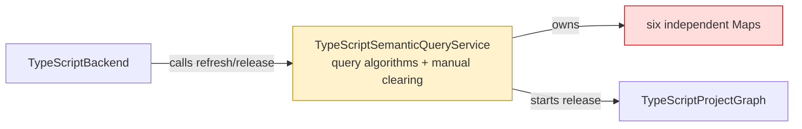

After — core owns cache lifetime and the backend is the release barrier:

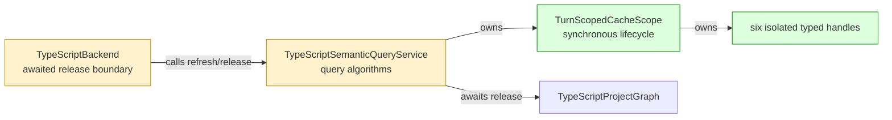

Legend: green = added ownership; red = removed ownership; yellow = changed responsibility.

## Where it lives

```text
.
└── packages/
    ├── core/src/
    │   ├── ** index.ts
    │   └── backend/
    │       ├── ++ turn-scoped-cache-scope.ts       # owns generic cache lifetime
    │       └── ++ turn-scoped-cache-scope.test.ts  # locks identity, error, and clearing contracts
    └── backend-typescript/src/typescript-backend/
        ├── ** typescript-semantic-query-service.ts       # adopts six isolated cache handles
        ├── ** typescript-semantic-query-service.test.ts  # characterizes TypeScript cache behavior
        └── ** typescript-backend.ts                      # owns successful-turn and release barriers
```

## Public surface

Added to `@symnav/core`:

```ts
export interface TurnScopedCache<Key, Value> {
  getOrCreate(key: Key, createValue: () => Value): Value;
}

export class TurnScopedCacheScope {
  createCache<Key, Value>(): TurnScopedCache<Key, Value>;
  beginTurn(): void;
  releaseTransientResources(): void;
}
```

Changed on exported `TypeScriptSemanticQueryService`:

```ts
// before: beginTurn(snapshot: WorkspaceSnapshot): void
beginTurn(files: readonly WorkspaceFile[]): void;

// before: releaseTransientResources(): void
releaseTransientResources(): Promise<void>;
```

## Decisions

- Chose one scope with six handles over one shared map, because the existing queries have independent key and value spaces.
- Chose `Map.has` before `Map.get` over truthiness checks, because `undefined` is a valid cached value.
- Chose synchronous cache clearing before project release over clearing after the await, because released semantics must be unavailable while release is pending or rejecting.
- Chose to begin the next turn only after refresh succeeds over clearing at refresh entry, because failed refresh must preserve the current successful turn.

## Look here

- `packages/core/src/backend/turn-scoped-cache-scope.ts:14`
- `packages/backend-typescript/src/typescript-backend/typescript-semantic-query-service.ts:129`
- `packages/backend-typescript/src/typescript-backend/typescript-backend.ts:79`


--- commits ---
* 44de06c6 Characterize TypeScript semantic cache identities
* 67df0279 Define turn-scoped cache handles
* f515f73e Specify turn-scoped cache lifecycle
* 471a4665 Implement turn-scoped cache lifecycle
* 9e656518 Specify awaited semantic resource release
* 64919bcb Adopt turn-scoped TypeScript query caches


######## PR #128 — Retain workspaces through core sessions
base agent/daemon-architecture-refactor-part-04-query-cache-lifecycle head agent/daemon-architecture-refactor-part-05-workspace-session

## Context

The [daemon architecture spec](https://github.com/mohasarc/symnav/blob/main/plans/005/daemon-architecture-functional-spec.md) assigns language-independent workspace retention and backend lifetime to core. Building on #127, this layer removes CLI-owned request scopes while preserving cold discovery, retained daemon turns, selection isolation, command ordering, and output behavior.

## Shape

Before — CLI-owned scopes split workspace preparation from worker resource lifetime:

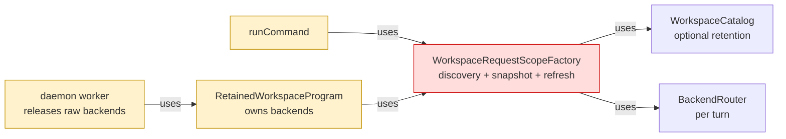

After — core sessions own request and retained preparation through one lifecycle boundary:

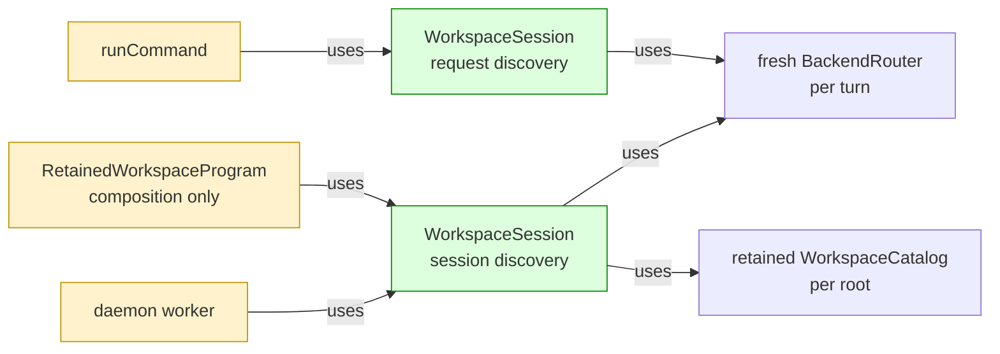

Legend: green = added ownership; red = removed ownership; yellow = changed responsibility; default = pre-existing and unchanged.

## Where it lives

```text
.
├── packages/core/src/
│   ├── ** index.ts
│   └── workspace/
│       ├── ++ workspace-session.ts       # owns discovery, preparation, routing, and release
│       └── ++ workspace-session.test.ts  # locks retention and lifecycle contracts
└── apps/cli/
    ├── src/
    │   ├── ** command.ts                           # preserves discovery and validation order
    │   ├── ** cli-program-executor.ts              # accepts an injected session
    │   ├── ** program-dependencies.ts              # replaces scope factory dependency
    │   ├── daemon/
    │   │   ├── ** retained-workspace-program.ts  # composes one retained session
    │   │   └── ** daemon-navigation-worker-entry.ts
    │   ├── -- workspace-request-scope.ts           # superseded CLI ownership
    │   └── -- workspace-request-scope.test.ts
    └── test/integration/commands/
        └── ** ... 3 files  # session injection and retained-selection coverage
```

## Public surface

Added to `@symnav/core`:

```ts
export type WorkspaceDiscoveryRetention = "request" | "session";
export type WorkspaceSnapshotSelector = (
  workspace: Workspace,
  router: BackendRouter,
) => Promise<WorkspaceSnapshot>;
export type WorkspacePreparation =
  | { readonly coverage: "workspace" }
  | { readonly coverage: "selection"; readonly selectSnapshot: WorkspaceSnapshotSelector };
export interface PreparedWorkspaceScope {
  readonly workspace: Workspace;
  readonly snapshot: WorkspaceSnapshot;
  readonly router: BackendRouter;
  readonly refresh: BackendRefreshSummary;
}
export class WorkspaceSession {
  constructor(options: {
    readonly fileSystem: FileSystem;
    readonly backends: readonly LanguageBackend[];
    readonly discoveryRetention: WorkspaceDiscoveryRetention;
  });
  prepare(startDirectory: string, preparation?: WorkspacePreparation): Promise<PreparedWorkspaceScope>;
  openWorkspace(startDirectory: string, coverage: BackendRefreshCoverage): Promise<Workspace>;
  prepareWorkspace(workspace: Workspace, preparation: WorkspacePreparation): Promise<PreparedWorkspaceScope>;
  releaseTransientResources(): Promise<void>;
}
```

Changed in CLI composition:

```ts
// before: scopeFactory?: WorkspaceRequestScopeFactory
readonly workspaceSession?: WorkspaceSession;

// before: constructor(dependencies, scopeFactory?, outputOptions?)
constructor(
  dependencies: ProgramDependencies,
  workspaceSession?: WorkspaceSession,
  outputOptions?: OrderedCommandOutputOptions,
);
```

## Decisions

- Chose explicit request/session discovery retention over one cached strategy, because cold commands must not retain a catalog while daemon turns must reuse unchanged file identity.
- Chose fresh selection discovery over retained-catalog reconciliation, because a selected file must not enumerate or fail on unrelated retained siblings.
- Chose a copied backend array and fresh router per turn over a persistent router, because backend order is session state while routing results are turn state.
- Chose explicit workspace opening before validation and preparation after validation over one combined call, because existing error and source-read ordering is observable.
- Chose repeatable concurrent release over permanent session closure, because backend cleanup must retain state and retry every backend on later calls.

## Look here

- `packages/core/src/workspace/workspace-session.ts:32`
- `apps/cli/src/command.ts:59`
- `apps/cli/src/daemon/retained-workspace-program.ts:6`


--- commits ---
* 4da5bf21 Define workspace session contracts
* 5b6ab208 Add the workspace session boundary
* de7b0d90 Specify request and retained workspace turns
* dee58943 Prepare request and retained workspace turns
* 99cbd3a5 Specify selection discovery and coverage
* cc2bbd7e Prepare selection-scoped workspace turns
* 678ee343 Specify workspace session failure boundaries
* 76672237 Propagate workspace preparation failures
* 5411dd86 Specify stable backend routing order
* d8b8c719 Stabilize backend routing order
* 06f9a977 Specify multiple-root session retention
* 90b09c0a Retain independent workspace roots
* 2d8ac0b2 Specify workspace session release lifecycle
* bb8b6404 Release workspace session resources concurrently
* 385ada10 Specify command workspace session injection
* 1818c93a Prepare commands through workspace sessions
* 08f697b9 Specify retained executor session reuse
* 65e58d0e Retain one workspace session in daemon workers
* 03cc3f2d Characterize lazy help execution
* 144e1e75 Characterize cold session construction
* ca0002b0 Migrate retained overview sessions
* ccad044c Remove CLI workspace scope ownership


######## PR #129 — Resolve state directories in CLI
base agent/daemon-architecture-refactor-part-05-workspace-session head agent/daemon-architecture-refactor-part-06-state-directory-ownership

## Context

The [daemon architecture spec](https://github.com/mohasarc/symnav/blob/main/plans/005/daemon-architecture-functional-spec.md) assigns environment resolution to CLI and keeps telemetry as a zero-internal-dependency leaf. Building on #128, this layer moves the existing path algorithm without changing state layout, daemon routing, or lifecycle behavior.

## Shape

Before — telemetry selected and canonicalized the shared state path:

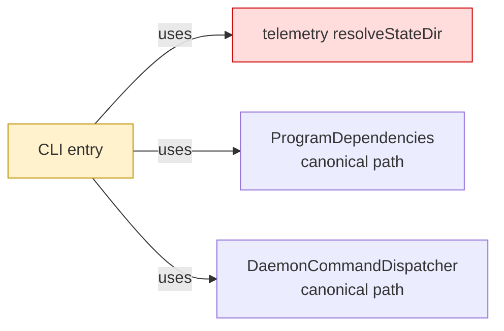

After — CLI resolves once and passes the same value through composition:

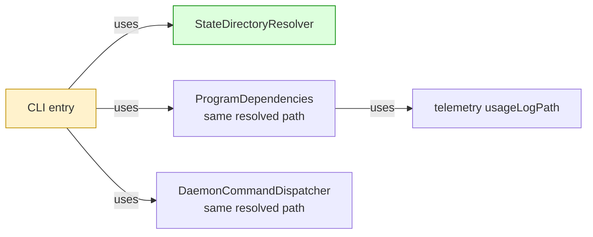

Legend: green = added ownership; red = removed ownership; yellow = changed responsibility; default = pre-existing and unchanged.

## Where it lives

```text
.
├── apps/cli/src/
│   ├── ++ state-directory-resolver.ts       # owns selection and canonicalization
│   ├── ++ state-directory-resolver.test.ts  # locks environment, path, and symlink behavior
│   ├── ** cli.ts                            # resolves once for top-level composition
│   └── ** program.ts                        # consumes the path and retains direct-build fallback
└── packages/telemetry/src/
    ├── ** index.ts                          # removes shared resolver exports
    ├── ** state-dir.ts                      # retains usage-log path derivation only
    └── ** state-dir.test.ts                 # locks the reduced telemetry surface
```

## Public surface

Added inside `apps/cli`:

```ts
export class StateDirectoryResolver {
  constructor(environment?: NodeJS.ProcessEnv, homeDirectory?: string);
  resolve(): string;
  static canonicalize(stateDirectory: string): string;
}
```

Removed from `@symnav/telemetry`:

```ts
export function canonicalStateDir(stateDirectory: string): string;
export function resolveStateDir(env?: NodeJS.ProcessEnv, homedir?: string): string;
```

## Decisions

- Chose a CLI-owned class over renamed telemetry functions, because CLI composes both telemetry and daemon state consumers.
- Chose one top-level resolved value over per-consumer resolution, because telemetry identity, usage writes, and daemon process paths must retain the same canonical string.
- Chose longest-existing-ancestor canonicalization over requiring the final directory to exist, because configured and default paths may contain missing tail segments.
- Chose constructor-injected environment and home values over test-time global mutation, because path selection needs deterministic isolated tests.

## Look here

- `apps/cli/src/state-directory-resolver.ts:11`
- `apps/cli/src/cli.ts:7`
- `apps/cli/src/program.ts:44`


--- commits ---
* f2699586 Specify CLI state directory resolution
* c68fac83 Move state directory resolution to CLI
* f773f9cd Resolve the state directory at CLI composition
* 7a9ae5ca Remove shared state resolution from telemetry
* d3a3d80f Stabilize controlled worker fixture synchronization
* 1fc179ce Reproduce transient daemon owner reads
* b0a6ce67 Stabilize daemon startup ownership oracle


######## PR #130 — Establish daemon package and policy snapshot
base agent/daemon-architecture-refactor-part-06-state-directory-ownership head agent/daemon-architecture-refactor-part-07-daemon-package-policy-snapshot

## Context

Daemon contracts and thresholds lived beside CLI mechanisms, so package rules could not enforce leaf ownership and detached processes received only reconstructed resource subsets. This layer establishes the leaf contract/policy owner and carries one complete snapshot through process and worker boundaries; operational consumer migration stays in the next stack layer.

## Shape

Before — CLI owned the portable boundary and policy inputs alongside mechanisms:

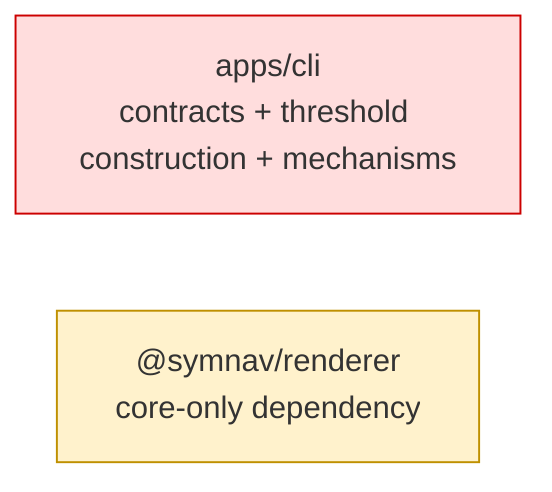

After — daemon contracts and the immutable snapshot have a leaf owner:

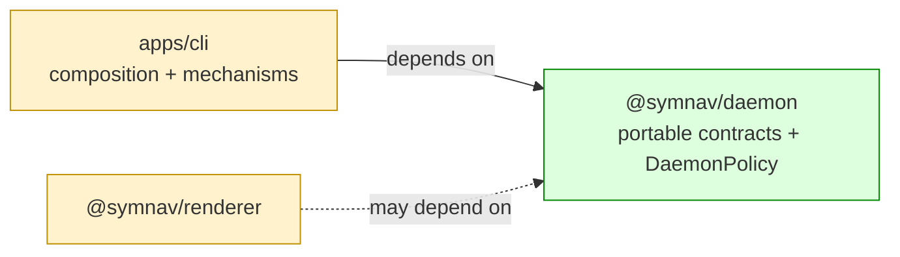

Legend: green = added ownership; red = removed ownership; yellow = changed responsibility or dependency permission.

- CLI creates one `DaemonPolicy` from system memory.
- Launch, process-entry, and worker-entry boundaries pass the complete versioned snapshot.
- Existing daemon mechanisms remain under `apps/cli` in this layer.

## Where it lives

```text
.
├── ** AGENTS.md                         # records daemon ownership and locked dependencies
├── ** eslint.config.mjs                 # registers daemon and test-only policy access
├── ** tsconfig.json                     # adds daemon to the root build graph
├── ** pnpm-lock.yaml                    # records workspace links
├── ** apps/cli/                         # 27 files compose and propagate one snapshot
├── ++ packages/daemon/
│   ├── ++ package.json                  # leaf ESM package with exact root/test exports
│   ├── ++ tsconfig*.json                # production leaf and test references
│   ├── ++ src/
│   │   ├── ++ ... 4 contract files      # executor, diagnostics, commands, lifecycle reports
│   │   ├── ++ daemon-policy.ts          # defaults, memory recipes, freezing, strict codec
│   │   ├── ++ index.ts                  # closed public root
│   │   ├── ++ policy-testing.ts         # temporary test-only override factory
│   │   └── ++ ... 2 test files          # exact type/declaration/runtime policy oracles
│   └── ++ test/public-import.test.ts     # package import surface proof
├── ** packages/renderer/                 # 2 files permit the future daemon-report edge
├── ** meta-tests/src/                    # 3 files enforce graph, exports, and policy docs
└── plans/
    ├── ** 000/symnav-stages.md           # records the contract-first migration milestone
    └── ++ 005/daemon-policy.md           # enumerates every value, recipe, and absence
```

Legend: `++` added, `**` changed, `~~` moved, `--` removed.

## Public surface

Added at `@symnav/daemon` root:

```ts
export interface DaemonExecutor {
  initialize(workspaceRoot: string): Promise<DaemonExecutorInitializationResult>;
  execute(request: DaemonExecutorRequest): Promise<DaemonExecutorExecutionResult>;
  releaseTransientResources(): Promise<void>;
}

export class DaemonPolicy {
  private constructor(values: DaemonPolicyValues);
  static currentSystem(): DaemonPolicy;
  static fromSystemMemory(memory: DaemonSystemMemory): DaemonPolicy;
  static fromSerialized(value: unknown): DaemonPolicy;
  readonly values: DaemonPolicyValues;
  toSerialized(): Readonly<{
    readonly schemaVersion: 1;
    readonly values: DaemonPolicyValues;
  }>;
}
```

The root also adds type-only command, diagnostic, executor request/output, activity, status, start, and stop contracts. Temporary `@symnav/daemon/policy-testing` exports only `DaemonPolicyTestFactory`; production imports are rejected.

## Decisions

- Chose a zero-internal-dependency package over keeping portable contracts in CLI, because future daemon mechanisms need an enforceable owner.
- Chose a complete versioned snapshot over partial per-hop options, because process and worker boundaries must preserve exact derived values.
- Chose a restricted `./policy-testing` subpath over root-level overrides, because tests need independent values without creating a user tuning surface.
- Chose AST, declaration, runtime, manifest, and dependency allowlists over documentation alone, because public-surface and package-graph drift must fail CI.
- Chose a cut after snapshot propagation over including operational consumer migration, because policy transport and threshold adoption are separate review concerns.

## Look here

- `packages/daemon/src/daemon-policy.ts:91`
- `packages/daemon/src/daemon-policy.ts:185`
- `apps/cli/src/daemon/daemon-process-launcher.ts:122`


--- commits ---
* 66328a7c Specify the daemon host contract
* 0e1c76d3 Define the daemon host contract
* 7dc82aaf Specify the daemon project graph
* eb85a0fe Wire the daemon workspace package
* e4af9b9b Specify daemon boundary registration
* 6f46c0ae Register the daemon lint boundary
* 7c24fb87 Specify daemon lint permissions
* 6713cddd Enforce daemon lint permissions
* 0370a6ed Document the daemon package ownership
* 1409e5e9 Specify import-equals export detection
* fd23ff7f Detect import-equals exports
* 6aaea736 Specify the complete daemon policy
* f3fcd99c Define the complete daemon policy
* e18af3c0 Specify daemon policy documentation
* c1737748 Document every daemon policy threshold
* 1ef73960 Specify complete daemon policy propagation
* b32bbb41 Thread one daemon policy snapshot
* b3a6c4fa Resolve daemon contract source URLs portably


######## PR #131 — Route daemon thresholds through centralized policy
base agent/daemon-architecture-refactor-part-07-daemon-package-policy-snapshot head agent/daemon-architecture-refactor-part-08-daemon-policy-consumers

## Context

The preceding stack layer defines `DaemonPolicy` and carries one complete snapshot across process and worker boundaries. CLI daemon mechanisms still owned local defaults, optional numeric overrides, and hard-coded timeout/retry behavior, so runtime consumers could bypass that snapshot.

## Shape

Before — operational consumers retained their own threshold inputs:

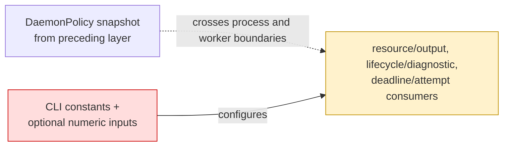

After — each consumer receives its required policy section:

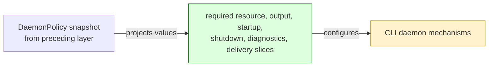

Legend: green = added policy input; red = removed local ownership; yellow = changed consumer.

- Output capture, completion spooling, framing, worker chunk validation, and resource supervision use required output/resource slices.
- Startup, shutdown, idle lifetime, process termination, acknowledgement polling, logging, and trace retention use required lifecycle/diagnostic slices.
- Status observation selects its 100 ms timeout by composition purpose; ordinary lifecycle and execution-status exchanges retain 250 ms.
- Result fetch resumes and post-accept execution reattachments consume independent numeric budgets.

## Where it lives

```text
.
├── apps/cli/
│   ├── src/
│   │   ├── ** cli-program-executor.ts              # supplies output policy to command capture
│   │   ├── ** command-execution-result.ts           # applies chunk, inline, and result capacities
│   │   ├── ** commands/daemon/                      # composes lifecycle policy and status timeout purpose
│   │   └── ** daemon/
│   │       ├── ** ... 16 implementation files      # consume required operational policy slices
│   │       └── ** ... 15 test files                # preserve threshold and retry behavior
│   └── test/
│       ├── ** ... 7 e2e/benchmark files            # retain process and output parity
│       └── helpers/
│           ├── ++ ... 7 files                      # adapt legacy test knobs to validated policies
│           └── ** ... 10 files                     # use policy-backed helpers
└── meta-tests/src/
    └── ** daemon-package.test.ts                    # rejects retired defaults and bypasses
```

Legend: `++` added, `**` changed, `~~` moved, `--` removed.

## Decisions

- Chose required policy slices over optional per-consumer numbers, because omitted composition must not recreate local defaults.
- Chose composition-purpose timeout selection over request-kind selection, because status observation and ordinary execution-status requests have distinct deadlines.
- Chose independent numeric resume and reattachment counters over one shared boolean, because each reattached execute attempt has its own fetch-resume allowance.
- Chose test-only adapters over production compatibility overloads, because tests need small thresholds without restoring runtime tuning seams.

## Look here

- `apps/cli/src/daemon/local-daemon-transport.ts:289`
- `apps/cli/src/daemon/local-daemon-transport.ts:402`
- `apps/cli/src/daemon/workspace-daemon.ts:113`


--- commits ---
* d7c3ceef Specify resource and output policy slices
* 8dca0473 Route resource and output policy
* 5830598f Specify lifecycle and diagnostic policy slices
* bb020597 Route lifecycle and diagnostic policy
* 3f673305 Specify distinct daemon deadlines and attempts
* b100221d Preserve distinct daemon attempt limits


######## PR #132 — Own one daemon command vocabulary
base agent/daemon-architecture-refactor-part-08-daemon-policy-consumers head agent/daemon-architecture-refactor-part-09-command-vocabulary

## Context

Command labels had four runtime owners, and daemon process code inferred operational identity by scanning opaque argv. A command-looking option value or target could therefore override the command selected by CLI syntax.

## Shape

Before — command identity was reconstructed after CLI routing:

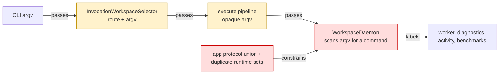

After — CLI classifies once and every daemon boundary carries that identity:

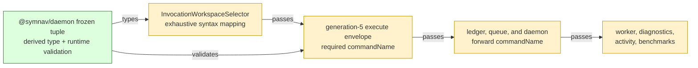

Legend: green = added authority; red = removed authority or derivation; yellow = changed path.

- Argv normalization remains independent from command identity.
- Readiness still executes `--version` with telemetry disabled, now labeled explicitly as `version`.
- Generation-4 requests are rejected before execution, and generation-5 clients replace generation-4 daemons before readiness.

## Where it lives

```text
.
├── packages/daemon/
│   ├── src/
│   │   ├── ** daemon-command-name.ts              # owns tuple, validator, and readiness shape
│   │   ├── ++ daemon-command-name.test.ts         # locks values and runtime immutability
│   │   ├── ** host-contract.test.ts               # locks source, declarations, and exports
│   │   └── ** index.ts                            # exposes root value and type contracts
│   └── test/
│       └── ** public-import.test.ts                # verifies consumer-visible surface
└── apps/cli/
    ├── src/daemon/
    │   ├── ** invocation-workspace-selector.ts    # maps CLI syntax once
    │   ├── ** ... 14 production files             # carry identity through daemon boundaries
    │   └── ** ... 12 colocated test files          # lock mapping and propagation
    └── test/
        └── ** ... 9 files                         # preserve process, e2e, and benchmark behavior
```

Legend: `++` added, `**` changed, `~~` moved, `--` removed.

## Public surface

Added at the `@symnav/daemon` root:

```ts
export const DAEMON_COMMAND_NAMES: readonly ["overview", "resolve", "def", "refs", "context", "graph", "stats", "help", "version", "unknown"];
export interface DaemonReadinessProbe {
  readonly commandName: DaemonCommandName;
  readonly argv: readonly string[];
}
```

## Decisions

- Chose a frozen daemon-owned tuple over another app-local set, because runtime validation and the union must change together.
- Chose an exhaustive CLI record over deriving workspace routes from the full tuple, because help, version, control, and unknown are syntax routes rather than workspace commands.
- Chose `commandName` beside opaque argv over nesting or reparsing it, because argv normalization and operational labeling have different owners.
- Chose to include `commandName` in accepted-request compatibility over comparing argv alone, because retry attachment must preserve original operational identity.
- Chose a new protocol generation over optional or legacy command metadata, because either mixed-generation direction must take established compatibility handling before execution.

## Look here

- `apps/cli/src/daemon/invocation-workspace-selector.ts:6`
- `apps/cli/src/daemon/daemon-protocol.ts:7`
- `apps/cli/src/daemon/accepted-request-ledger.ts:209`


--- commits ---
* 7184bbd3 Specify the daemon command vocabulary
* 6898be72 Define the daemon command vocabulary
* f7294767 Specify exhaustive CLI command mapping
* 790b58f4 Map CLI routes to daemon command names
* cf807d16 Specify explicit daemon command propagation
* 9dd51416 Propagate daemon command names explicitly
* bc0af5cf Advance daemon protocol for command metadata
* f5fcbfed Resolve command contract source URL portably


######## PR #133 — Unify daemon execution failure vocabulary
base agent/daemon-architecture-refactor-part-09-command-vocabulary head agent/daemon-architecture-refactor-part-10-execution-failure-vocabulary

## Context

Execution failures previously used an app-owned outer union, a colliding worker-thread alias, and repeated validators and classification branches. This change gives `@symnav/daemon` one outer authority while preserving every serialized string and client outcome.

## Shape

Before — outer execution failures had several app-owned authorities, while worker failures reused the same type name:

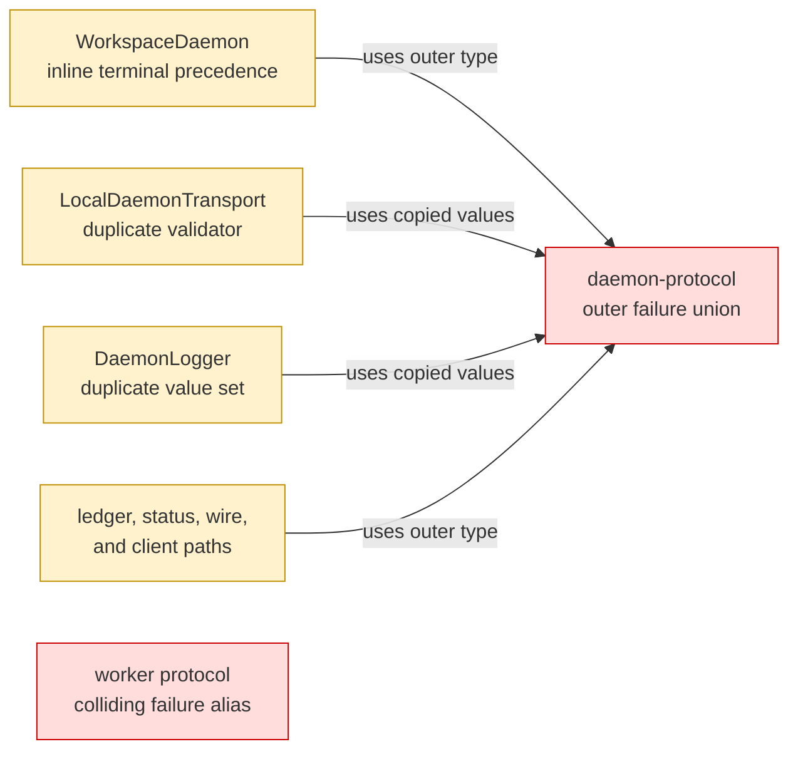

After — daemon owns the closed outer vocabulary and precedence; the CLI supplies app-owned error identity facts:

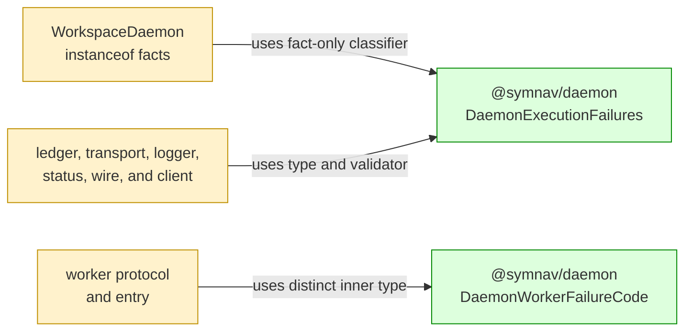

Legend: green = added authority; red = removed authority or collision; yellow = changed path.

- Outer classification preserves resource, capacity, worker-exit, and shutdown precedence.
- Worker values remain `initialization`, `execution`, `protocol`, and `resource` on the wire.
- Accepted terminal failures retain their controlled client result and never replay work.

## Where it lives

```text
.
├── packages/daemon/
│   ├── src/
│   │   ├── ++ daemon-execution-failure.ts       # owns outer validation, precedence, and both vocabularies
│   │   ├── ++ daemon-execution-failure.test.ts  # locks closed sets and precedence
│   │   ├── ** host-contract.test.ts             # locks source and declaration exports
│   │   └── ** index.ts                          # exposes root runtime and type contracts
│   └── test/
│       └── ** public-import.test.ts              # verifies consumer-visible imports
└── apps/cli/src/daemon/
    ├── ** workspace-daemon.ts                   # derives app-owned identity facts
    ├── ** daemon-navigation-worker-protocol.ts  # adopts distinct worker failure type
    ├── ** daemon-navigation-worker-entry.ts     # emits unchanged worker values
    ├── ** ... 5 outer consumer files            # protocol, ledger, transport, logging, and client mapping
    └── ** ... 5 colocated test files             # lock boundaries, subtype behavior, and no replay
```

Legend: `++` added, `**` changed, `~~` moved, `--` removed.

## Public surface

Added at the `@symnav/daemon` root:

```ts
export type DaemonExecutionFailureCode = (typeof executionFailureCodes)[number];
export type DaemonWorkerFailureCode = "initialization" | "execution" | "protocol" | "resource";
export interface DaemonExecutionFailureContext {
  readonly resourceInterrupted: boolean;
  readonly responseCapacityExceeded: boolean;
  readonly workerExited: boolean;
  readonly shutdownFailureCode?: "stopping" | "controlled-resource";
  readonly shutdownStarted: boolean;
}
export class DaemonExecutionFailures {
  static isCode(value: unknown): value is DaemonExecutionFailureCode;
  static classify(context: DaemonExecutionFailureContext): DaemonExecutionFailureCode;
}
```

## Decisions

- Chose one private outer tuple with a derived union over repeated app-local unions, because runtime validation and compile-time vocabulary must change together.
- Chose a distinct worker type with no shared literals over retaining the colliding alias, because inner worker failures and outer request-completion failures are different domains.
- Chose a pure context classifier over lifecycle-specific branching at the call site, because precedence is exhaustively testable without constructing a workspace daemon.
- Chose app-owned `instanceof` fact derivation over constructor-name or `error.name` reflection, because it preserves subtype behavior without reversing package dependencies or accepting spoofed errors.

## Look here

- `packages/daemon/src/daemon-execution-failure.ts:26`
- `apps/cli/src/daemon/workspace-daemon.ts:641`
- `apps/cli/src/daemon/local-daemon-transport.ts:1347`


--- commits ---
* 47e5d214 Specify daemon failure vocabularies
* b24fc749 Define daemon execution failure authority
* 6dbd687b Rename the worker failure code type
* fd8175c9 Specify execution failure boundaries
* 04ef2e5d Centralize execution failure classification
* b62f93c5 Resolve failure contract source URL portably


######## PR #134 — Make daemon admission rejection authoritative
base agent/daemon-architecture-refactor-part-10-execution-failure-vocabulary head agent/daemon-architecture-refactor-part-11-admission-rejection

## Context

Execution admission mixed authentication, daemon state, duplicate compatibility, wire framing, and retry booleans in app-owned branches. `@symnav/daemon` now owns rejection order and retry meaning without changing disconnect, sampling, queue, duplicate, or fallback behavior.

## Shape

Before — app code owned admission order, rejection frames, and retry interpretation:

```mermaid
flowchart LR
    Workspace["WorkspaceDaemon<br/>hand-ordered branches +<br/>mutation-time duplicate check"]
    Protocol["daemon-protocol<br/>app-owned rejection union"]
    Transport["LocalDaemonTransport<br/>copied code validator +<br/>trusted retrySafe"]
    Fallback["dispatcher fallback<br/>local replay gate"]

    Workspace -->|"uses caller-supplied retrySafe"| Protocol
    Transport -->|"uses copied rejection set"| Protocol
    Fallback -->|"uses wire retrySafe"| Transport

    style Workspace fill:#ffdddd,stroke:#cc0000
    style Protocol fill:#ffdddd,stroke:#cc0000
    style Transport fill:#ffdddd,stroke:#cc0000
```

After — daemon contracts own first-failure decisions, frame consistency, and code-derived retry safety:

```mermaid
flowchart LR
    Ledger["AcceptedRequestLedger<br/>side-effect-free compatibility"]
    Workspace["WorkspaceDaemon<br/>projects admission context"]
    Policy["@symnav/daemon<br/>DaemonAdmissionPolicy"]
    Rejections["@symnav/daemon<br/>DaemonAdmissionRejections"]
    Transport["LocalDaemonTransport<br/>validates and projects code"]
    Fallback["dispatcher fallback<br/>local replay gate"]

    Workspace -->|"uses compatibility"| Ledger
    Workspace -->|"uses ordered decision"| Policy
    Workspace -->|"uses derived frame"| Rejections
    Transport -->|"uses consistency + retry table"| Rejections
    Fallback -->|"uses derived retrySafe"| Transport

    style Ledger fill:#fff2cc,stroke:#bf9000
    style Workspace fill:#fff2cc,stroke:#bf9000
    style Policy fill:#ddffdd,stroke:#008800
    style Rejections fill:#ddffdd,stroke:#008800
    style Transport fill:#fff2cc,stroke:#bf9000
```

Legend: green = added authority; red = removed authority; yellow = changed path.

- Guard precedence is authentication, worker readiness, resource pressure, queue state, then duplicate compatibility.
- Authentication mismatch still disconnects without a rejection frame or resource sample.
- Authenticated `not-ready`, `resource-pressure`, and `draining` rejections remain replayable; `incompatible` does not.

## Where it lives

```text
.
├── packages/daemon/
│   ├── src/
│   │   ├── ++ daemon-admission.ts             # owns guards, frames, validation, and retry safety
│   │   ├── ++ daemon-admission.test.ts        # locks pairwise precedence and retry table
│   │   ├── ** host-contract.test.ts           # locks exact source and declaration surface
│   │   └── ** index.ts                        # exposes admission contracts at package root
│   └── test/
│       └── ** public-import.test.ts            # verifies consumer-visible imports
└── apps/cli/src/daemon/
    ├── ** workspace-daemon.ts                 # projects state into synchronous policy decisions
    ├── ** accepted-request-ledger.ts          # reports compatibility without mutation
    ├── ** local-daemon-transport.ts           # validates frames and derives retry projection
    ├── ** daemon-protocol.ts                  # reuses daemon-owned frame vocabulary
    ├── ** workspace-request-queue.ts          # reuses daemon-owned queue-state vocabulary
    └── ** ... 4 test files                    # preserve admission, wire, duplicate, and fallback behavior
```

Legend: `++` added, `**` changed, `~~` moved, `--` removed.

## Public surface

Added at the `@symnav/daemon` root:

```ts
export type DaemonExecuteRejectionCode =
  | "not-ready"
  | "draining"
  | "resource-pressure"
  | "incompatible";
export type AcceptedRequestCompatibility = "unseen" | "matching" | "conflicting";
export type WorkspaceRequestQueueState = "accepting" | "draining" | "closed";
export type DaemonExecutionCoordinates = {
  readonly instanceId: string;
  readonly processToken: string;
  readonly requestId: string;
};
export type DaemonRejectedExecutionFrame = {
  readonly kind: "rejected";
  readonly instanceId: string;
  readonly processToken: string;
  readonly requestId: string;
  readonly code: DaemonExecuteRejectionCode;
  readonly retrySafe: boolean;
};
export interface DaemonAdmissionContext {
  readonly request: unknown;
  readonly authenticated: boolean;
  readonly workerReady: boolean;
  readonly resourceAdmissionPaused: boolean;
  readonly queueState: WorkspaceRequestQueueState;
  readonly compatibility: AcceptedRequestCompatibility;
}
export interface DaemonAdmissionGuard {
  rejectionFor(context: DaemonAdmissionContext): DaemonAdmissionRejectionCode | undefined;
}
export type DaemonAdmissionRejectionCode = "authentication" | DaemonExecuteRejectionCode;
export type DaemonAdmissionDecision =
  | { readonly kind: "accept" }
  | { readonly kind: "disconnect"; readonly code: "authentication" }
  | { readonly kind: "reject"; readonly code: DaemonExecuteRejectionCode };
export class DaemonAdmissionPolicy {
  decide(context: DaemonAdmissionContext): DaemonAdmissionDecision;
}
export class DaemonAdmissionRejections {
  static retrySafe(code: DaemonExecuteRejectionCode): boolean;
  static frame(
    code: DaemonExecuteRejectionCode,
    coordinates: DaemonExecutionCoordinates,
  ): DaemonRejectedExecutionFrame;
  static assertConsistent(frame: DaemonRejectedExecutionFrame): void;
}
```

## Decisions

- Chose explicit guard classes over inline conditionals, because first-failure order is visible and exhaustively testable as one policy.
- Chose side-effect-free ledger compatibility over mutation-time corruption handling, because conflicts must reject without changing accepted state.
- Chose code-derived retry safety over trusting wire booleans, because contradictory frames must be corrupt rather than replayable.
- Chose `unknown` for the temporary request field over importing the CLI request type, because `@symnav/daemon` must remain dependency-free until the daemon-owned executor contract replaces it.

## Look here

- `packages/daemon/src/daemon-admission.ts:85`
- `apps/cli/src/daemon/workspace-daemon.ts:556`
- `apps/cli/src/daemon/local-daemon-transport.ts:1293`


--- commits ---
* 97edfebf Characterize authentication admission disconnect
* bb218351 Characterize ordered admission boundaries
* e75156fd Characterize nonawaited admission sampling
* 4bfd4c1c Specify daemon admission contracts
* 2f66bf87 Define daemon admission contracts
* dc949502 Specify ordered daemon admission policy
* f35a9d55 Enforce ordered daemon admission policy
* 105256cd Specify daemon admission rejection authority
* e6072529 Define daemon admission rejection authority
* 37ead002 Specify code-derived admission retry safety
* 686c6390 Derive admission retry safety from rejection codes
* 2a98b1d5 Specify side-effect-free duplicate compatibility
* ad0d4594 Expose accepted-request compatibility
* f80e430d Route execution admission through ordered guards
* f5120112 Resolve admission contract source URL portably


######## PR #135 — Execute daemon work through an injected host module
base agent/daemon-architecture-refactor-part-11-admission-rejection head agent/daemon-architecture-refactor-part-12-injected-host-module

## Context

Daemon workers constructed CLI and core execution objects directly, despite `@symnav/daemon` needing to remain free of internal package dependencies. This range injects the CLI executor through an absolute module URL and preserves execution, output, diagnostics, readiness, and resource-reporting behavior.

## Shape

Before — worker code owned host-specific execution construction:

```mermaid
flowchart LR
    Worker["Daemon worker<br/>CLI/core imports"]
    Adapter["RetainedWorkspaceProgram"]
    Session["WorkspaceSession +<br/>CliProgramExecutor"]

    Worker -->|"constructs"| Adapter
    Adapter -->|"constructs"| Session

    style Worker fill:#fff2cc,stroke:#bf9000
    style Adapter fill:#ffdddd,stroke:#cc0000
```

After — CLI supplies a validated host module through process and worker configuration:

```mermaid
flowchart LR
    Composition["CLI composition"]
    Configuration["daemon process +<br/>worker configuration"]
    Worker["Daemon worker<br/>daemon contracts only"]
    Loader["DaemonExecutorModuleLoader"]
    Executor["CLI DaemonExecutor"]
    Session["WorkspaceSession +<br/>CliProgramExecutor"]

    Composition -->|"absolute file URL"| Configuration
    Configuration -->|"worker data"| Worker
    Worker -->|"module URL + host options"| Loader
    Loader -->|"validated factory result"| Executor
    Executor -->|"retained session"| Session

    style Composition fill:#fff2cc,stroke:#bf9000
    style Configuration fill:#fff2cc,stroke:#bf9000
    style Worker fill:#fff2cc,stroke:#bf9000
    style Loader fill:#ddffdd,stroke:#008800
    style Executor fill:#ddffdd,stroke:#008800
```

Legend: green = added ownership; red = removed ownership; yellow = changed path.

- Worker output is sequenced and rechunked at the daemon policy cap before each acknowledgement.
- Recursive diagnostics remain opaque across the host boundary while known timing and refresh fields are projected defensively.
- The final test-only commit resolves Phase 12's material carry: deferred adapter sampling and a no-op worker callback now fail mutation-resistant request-local heap tests.

## Where it lives

```text
.
├── packages/daemon/
│   ├── ** src/daemon-diagnostics.ts                   # validates recursive JSON-like diagnostics
│   ├── ** src/daemon-executor.ts                      # owns host contracts and module loading
│   ├── ** src/index.ts                                # exposes the daemon package surface
│   └── ** ... 3 contract and public-import tests      # lock the dependency-free boundary
└── apps/cli/
    ├── ++ src/daemon-executor.ts                      # implements the injected host factory
    ├── ++ src/daemon-executor.test.ts                 # proves synchronous phase sampling
    ├── ** src/commands/daemon/register-daemon-command.ts # supplies the executor module URL
    ├── ** src/daemon/
    │   ├── ** daemon-navigation-worker-entry.ts       # loads, validates, executes, and samples
    │   ├── ** daemon-navigation-worker-protocol.ts    # carries daemon-owned messages
    │   ├── ** daemon-process-launcher.ts              # propagates strict process configuration
    │   ├── ++ local-daemon-output.ts                  # bridges daemon output to CLI storage
    │   ├── -- retained-workspace-program.ts           # superseded worker-local adapter
    │   └── ** ... 20 files                            # preserve lifecycle and transport behavior
    └── test/
        ├── ++ helpers/injected-daemon-executor-fixture.mjs
        ├── ++ helpers/resource-sampling-daemon-executor-fixture.mjs
        └── ** ... 7 files                             # preserve process, parity, and lifecycle behavior
```

Legend: `++` added, `**` changed, `~~` moved, `--` removed.

## Public surface

Added at the `@symnav/daemon` root and CLI executor module:

```ts
export class DaemonDiagnosticValues {
  static isDiagnostics(value: unknown): value is DaemonDiagnostics;
}
export interface DaemonSequencedOutputRecord extends DaemonOutputRecord { readonly sequence: number; }
export interface DaemonOutputSink { append(record: DaemonSequencedOutputRecord): Promise<void>; }
export class DaemonExecutorModuleLoader {
  static load(moduleUrl: DaemonExecutorModuleUrl, options: DaemonExecutorFactoryOptions): Promise<DaemonExecutor>;
}
export function createDaemonExecutor(options: DaemonExecutorFactoryOptions): DaemonExecutor;
export function daemonExecutorModuleUrl(): DaemonExecutorModuleUrl;
```

Changed:

```ts
export interface DaemonExecutorFactoryOptions {
  readonly stateDirectory: string;
  readonly productVersion: string;
  readonly sampleResources: () => void;
}
```

## Decisions

- Chose an absolute injected file URL over importing CLI code from daemon mechanisms, because the daemon package must keep zero internal dependencies.
- Chose recursive JSON-like diagnostics over a CLI refresh-summary contract, because worker telemetry can project known fields without owning host-specific diagnostics.
- Chose worker-side rechunking and sequencing over transport metadata in executor output, because chunk limits and acknowledgement flow belong to the worker protocol.
- Chose runtime validation over trusting dynamically imported TypeScript shapes, because invalid host modules must retain existing initialization and execution failure handling.
- Chose a daemon-owned no-payload sampling callback over sharing CLI command-phase types, because synchronous phase boundaries must update the active request's heap high-water without reversing dependency direction.

## Look here

- `packages/daemon/src/daemon-executor.ts:105`
- `apps/cli/src/daemon/daemon-navigation-worker-entry.ts:89`
- `apps/cli/src/daemon-executor.ts:53`


--- commits ---
* cb7acede Specify the CLI daemon executor
* 86cbadc5 Implement the CLI daemon executor
* 6bd8c92b Specify daemon output and diagnostic contracts
* d384ae39 Define daemon output and diagnostic contracts
* 98595d68 Specify daemon-owned worker messages
* b722a4a6 Use daemon-owned worker messages
* c139cbe9 Specify executor module URL propagation
* 9bfc7055 Thread the executor module URL
* 93e93c49 Specify strict daemon process configuration
* c7a51af6 Validate daemon process configuration exactly
* d176d50b Specify executor module loading
* 0c2c8fcc Load injected daemon executor modules
* 169115c8 Specify injected worker execution
* d5f127b6 Execute workers through injected host modules
* 47853f2e Prove injected executor readiness parity
* c6bea774 Prove synchronous worker resource sampling
* 38dfceb5 Cover encoded executor module paths
* 0d521802 Load executor modules through the host runtime
* 323888b8 Budget retained executor integration tests


######## PR #136 — Render daemon lifecycle reports in renderer
base agent/daemon-architecture-refactor-part-12-injected-host-module head agent/daemon-architecture-refactor-part-13-lifecycle-renderer

## Context

The [daemon architecture contract](plans/005/daemon-architecture-functional-spec.md#lifecycle-rendering) assigns lifecycle formatting to `@symnav/renderer`, but CLI daemon internals still owned start, status, and stop output bytes. The move must preserve every text/JSON byte and leave format selection, writes, and existing error wrappers in CLI.

## Shape

Before — CLI command registration depended on an app-internal formatter and app-owned report types:

```mermaid
flowchart LR
    Command["CLI command registration<br/>selects format and writes bytes"]
    Renderer["CLI DaemonLifecycleRenderer<br/>&lt;&lt;internal&gt;&gt;"]
    Reports["CLI daemon-protocol<br/>lifecycle report types"]

    Command -->|"uses"| Renderer
    Renderer -->|"uses"| Reports

    classDef removed fill:#ffebe9,stroke:#cf222e,color:#24292f
    classDef changed fill:#fff8c5,stroke:#9a6700,color:#24292f
    class Command changed
    class Renderer removed
```

After — renderer owns formatting against public daemon reports; CLI retains selection and terminal effects:

```mermaid
flowchart LR
    Command["CLI command registration<br/>selects format and writes bytes"]
    Renderer["@symnav/renderer<br/>DaemonLifecycleRenderer"]
    Reports["@symnav/daemon<br/>public lifecycle reports"]

    Command -->|"uses"| Renderer
    Renderer -->|"uses"| Reports

    classDef added fill:#dafbe1,stroke:#1a7f37,color:#24292f
    classDef changed fill:#fff8c5,stroke:#9a6700,color:#24292f
    class Command changed
    class Renderer added
```

Legend: green = added ownership; red = removed ownership; yellow = changed dependency; default = unchanged.

## Where it lives

```text
.
├── packages/renderer/src/
│   ├── ** index.ts                                      # exports lifecycle rendering at package root
│   └── lifecycle/
│       ├── ~~ daemon-lifecycle-renderer.ts              # moved from apps/cli/src/daemon/
│       └── ++ daemon-lifecycle-renderer.test.ts         # locks lifecycle bytes at their owner
├── apps/cli/src/
│   ├── commands/daemon/
│   │   ├── ** register-daemon-command.ts                # consumes the public renderer
│   │   └── ++ register-daemon-command.test.ts           # locks selection and unchanged forwarding
│   └── daemon/
│       └── -- daemon-lifecycle-renderer.test.ts         # superseded CLI-owned coverage
└── meta-tests/src/
    └── ++ renderer-package.test.ts                      # enforces dependency and import boundaries
```

Legend: `++` added, `**` changed, `~~` moved, `--` removed.

## Public surface

Added at the `@symnav/renderer` root:

```ts
export class DaemonLifecycleRenderer {
  static renderStartText(result: DaemonStartResult): string;
  static renderStartJson(result: DaemonStartResult): string;
  static renderStatusText(results: readonly RunningDaemonStatus[]): string;
  static renderStatusJson(results: readonly RunningDaemonStatus[]): string;
  static renderStopText(result: DaemonStopResult): string;
  static renderStopJson(result: DaemonStopResult): string;
}
```

## Decisions

- Chose one stateless renderer class over command-specific formatter functions, because start, status, and stop bytes form one cohesive public rendering unit.
- Chose public `@symnav/daemon` report imports over daemon internal subpaths, because renderer depends on daemon contracts rather than their source layout.

## Look here

- `packages/renderer/src/lifecycle/daemon-lifecycle-renderer.ts:41`
- `apps/cli/src/commands/daemon/register-daemon-command.test.ts:85`
- `meta-tests/src/renderer-package.test.ts:19`


--- commits ---
* 7aa52ae1 Lock daemon lifecycle rendering bytes
* 57d3e5af Specify renderer-owned daemon lifecycle output
* 3147c1f3 Render daemon lifecycle reports in renderer
* ec175609 Specify CLI lifecycle renderer delegation
* 26e24735 Delegate daemon lifecycle rendering from CLI


######## PR #137 — Isolate daemon transport framing and validation
base agent/daemon-architecture-refactor-part-13-lifecycle-renderer head agent/daemon-architecture-refactor-part-14-transport-framing

## Context

The [daemon architecture contract](plans/005/daemon-architecture-functional-spec.md#included) calls for `LocalDaemonTransport` to split into codec, validator, client, and server responsibilities. One socket facade still owned wire framing, protocol validation, correlation, and every consumer-facing transport method.

## Shape

Before — consumers and protocol mechanics converged on one concrete transport:

```mermaid
flowchart LR
    Consumers["Daemon consumers"]
    Transport["LocalDaemonTransport"]
    Protocol["Framing + validation<br/>&lt;&lt;embedded&gt;&gt;"]
    Sockets["Node sockets"]

    Consumers -->|"uses"| Transport
    Transport -->|"uses"| Protocol
    Transport -->|"uses"| Sockets

    classDef removed fill:#ffebe9,stroke:#cf222e,color:#24292f
    classDef changed fill:#fff8c5,stroke:#9a6700,color:#24292f
    class Consumers,Transport changed
    class Protocol removed
```

After — consumers use operation-shaped ports while the facade delegates protocol concerns:

```mermaid
flowchart LR
    Consumers["Daemon consumers"]
    Lifecycle["Lifecycle ports<br/>&lt;&lt;internal&gt;&gt;"]
    Execution["Execution port<br/>&lt;&lt;internal&gt;&gt;"]
    Server["Request-server port<br/>&lt;&lt;internal&gt;&gt;"]
    Transport["LocalDaemonTransport<br/>Node socket facade"]
    Codec["DaemonWireCodec"]
    Validator["DaemonProtocolValidator"]
    Sockets["Node sockets"]

    Consumers -->|"uses"| Lifecycle
    Consumers -->|"uses"| Execution
    Consumers -->|"uses"| Server
    Transport -->|"implements"| Lifecycle
    Transport -->|"implements"| Execution
    Transport -->|"implements"| Server
    Transport -->|"uses"| Codec
    Transport -->|"uses"| Validator
    Transport -->|"uses"| Sockets

    classDef added fill:#dafbe1,stroke:#1a7f37,color:#24292f
    classDef changed fill:#fff8c5,stroke:#9a6700,color:#24292f
    class Lifecycle,Execution,Server,Codec,Validator added
    class Consumers,Transport changed
```

Legend: green = added boundary; red = removed embedded ownership; yellow = changed dependency or owner; default = unchanged.

## Where it lives

```text
.
└── apps/cli/src/daemon/
    ├── ++ daemon-transport.ts              # operation-shaped lifecycle, execution, socket, and server ports
    ├── ++ daemon-wire-codec.ts             # JSON and binary framing with independent capacity limits
    ├── ++ daemon-protocol-validator.ts      # exact schemas, response correlation, and retry consistency
    ├── ** local-daemon-transport.ts         # Node socket facade delegates framing and validation
    ├── -- daemon-result-chunk-codec.ts      # binary chunk framing moved into wire codec ownership
    └── ** ... 5 daemon consumers            # depend on the narrow ports they use
```

Legend: `++` added, `**` changed, `~~` moved, `--` removed.

## Decisions

- Chose operation-shaped transport interfaces over `LocalDaemonTransport` and consumer-local transport shapes, because lifecycle observation, execution, and request serving require different capabilities.
- Chose separate control and transfer decoders over one binary-aware decoder, because only execution transfer connections may interpret high-bit frames as result chunks.
- Chose response-kind-specific JSON limits over one control limit, because lifecycle responses retain ordinary JSON capacity while execution frames use the smaller execution-control cap.
- Chose to map `DaemonProtocolError` at the facade boundary over changing `DaemonTransportError`, because delivery, authentication, compatibility, and retry classifications must remain stable.
- Chose to absorb result-chunk header and digest validation into `DaemonWireCodec` over retaining a standalone chunk codec, because chunk integrity belongs to the binary frame format.

## Look here

- `apps/cli/src/daemon/daemon-transport.ts:15`
- `apps/cli/src/daemon/daemon-wire-codec.ts:30`
- `apps/cli/src/daemon/daemon-protocol-validator.ts:30`


--- commits ---
* 90f7e582 Specify narrow daemon transport ports
* 749ed0b6 Depend on narrow daemon transport ports
* e219eeca Specify daemon wire framing
* aaf00164 Delegate daemon wire framing
* c0473870 Specify lifecycle response capacity
* 1c55e10d Preserve lifecycle response capacity
* 4c9afef8 Specify daemon protocol validation
* 757c41a2 Delegate daemon protocol validation


######## PR #138 — Receive resumable daemon result transfers
base agent/daemon-architecture-refactor-part-14-transport-framing head agent/daemon-architecture-refactor-part-15

## Context

Phase 14 isolated daemon wire framing and validation, but `LocalDaemonTransport` still owned result manifests, durable resume offsets, digest checks, and client output storage. This PR separates those stateful responsibilities without changing wire bytes, retry classification, output bytes, or lifecycle behavior.

## Shape

Before — the socket facade retained every result-transfer concern:

```mermaid
flowchart LR
    Caller["Execution caller"] -->|"uses"| Transport["LocalDaemonTransport"]
    Transport -->|"uses"| Codec["DaemonWireCodec<br/>+ validator"]
    Transport -->|"owns"| Receipt["Manifest, offset,<br/>digest, storage"]
    Receipt -->|"returns"| Output["LocalDaemonOutput"]

    classDef removed fill:#ffebe9,stroke:#cf222e,color:#24292f
    classDef changed fill:#fff8c5,stroke:#9a6700,color:#24292f
    class Transport changed
    class Receipt,Output removed
```

After — one receiver survives reconnection while capture owns durable output:

```mermaid
flowchart LR
    Caller["Execution caller"] -->|"uses"| Transport["LocalDaemonTransport"]
    Transport -->|"uses"| Codec["DaemonWireCodec<br/>+ validator"]
    Transport -->|"uses"| Receiver["DaemonResultTransferReceiver"]
    Receiver -->|"uses"| Capture["DaemonClientResultCapture"]
    Capture -->|"returns"| Output["DaemonExecutorOutput"]

    classDef added fill:#dafbe1,stroke:#1a7f37,color:#24292f
    classDef changed fill:#fff8c5,stroke:#9a6700,color:#24292f
    class Receiver,Capture added
    class Transport,Output changed
```

Legend: green = added owner; red = removed embedded owner; yellow = changed responsibility or contract; default = unchanged.

## Where it lives

```text
.
└── apps/cli/
    ├── src/
    │   ├── ** command-execution-result.ts                 # replays the daemon executor output contract
    │   └── daemon/
    │       ├── ++ daemon-client-result-capture.ts         # durable inline/file capture and replay
    │       ├── ++ daemon-result-transfer-receiver.ts      # resumable manifest/chunk/end state
    │       ├── ** local-daemon-transport.ts               # delegates receipt and capture ownership
    │       ├── -- local-daemon-output.ts                  # replaced by daemon-scoped capture
    │       └── ** ... 2 dispatch contracts                # carry daemon executor results
    └── test/e2e/daemon/
        └── ** ... 2 parity suites                         # consume the opaque output contract
```

Legend: `++` added, `**` changed, `~~` moved, `--` removed.

## Decisions

- Chose daemon-scoped capture over extending CLI `OrderedCommandOutput`, because warm result storage must not depend on cold-command output internals.
- Chose to advance resume offsets after awaited append over advancing on frame receipt, because fetch must restart at the first record not durably stored.
- Chose one receiver across initial and fetch connections over rebuilding receipt state, because manifest identity, digest progress, and offsets must survive reconnection.
- Chose fresh wire decoders per connection over retaining decoder state, because framing state ends at the socket boundary while transfer state continues.
- Chose caller ownership after successful finish over receiver-owned cleanup, because replay and acknowledgement failures need one explicit disposal path.

## Look here

- `apps/cli/src/daemon/daemon-client-result-capture.ts:63`
- `apps/cli/src/daemon/daemon-result-transfer-receiver.ts:41`
- `apps/cli/src/daemon/local-daemon-transport.ts:263`


--- commits ---
* 54466796 Define daemon client result capture contracts
* 50a305c3 Specify daemon client result storage
* 2fb52b96 Store daemon client results independently
* a5131e83 Specify daemon client result capacity
* 525e3f03 Bound daemon client result storage
* 98671531 Specify daemon client result replay validation
* fd191155 Validate stored daemon client results
* 22225c82 Capture daemon transport results internally
* 9576779f Specify resumable daemon result receipt
* 4c9720bf Receive resumable daemon result transfers
* 41a8115c Delegate resumable result receipt
* 4e0dc197 Budget twelve MiB transport test


######## PR #139 — Route outbound daemon sockets through one client
base agent/daemon-architecture-refactor-part-15 head agent/daemon-architecture-refactor-part-16-socket-client

## Context

`LocalDaemonTransport` repeated Node socket connection, timeout, read-flow, write-backpressure, and closure mechanics across five outbound paths. One low-level client now owns those mechanics while protocol and delivery decisions remain in the transport façade.

## Shape

Before — each outbound exchange managed a raw socket:

```mermaid
flowchart LR
    Transport["LocalDaemonTransport"] -->|"opens"| Lifecycle["Lifecycle socket"]
    Transport -->|"opens"| Execution["Execution socket"]
    Transport -->|"opens"| Results["Result and acknowledgement sockets"]
    Transport -->|"opens"| Probe["Endpoint probe"]

    classDef removed fill:#ffebe9,stroke:#cf222e,color:#24292f
    class Lifecycle,Execution,Results,Probe removed
```

After — all outbound paths consume one byte-connection port:

```mermaid
flowchart LR
    Transport["LocalDaemonTransport"] -->|"uses"| Port["DaemonSocketClient"]
    Client["LocalDaemonSocketClient"] -->|"implements"| Port
    Client -->|"owns"| Socket["node:net Socket"]
    Transport -->|"retains"| Protocol["Codec, validation, delivery state"]

    classDef added fill:#dafbe1,stroke:#1a7f37,color:#24292f
    classDef changed fill:#fff8c5,stroke:#9a6700,color:#24292f
    class Client added
    class Transport changed
```

Legend: green = added; yellow = changed; red = removed; default = unchanged.

## Where it lives

```text
.
└── apps/cli/src/daemon/
    ├── ++ local-daemon-socket-client.ts                 # sole outbound Node socket owner
    ├── ++ local-daemon-socket-client.test.ts            # byte flow, timeout, backpressure, and closure
    ├── ++ local-daemon-transport-socket-client.test.ts  # delegation across five outbound paths
    ├── ** local-daemon-transport.ts                     # retains protocol and delivery semantics
    └── ** ... 2 transport test files                    # remove superseded private helper coverage
```

Legend: `++` added, `**` changed, `~~` moved, `--` removed.

## Public surface

```ts
export class LocalDaemonSocketClient implements DaemonSocketClient {
  connect(endpoint: string, timeoutMs?: number): Promise<DaemonSocketConnection>;
}
```

## Decisions

- Chose a pull-driven async iterator over forwarded `data` events, because consumer demand now controls socket resume and each delivered chunk pauses reads again.
- Chose a connection-owned FIFO over façade-owned drain handling, because frames must preserve write-call order across backpressure.
- Kept protocol decoding and delivery-state translation in `LocalDaemonTransport` over moving them into the socket client, because raw EOF and errors cannot classify request correlation or retry safety.
- Kept inbound server sockets in `LocalDaemonTransport` over extracting both directions together, because server binding and shutdown form the separate Phase 18 boundary.

## Look here

- `apps/cli/src/daemon/local-daemon-socket-client.ts:25`
- `apps/cli/src/daemon/local-daemon-socket-client.ts:51`
- `apps/cli/src/daemon/local-daemon-transport.ts:270`


--- commits ---
* 354f4dd7 Specify daemon socket byte connections
* 4408567f Connect daemon socket byte streams
* 005f0762 Specify pull-driven daemon socket reads
* 37df9db4 Pause daemon sockets between consumer reads
* 8a22b38e Specify ordered daemon socket writes
* 37ad54d6 Queue daemon socket writes through drain
* 43aac15d Specify daemon socket connection refusal
* 53dbc2cb Reject refused daemon socket connections
* 2cb84193 Specify daemon socket connection timeouts
* 5d6df744 Enforce daemon socket connection timeouts
* a04b57be Specify daemon socket reset propagation
* a3b5983b Propagate daemon socket resets
* f3b654c2 Specify daemon socket write failures
* fa4e8cf2 Propagate daemon socket write failures
* 621ca606 Specify daemon socket drain failures
* 6725e12f Propagate daemon socket drain failures
* 38a4740f Specify idempotent daemon socket closure
* 6e77152f Make daemon socket closure idempotent
* ff2af306 Specify lifecycle socket client delegation
* 6d1fc711 Delegate daemon lifecycle sockets
* b60e50bf Specify execution socket client delegation
* a9d7eafa Delegate daemon execution sockets
* fc1f586b Specify result socket client delegation
* 40d5e063 Delegate daemon result sockets
* e0d5d691 Specify endpoint probe socket delegation
* 678dae9a Delegate daemon endpoint probes
* 29a747e9 Remove raw daemon client socket mechanics


######## PR #140 — Route daemon lifecycle exchanges through one client
base agent/daemon-architecture-refactor-part-16-socket-client head agent/daemon-architecture-refactor-part-17-lifecycle-client

## Context

Part 16 separated raw outbound socket mechanics, but `LocalDaemonTransport` still owned protocol-level lifecycle and acknowledgement state machines. This part gives those bounded exchanges one owner while preserving existing timeout and delivery-classification contracts.

## Shape

Before — the transport façade implemented each one-response exchange:

```mermaid
flowchart LR
    Callers["Observer, controller, startup, and status"] -->|"uses"| Facade["LocalDaemonTransport"]
    Facade -->|"uses"| Lifecycle["Embedded lifecycle and execution-status logic"]
    Facade -->|"uses"| Acknowledgement["Embedded result-acknowledgement logic"]
    Facade -->|"uses"| Socket["DaemonSocketClient"]

    classDef removed fill:#ffebe9,stroke:#cf222e,color:#24292f
    classDef changed fill:#fff8c5,stroke:#9a6700,color:#24292f
    class Lifecycle,Acknowledgement removed
    class Facade changed
```

After — the façade delegates bounded exchanges to one lifecycle client:

```mermaid
flowchart LR
    Callers["Observer, controller, startup, and status"] -->|"uses"| Facade["LocalDaemonTransport"]
    Facade -->|"uses"| Client["DaemonLifecycleClient"]
    Client -->|"uses"| Socket["DaemonSocketClient"]
    Client -->|"uses"| Protocol["Codec and validator"]

    classDef added fill:#dafbe1,stroke:#1a7f37,color:#24292f
    classDef changed fill:#fff8c5,stroke:#9a6700,color:#24292f
    class Client added
    class Facade changed
```

Legend: green = added; yellow = changed; red = removed; default = unchanged.

## Where it lives

```text
.
└── apps/cli/src/
    ├── commands/daemon/
    │   └── ** register-daemon-command.ts          # injects daemon-status response timeout
    └── daemon/
        ├── ++ daemon-lifecycle-client.ts           # owns bounded one-response exchanges
        ├── ++ daemon-lifecycle-client.test.ts      # locks correlation, cleanup, and delivery states
        ├── ++ daemon-transport-error.ts             # owns shared transport failure classification
        ├── ** local-daemon-transport.ts             # composes and delegates lifecycle requests
        └── ** ... 7 files                           # update imports and composition oracles
```

Legend: `++` added, `**` changed, `~~` moved, `--` removed.

## Public surface

```ts
export class DaemonLifecycleClient implements DaemonLifecycleRequester {
  constructor(options: DaemonLifecycleClientOptions);
  request(endpoint: string, request: DaemonLifecycleRequest): Promise<DaemonLifecycleResponse>;
  executionStatus(
    endpoint: string,
    request: DaemonExecutionStatusRequest,
  ): Promise<DaemonExecutionStatus>;
  acknowledgeResult(
    endpoint: string,
    request: Pick<DaemonExecuteRequest, "protocolVersion" | "instanceId" | "processToken" | "requestId">,
    transferId: string,
  ): Promise<void>;
}
```

## Decisions

- Chose one client for lifecycle, execution-status, and result-acknowledgement exchanges over separate request-specific clients, because all three share bounded response, correlation, timeout, and cleanup semantics.
- Kept result acknowledgement off `DaemonLifecycleRequester` over widening the port, because only result completion needs that exchange.
- Chose timeout injection at composition over request-kind selection, because daemon status and ordinary routing both send `ping` with different deadlines.
- Chose semantic validation before assigning `accepted` over treating every decoded frame as accepted, because malformed shapes and authenticated protocol errors have distinct existing delivery states.
- Chose a shared transport-error module over lifecycle-client ownership, because execution routing and record observation still consume the same failure classification.

## Look here

- `apps/cli/src/daemon/daemon-lifecycle-client.ts:94`
- `apps/cli/src/daemon/daemon-lifecycle-client.ts:159`
- `apps/cli/src/commands/daemon/register-daemon-command.ts:110`


--- commits ---
* 3f1cee5e Extract daemon transport errors
* 428653ca Specify daemon lifecycle exchanges
* 7d85c7f3 Request correlated daemon lifecycle responses
* d8025c61 Specify daemon result acknowledgement exchange
* 9468c5e4 Acknowledge daemon result transfers
* 67e1a593 Specify lifecycle response timeout composition
* 5d33f009 Delegate daemon lifecycle exchanges
* d50909d0 Specify lifecycle response delivery states
* 85d65db8 Preserve lifecycle response delivery states


######## PR #141 — Route inbound daemon sockets through one server
base agent/daemon-architecture-refactor-part-17-lifecycle-client head agent/daemon-architecture-refactor-part-18

## Context

`LocalDaemonTransport` still owned inbound endpoint, connection, delivery, and shutdown mechanics alongside outbound protocol clients. This part gives inbound serving one owner before accepted-execution recovery moves in the next stack layer.

## Shape

Before — the transport façade embedded inbound socket mechanics:

```mermaid
flowchart LR
    Daemon["WorkspaceDaemon"] -->|"uses request server"| Facade["LocalDaemonTransport"]
    Facade -->|"owns"| Embedded["Embedded endpoint, connection, and shutdown mechanics"]
    Facade -->|"uses"| Socket["DaemonSocketClient"]
    Facade -->|"uses"| Protocol["Codec and validator"]

    classDef removed fill:#ffebe9,stroke:#cf222e,color:#24292f
    classDef changed fill:#fff8c5,stroke:#9a6700,color:#24292f
    class Embedded removed
    class Facade changed
```

After — the façade delegates inbound serving to a dedicated server:

```mermaid
flowchart LR
    Daemon["WorkspaceDaemon"] -->|"uses request server"| Facade["LocalDaemonTransport"]
    Facade -->|"delegates listen and cleanup"| Server["LocalDaemonSocketServer"]
    Server -->|"uses endpoint probes"| Socket["DaemonSocketClient"]
    Server -->|"uses framing and validation"| Protocol["Codec and validator"]

    classDef added fill:#dafbe1,stroke:#1a7f37,color:#24292f
    classDef changed fill:#fff8c5,stroke:#9a6700,color:#24292f
    class Server added
    class Facade changed
```

Legend: green = added; yellow = changed; red = removed; default = unchanged.

## Where it lives

```text
.
└── apps/cli/src/daemon/
    ├── ++ local-daemon-socket-server.ts       # owns endpoint, connection, send, and shutdown mechanics
    ├── ++ local-daemon-socket-server.test.ts  # locks server behavior and concurrent shutdown
    ├── ** local-daemon-transport.ts           # composes and delegates to socket server
    └── ** local-daemon-transport.test.ts      # retains transport-level integration coverage
```

Legend: `++` added, `**` changed, `~~` moved, `--` removed.

## Public surface

```ts
export class LocalDaemonSocketServer implements DaemonRequestServer {
  constructor(options: LocalDaemonSocketServerOptions);
  listen(endpoint: string, handler: DaemonRequestHandler): Promise<DaemonServer>;
  removeUnavailableEndpoint(endpoint: string): Promise<boolean>;
}
```

## Decisions

- Chose a dedicated socket-server owner over retaining inbound mechanics in the transport façade, because endpoint, connection, delivery, and shutdown behavior form one boundary.
- Chose the injected `DaemonSocketClient` over a second outbound connection path, because endpoint probes must use the existing mechanism and response timeout.
- Chose independent per-connection response and write chains over a server-wide queue, because one connection must preserve request and background-send order without coupling clients.
- Chose one cached shutdown promise over independent close operations, because concurrent graceful and forced callers must share settlement while force escalates an in-progress drain.

## Look here

- `apps/cli/src/daemon/local-daemon-socket-server.ts:31`
- `apps/cli/src/daemon/local-daemon-socket-server.ts:50`
- `apps/cli/src/daemon/local-daemon-socket-server.ts:91`


--- commits ---
* d4e962b0 Characterize daemon endpoint ownership
* 29b8913d Characterize serial daemon requests
* 7362f092 Characterize ordered daemon server sends
* f7075b83 Characterize daemon socket backpressure
* 33c6b525 Characterize daemon connection close listeners
* fadb37ac Characterize daemon connection isolation
* 7ba10447 Characterize graceful daemon server shutdown
* 906fbdea Specify concurrent daemon server shutdown
* 6e5b0400 Share concurrent daemon server shutdown
* e08798f7 Assign daemon socket server ownership
* 0526978c Extract daemon socket server
* f382defe Delegate daemon endpoint cleanup
* 5b71d1f2 Delegate daemon socket serving


######## PR #142 — Preserve accepted execution recovery in one client
base agent/daemon-architecture-refactor-part-18 head agent/daemon-architecture-refactor-part-19

## Context

Outbound execution still lived in `LocalDaemonTransport` after lifecycle and socket mechanics gained dedicated owners. Accepted work requires independent recovery budgets for result fetches within an attempt and identical-request reattachments across attempts.

## Shape

Before — the transport façade embedded the execution state machine:

```mermaid
flowchart LR
    Callers["Daemon command callers"] -->|"execute"| Facade["LocalDaemonTransport"]
    Facade -->|"owns"| Embedded["Embedded admission, transfer, acknowledgement, and recovery"]
    Embedded -->|"uses"| Socket["DaemonSocketClient"]
    Embedded -->|"uses"| Lifecycle["DaemonLifecycleClient"]
    Embedded -->|"creates"| Output["Result capture"]

    classDef removed fill:#ffebe9,stroke:#cf222e,color:#24292f
    classDef changed fill:#fff8c5,stroke:#9a6700,color:#24292f
    class Embedded removed
    class Facade changed
```

After — the façade delegates the complete state machine to one execution client:

```mermaid
flowchart LR
    Callers["Daemon command callers"] -->|"execute"| Facade["LocalDaemonTransport"]
    Facade -->|"delegates"| Client["DaemonExecutionClient"]
    Client -->|"uses"| Socket["DaemonSocketClient"]
    Client -->|"acknowledges through"| Lifecycle["DaemonLifecycleClient"]
    Client -->|"creates per attempt"| Output["Result capture"]

    classDef added fill:#dafbe1,stroke:#1a7f37,color:#24292f
    classDef changed fill:#fff8c5,stroke:#9a6700,color:#24292f
    class Client added
    class Facade changed
```

Legend: green = added; yellow = changed; red = removed; default = unchanged.

## Where it lives

```text
.
└── apps/cli/src/daemon/
    ├── ++ daemon-execution-client.ts               # owns outbound execution and accepted recovery
    ├── ++ daemon-execution-client.test.ts          # locks direct ownership and identical-request recovery
    ├── ** local-daemon-transport.ts                # composes and delegates to execution client
    └── ** local-daemon-transport-execution.test.ts # retains transport-level delivery oracles
```

Legend: `++` added, `**` changed, `~~` moved, `--` removed.

## Public surface

```ts
export class DaemonExecutionClient implements DaemonExecutionRequester {
  constructor(options: DaemonExecutionClientOptions);
  execute(endpoint: string, request: DaemonExecuteRequest): Promise<DaemonExecutionReceipt>;
}
```

## Decisions

- Chose a dedicated execution client over a generic response chain, because admission, accepted completion, transfer, acknowledgement, and recovery share one state machine.
- Chose a fresh output capture per execute attempt over reusing interrupted capture state, because duplicate-request reattachment starts a new delivery while result fetch resumes the current delivery.
- Chose independent numeric policy counters over boolean recovery flags, because fetch resumes and accepted reattachments have separate configurable budgets.
- Chose the lifecycle client's acknowledgement-only surface over widening `DaemonLifecycleRequester`, because only result completion needs acknowledgement.
- Chose an internal fetch-ended error over changing the public exhausted-fetch failure, because final exhaustion must retain accepted-corruption behavior without replaying execution.

## Look here

- `apps/cli/src/daemon/daemon-execution-client.ts:46`
- `apps/cli/src/daemon/daemon-execution-client.ts:75`
- `apps/cli/src/daemon/daemon-execution-client.ts:300`


--- commits ---
* 7eb8dd4c Characterize execution admission deadlines
* 30c4b547 Specify result fetch resume budgets
* f1e1d484 Honor repeated result fetch resumes
* 6acb1fb1 Characterize execution reattachment budgets
* 149f4b6a Characterize failed execution reattachment
* 5419a881 Characterize isolated execution reattachment
* 9330f32b Characterize execution output disposal
* 7d972ae2 Assign daemon execution client ownership
* 815bfc9d Extract one-attempt daemon execution
* ea64fe2d Specify accepted execution recovery ownership
* 2c8829f2 Own accepted execution recovery
* 6939ec68 Delegate daemon execution exchanges
* 76eaea78 Specify exhausted result fetch failure
* 40f90692 Preserve exhausted result fetch failures
* 40dc2323 Specify original accepted-close failure
* 5e9ee275 Retain original accepted-close failure


######## PR #143 — Compose local daemon transport from split owners
base agent/daemon-architecture-refactor-part-19 head agent/daemon-architecture-refactor-part-20

## Context

Lifecycle, execution, and socket behavior already had dedicated owners, but `LocalDaemonTransport` still accepted selected policy values and retained a frame-capacity probe. The compatibility facade remains until package composition replaces it later in the stack.

## Shape

Before — the facade retained legacy construction and framing seams:

```mermaid
flowchart LR
    Sites["CLI composition sites"] -->|"pass selected values"| Slices["Policy value slices"]
    Slices -->|"configure"| Facade["LocalDaemonTransport"]
    Facade -->|"owns"| Probe["Frame-capacity probe"]
    Facade -->|"constructs and delegates"| Owners["Split transport owners"]

    classDef removed fill:#ffebe9,stroke:#cf222e,color:#24292f
    classDef changed fill:#fff8c5,stroke:#9a6700,color:#24292f
    class Slices,Probe removed
    class Facade changed
```

After — one policy drives composition and the facade only delegates:

```mermaid
flowchart LR
    Sites["CLI composition sites"] -->|"inject one object"| Policy["DaemonPolicy"]
    Policy -->|"configures"| Facade["LocalDaemonTransport"]
    Seams["Component injection seams<br/>&lt;&lt;internal&gt;&gt;"] -->|"supply owners"| Facade
    Facade -->|"delegates unchanged values"| Owners["Split transport owners"]
    Owners -->|"share"| Dependencies["Codec, validator, socket client"]

    classDef added fill:#dafbe1,stroke:#1a7f37,color:#24292f
    classDef changed fill:#fff8c5,stroke:#9a6700,color:#24292f
    class Seams added
    class Facade changed
```

Legend: green = added; yellow = changed; red = removed; default = unchanged.

## Where it lives

```text
.
└── apps/cli/
    ├── src/
    │   ├── commands/daemon/
    │   │   └── ** register-daemon-command.ts             # passes one policy into lifecycle composition
    │   └── daemon/
    │       ├── ** local-daemon-transport.ts               # composes and delegates to split owners
    │       ├── ++ local-daemon-transport-composition.test.ts # locks wiring, identity, and ownership
    │       ├── ** ... 2 transport tests                    # use policy-based construction
    │       └── ** ... 2 daemon composition sites           # pass the runtime policy object
    └── test/helpers/
        └── ** local-daemon-transport.ts                    # keeps policy overrides test-only
```

Legend: `++` added, `**` changed, `~~` moved, `--` removed.

## Public surface

```ts
// before: constructor(policy: LocalDaemonTransportPolicy, options?: LocalDaemonTransportOptions)
constructor(options: LocalDaemonTransportOptions);

// removed
export type LocalDaemonTransportPolicy = Pick<DaemonPolicyValues, "transport" | "delivery" | "output">;
canFrame(value: unknown): boolean;
```

## Decisions

- Chose one required `DaemonPolicy` over an optional system-policy fallback, because production composition must not bypass the injected policy snapshot.
- Chose direct component injection over module mocking, because delegation tests compare returned promises and values by identity.
- Chose to remove `canFrame` over delegating the probe, because `DaemonWireCodec` already owns and tests capacity behavior.
- Chose a source architecture oracle over a line-count limit, because prohibited coordination mechanics are the boundary that must remain absent.

## Look here

- `apps/cli/src/daemon/local-daemon-transport.ts:51`
- `apps/cli/src/daemon/local-daemon-transport-composition.test.ts:31`
- `apps/cli/src/daemon/local-daemon-transport-composition.test.ts:85`


--- commits ---
* d1c7264b Define split transport component options
* dc4043e5 Specify split transport delegation
* c0263b1d Delegate split transport components
* 85eb00a0 Define split transport composition options
* f2caa0e5 Specify default split transport composition
* e91023ac Compose split transport from one policy
* 669e970b Forbid transport mechanics in the facade
* e3fa3d8e Keep the transport facade composition-only


######## PR #144 — Project daemon activity from explicit snapshots
base agent/daemon-architecture-refactor-part-20 head agent/daemon-architecture-refactor-part-21

## Context

`WorkspaceDaemon` derived lifecycle detail and legacy pong fields inline from process, queue, resource, and worker state. The next worker-generation extraction needs the same worker snapshot contract without inheriting process-owned formatting.

## Shape

Before — the process shell owned snapshot capture and projection:

```mermaid
flowchart LR
    Request["Ping/status request"] -->|calls| Daemon["WorkspaceDaemon"]
    Sources["Queue, resource, worker,<br/>clock, and process state"] -->|supplies values| Inline["activitySnapshot<br/>&lt;&lt;private&gt;&gt;"]
    Daemon -->|calls| Inline
    Inline -->|returns| Output["Activity + legacy pong"]

    classDef removed fill:#ffebe9,stroke:#cf222e,color:#24292f
    classDef changed fill:#fff8c5,stroke:#9a6700,color:#24292f
    class Inline removed
    class Daemon changed
```

After — the process shell captures values and one pure projector owns output shape:

```mermaid
flowchart LR
    Request["Ping/status request"] -->|calls| Daemon["WorkspaceDaemon"]
    Sources["Queue, resource, worker,<br/>clock, and process snapshots"] -->|supplies values| Daemon
    Daemon -->|passes explicit input| Projector["DaemonActivityProjector<br/>&lt;&lt;stateless&gt;&gt;"]
    Projector -->|returns frozen values| Output["Activity + legacy pong"]

    classDef added fill:#dafbe1,stroke:#1a7f37,color:#24292f
    classDef changed fill:#fff8c5,stroke:#9a6700,color:#24292f
    class Projector added
    class Daemon changed
```

Legend: green = added; yellow = changed; red = removed; default = unchanged.

## Where it lives

```text
.
└── apps/cli/src/daemon/
    ├── ++ daemon-activity-projector.ts       # owns activity and pong projection
    ├── ++ daemon-activity-projector.test.ts  # locks precedence, optionality, sampling, and freezing
    ├── ** workspace-daemon.ts                # supplies explicit snapshot values
    └── ** workspace-daemon-requests.test.ts  # proves runtime adoption and output identity
```

Legend: `++` added, `**` changed, `~~` moved, `--` removed.

## Public surface

```ts
export interface DaemonWorkerGenerationSnapshot {
  readonly generation: number; readonly ready: boolean; readonly fileCount?: number;
}
export interface DaemonActivityProjectionInput {
  readonly nowMonotonicMs: number; readonly pid: number; readonly processRssBytes: number;
  readonly startedAt: number; readonly startedMonotonicAt: number;
  readonly lastNavigationAt?: number; readonly lastCompletedMonotonicAt?: number;
  readonly productVersion: string; readonly instanceId: string; readonly hardProcessRssBytes: number;
  readonly queue: WorkspaceRequestQueueSnapshot; readonly resources: DaemonResourceSnapshot;
  readonly worker: DaemonWorkerGenerationSnapshot;
}
export interface DaemonActivityProjection { readonly activity: DaemonActivitySnapshot; readonly pong: DaemonPong; }
export class DaemonActivityProjector {
  static project(input: DaemonActivityProjectionInput): DaemonActivityProjection;
}
```

## Decisions

- Chose a static projector over an injected service, because projection depends only on explicit snapshot values.
- Chose explicit clock and process values over callbacks, because the projector must remain deterministic and own no mutable dependency.
- Chose worker snapshot generation over resource snapshot generation, because replacement status exposes the in-progress generation before resource readiness publication.
- Chose sampled `resources.spoolBytes` over a completion-store read, because status reports the resource supervisor's last observation.
- Kept legacy pong `fileCount` independent of worker readiness over matching activity optionality, because existing pong output retains the last supplied count during startup and replacement.

## Look here

- `apps/cli/src/daemon/daemon-activity-projector.ts:37`
- `apps/cli/src/daemon/daemon-activity-projector.test.ts:127`
- `apps/cli/src/daemon/workspace-daemon.ts:449`


--- commits ---
* 52592b83 Define daemon activity projection inputs
* c6939500 Specify daemon activity lifecycle precedence
* 31c465b2 Project daemon activity lifecycle
* f8a7001f Specify daemon activity detail optionality
* 1401bf7d Project daemon activity details
* 1175fc95 Specify daemon activity timing
* 50c0a6a4 Clamp daemon activity timing
* d03f7890 Specify daemon activity recovery detail
* 75d1d8f9 Project daemon activity recovery detail
* 8b91e501 Specify replacement activity generation
* c6f30e71 Project replacement activity generation
* 32ecc119 Specify sampled activity spool bytes
* 39e24c78 Use sampled activity spool bytes
* 4e4c7a97 Characterize legacy recovery activity
* 6ab72f2d Specify frozen daemon activity projections
* 9b076a43 Freeze daemon activity projections
* f0b64985 Order daemon activity projection steps
* dd9f503f Specify daemon activity projector adoption
* 9ea7979c Delegate daemon activity projection


######## PR #145 — Manage daemon worker generations explicitly
base agent/daemon-architecture-refactor-part-21 head agent/daemon-architecture-refactor-part-22

## Context

`WorkspaceDaemon` mixed worker-generation mechanics with process coordination, which blocked the planned daemon-package move. This Phase 22 stack layer follows activity-projector PR #144; the exact local CI-parity sequence passed 2,396 tests with eight expected skips, while focused mutation oracles lock lifecycle parity.

## Shape

Before — the process shell owned worker generations and their lifecycle:

```mermaid
flowchart LR
    Process["WorkspaceDaemon<br/>&lt;&lt;process shell&gt;&gt;"] -->|calls| Worker["Navigation worker"]
    Process -->|calls| Embedded["Startup, execution, replacement,<br/>exit recovery, release, shutdown<br/>&lt;&lt;embedded&gt;&gt;"]
    Supervisor["DaemonResourceSupervisor<br/>&lt;&lt;policy owner&gt;&gt;"] -->|calls| Process

    classDef removed fill:#ffebe9,stroke:#cf222e,color:#24292f
    classDef changed fill:#fff8c5,stroke:#9a6700,color:#24292f
    class Embedded removed
    class Process changed
```

After — one manager owns mechanics behind a policy-neutral recovery port:

```mermaid
flowchart LR
    Process["WorkspaceDaemon<br/>&lt;&lt;composition shell&gt;&gt;"] -->|calls| Manager["DaemonWorkerGenerationManager<br/>&lt;&lt;generation owner&gt;&gt;"]
    Manager -->|calls| Worker["Current or in-progress worker"]
    Manager -->|calls recover| Recovery["DaemonWorkerExitRecovery<br/>&lt;&lt;port&gt;&gt;"]
    Recovery -->|calls| Supervisor["DaemonResourceSupervisor<br/>&lt;&lt;policy owner&gt;&gt;"]
    Supervisor -->|calls replace| Manager

    classDef added fill:#dafbe1,stroke:#1a7f37,color:#24292f
    classDef changed fill:#fff8c5,stroke:#9a6700,color:#24292f
    class Manager,Recovery added
    class Process,Supervisor changed
```

Legend: green = added; yellow = changed; red = removed; default = unchanged.

## Where it lives

```text
.
└── apps/cli/src/daemon/
    ├── ++ daemon-worker-generation-manager.ts       # owns worker lifecycle and snapshot state
    ├── ++ daemon-worker-generation-manager.test.ts  # locks transitions, fencing, and shutdown
    ├── ** daemon-resource-monitor.ts                 # implements exit-recovery policy port
    ├── ** daemon-resource-monitor.test.ts            # locks recovery-port delegation
    ├── ** daemon-activity-projector.ts               # consumes single worker snapshot contract
    ├── ** daemon-activity-projector.test.ts          # prevents duplicate snapshot ownership
    ├── ** workspace-daemon.ts                        # composes and delegates worker mechanics
    └── ** workspace-daemon-requests.test.ts          # preserves process-level behavior
```

Legend: `++` added, `**` changed, `~~` moved, `--` removed.

## Public surface

```ts
export type DaemonWorkerReadyReport = Extract<DaemonNavigationWorkerResponse, { readonly kind: "ready" }>;
export type DaemonWorkerExecutionReport = Extract<DaemonNavigationWorkerResponse, { readonly kind: "result" }>;
export type DaemonWorkerResourceReport = Extract<DaemonNavigationWorkerResponse, { readonly kind: "heap" }>;
export interface DaemonWorkerExecuteRequest { readonly commandName: DaemonCommandName; readonly request: DaemonExecutorRequest; }
export interface DaemonWorkerExitRecovery { recover(exit: DaemonNavigationWorkerExit): Promise<void>; }
export interface DaemonWorkerGenerationSnapshot { readonly generation: number; readonly ready: boolean; readonly fileCount?: number; }
export interface DaemonWorkerGenerationManagerOptions {
  readonly workspaceRoot: string;
  readonly createWorker: (generation: number) => DaemonNavigationWorker;
  readonly initialWorker?: DaemonNavigationWorker;
  readonly exitRecovery: DaemonWorkerExitRecovery;
  readonly onActiveResourceInterruption: (cause: DaemonWorkerReplacementCause) => void;
  readonly onDiagnostic: (diagnostic: DaemonWorkerDiagnostic) => void;
}
export class DaemonWorkerGenerationManager {
  constructor(options: DaemonWorkerGenerationManagerOptions);
  get snapshot(): DaemonWorkerGenerationSnapshot;
  start(): Promise<DaemonWorkerReadyReport>;
  activateReadiness(): void;
  execute(requestId: string, request: DaemonWorkerExecuteRequest, output: DaemonOutputSink): Promise<DaemonWorkerExecutionReport>;
  replace(cause: DaemonWorkerReplacementCause): Promise<DaemonWorkerReadyReport>;
  releaseTransientResources(): Promise<DaemonWorkerResourceReport>;
  close(): Promise<void>;
  terminate(): Promise<void>;
}
```

## Decisions

- Chose one generation manager over process-shell worker fields, because startup, execution, replacement, fencing, release, and shutdown share one lifecycle state.
- Chose a recovery port over importing the resource supervisor, because replacement-window and circuit decisions remain resource policy.
- Chose explicit readiness activation over publishing readiness with the worker report, because warm-up sampling remains the admission and activity barrier.
- Chose one stored replacement operation over parallel transitions, because concurrent callers must share one generation handoff.
- Chose separate close and termination operations over one shutdown promise, because forced termination can interrupt a blocked graceful close while repeated calls retain promise identity.

## Look here

- `apps/cli/src/daemon/daemon-worker-generation-manager.ts:80`
- `apps/cli/src/daemon/daemon-worker-generation-manager.ts:122`
- `apps/cli/src/daemon/workspace-daemon.ts:223`


--- commits ---
* 15995e65 Characterize worker replacement order
* 246be5c0 Define worker generation manager contracts
* bda67590 Specify worker generation startup
* 7a5e35a2 Manage worker generation startup
* ebb12798 Specify worker generation execution
* 38d88f31 Delegate worker generation execution
* b69c177e Specify worker generation replacement
* a9d438a2 Manage worker generation replacement
* 6e380452 Specify worker generation exit recovery
* f13cadfa Fence worker generation exit recovery
* 377a5c7c Specify worker generation resource release
* 75527597 Release current worker resources
* f5e8c443 Specify worker generation shutdown
* 03da2227 Make worker generation shutdown idempotent
* dfd7e5c6 Specify worker exit recovery port
* dcfeaa77 Route worker exits through recovery port
* 14b7a9ea Delegate worker generation ownership
* 69da4d4a Remove embedded worker generation mechanics
* 3017637c Lock active worker exit classification
* e4aee7e0 Lock resource interruption causes
* 7c6d9088 Colocate worker generation contracts
* 222d3505 Specify retained worker file counts
* 6fd3decb Retain worker file counts during transitions
* 20b21451 Specify warm-up readiness activation
* ce2a7489 Activate worker readiness after warm-up
* 7e090445 Specify worker snapshot contract ownership
* b8e8b7b8 Reuse worker generation snapshot contract


######## PR #146 — Own daemon completion delivery in one session
base agent/daemon-architecture-refactor-part-22 head agent/daemon-architecture-refactor-part-23

## Context

Implements Phase 23 of the daemon architecture plan. This stack layer follows worker-generation PR #145 and isolates completion delivery before accepted-execution extraction. Exact local CI parity passed 2,409 tests with eight expected skips; focused delivery, process, real Unix-socket, and mutation checks preserve protocol and lifecycle behavior.

## Shape

Before — `WorkspaceDaemon` coordinates completion delivery directly:

```mermaid
flowchart LR
    Process["WorkspaceDaemon<br/>&lt;&lt;process and delivery owner&gt;&gt;"] -->|uses| Ledger["AcceptedRequestLedger<br/>&lt;&lt;request state&gt;&gt;"]
    Process -->|uses| Spool["DaemonCompletionSpoolStore<br/>&lt;&lt;completion bytes&gt;&gt;"]
    Process -->|uses| Observer["DaemonOperationObserver<br/>&lt;&lt;delivery traces&gt;&gt;"]

    classDef removed fill:#ffebe9,stroke:#cf222e,color:#24292f
    class Process removed
```

After — one session coordinates delivery over the existing data owners:

```mermaid
flowchart LR
    Process["WorkspaceDaemon<br/>&lt;&lt;process shell&gt;&gt;"] -->|uses| Session["DaemonDeliverySession<br/>&lt;&lt;delivery coordinator&gt;&gt;"]
    Session -->|uses| Ledger["AcceptedRequestLedger<br/>&lt;&lt;request state&gt;&gt;"]
    Session -->|uses| Spool["DaemonCompletionSpoolStore<br/>&lt;&lt;completion bytes&gt;&gt;"]
    Session -->|uses| Observer["DaemonOperationObserver<br/>&lt;&lt;delivery traces&gt;&gt;"]

    classDef added fill:#dafbe1,stroke:#1a7f37,color:#24292f
    classDef changed fill:#fff8c5,stroke:#9a6700,color:#24292f
    class Session added
    class Process changed
```

Legend: green = added; red = removed; yellow = changed; unfilled = pre-existing and unchanged.

## Where it lives

```text
.
└── apps/cli/src/daemon/
    ├── ++ daemon-delivery-session.ts       # owns delivery coordination over injected state owners
    ├── ++ daemon-delivery-session.test.ts  # locks transfer, retention, barrier, and cleanup behavior
    ├── ** workspace-daemon.ts               # composes the session and delegates delivery behavior
    └── ** workspace-daemon-requests.test.ts # preserves process-level delivery and shutdown ordering
```

Legend: `++` added, `**` changed, `~~` moved, `--` removed.

## Public surface

Added:

```ts
export interface DaemonDiagnosticRecorder {
  record(event: DaemonDiagnosticEvent): void;
}
export interface DaemonCompletionWriter {
  append(record: DaemonSequencedOutputRecord): Promise<void>;
  finish(exitCode: number): Promise<CompletionSpoolManifest>;
  dispose(): Promise<void>;
}
export interface DaemonDeliverySnapshot {
  readonly spoolBytes: number;
  readonly hasUnacknowledgedCompletions: boolean;
}
export interface DaemonDeliveryAttachment {
  readonly requestId: string;
  readonly acceptedAt: number;
  readonly queuePosition: number;
}
export interface AcceptedExecutionJournal {
  readonly hasUnacknowledgedCompletions: boolean;
  entryFor(requestId: string): AcceptedRequestEntry | undefined;
  subscribe(requestId: string, subscriber: AcceptedRequestSubscriber): () => void;
  invalidateCompletion(requestId: string, code: DaemonExecutionFailureCode, completedAt: number): void;
  acknowledge(requestId: string): void;
  terminateDelivery(requestId: string): boolean;
  isDeliveryTerminated(requestId: string): boolean;
}
export type AuthenticatedDaemonResultFetchRequest = DaemonResultFetchRequest;
export type AuthenticatedDaemonResultAcknowledgement = DaemonResultAcknowledgement;
export type DaemonResultAcknowledged = Extract<DaemonResponse, { readonly kind: "result-acknowledged" }>;
export interface DaemonDeliverySessionOptions {
  readonly coordinates: Pick<DaemonIdentityCoordinates, "instanceId" | "processToken">;
  readonly journal: AcceptedExecutionJournal;
  readonly spoolStore: DaemonCompletionSpoolStore;
  readonly observer: DaemonOperationObserver;
  readonly diagnostics: DaemonDiagnosticRecorder;
  readonly clock: DaemonClock;
  readonly policy: Pick<DaemonPolicyValues, "delivery" | "diagnostics" | "shutdown">;
}
export class DaemonDeliverySession {
  constructor(options: DaemonDeliverySessionOptions);
  get snapshot(): DaemonDeliverySnapshot;
  beginAcceptedTrace(requestId: string, command: DaemonCommandName, queuePosition: number, workerGeneration: number): DaemonOperationTrace;
  createCompletion(requestId: string): Promise<DaemonCompletionWriter>;
  attach(attachment: DaemonDeliveryAttachment, send: DaemonServerSend): Promise<void>;
  fetch(request: AuthenticatedDaemonResultFetchRequest, send: DaemonServerSend): Promise<void>;
  acknowledge(request: AuthenticatedDaemonResultAcknowledgement): Promise<DaemonResultAcknowledged>;
  trackedCompletion(requestId: string): Promise<void> | undefined;
  waitForCompletionAcknowledgements(): Promise<void>;
  completeRetainedTraces(): void;
  cleanupInstance(): Promise<void>;
}
```

## Decisions

- Chose one injected delivery session over process-shell delivery fields, because attachment, transfer, acknowledgement, and trace lifecycles form one coordination boundary.
- Chose narrow ledger and spool ports over moving their data into the session, because accepted-request state and completion bytes already have authoritative owners.
- Chose the latest per-request delivery promise over aggregating duplicate attachments, because queue completion must wait for the current stream without creating another request registry.
- Chose retention-fenced trace handles over raw observer handles, because evicted or expired traces must ignore late diagnostics.
- Chose physical cleanup before logical acknowledgement over conditional journal acknowledgement, because cleanup failure remains diagnostic and must not withhold protocol success.

## Look here

- `apps/cli/src/daemon/daemon-delivery-session.ts:189`
- `apps/cli/src/daemon/daemon-delivery-session.ts:256`
- `apps/cli/src/daemon/daemon-delivery-session.ts:281`


--- commits ---
* 14341695 Define daemon delivery session contracts
* 1063d7c8 Specify delivery completion writers
* 42eae478 Own delivery completion writers
* a23b07b5 Specify delivery attachment streams
* d742199e Own delivery attachment streams
* 4a968bc6 Specify tracked completion delivery barriers
* b763ccb5 Expose tracked completion delivery barriers
* 3f7266e9 Specify resumable completion fetches
* 1eda8a94 Resume retained completion fetches
* 6eb44f16 Specify completion acknowledgements
* 7e30e44a Own completion acknowledgements
* ac20aaf1 Specify retained delivery traces
* 3a7454a4 Retain disconnected delivery traces
* b99655a9 Specify delivery acknowledgement waiting
* 0ee9ce52 Wait for delivery acknowledgements
* 1daa7a24 Specify delivery instance cleanup
* ed915bc4 Clean delivery instance spools
* 9e528015 Fence expired delivery traces
* 51893d8a Delegate daemon delivery ownership
* c0157a46 Lock latest delivery process barriers
* f79ba362 Lock worker-before-spool shutdown ordering


######## PR #147 — Serialize accepted daemon execution in one session
base agent/daemon-architecture-refactor-part-23 head agent/daemon-architecture-refactor-part-24

## Context

Implements Phase 24 of the daemon architecture plan. This stack layer follows delivery-session PR #146 and isolates accepted execution before Phase 25 replaces the residual process coordinator. Exact local CI parity passed 2,414 tests with eight expected skips; focused session, transport, parity, scale, stop, commit-replay, and mutation checks preserve protocol, timing, and lifecycle behavior.

## Shape

Before — `WorkspaceDaemon` coordinates accepted execution directly:

```mermaid
flowchart LR
    Process["WorkspaceDaemon<br/>&lt;&lt;process and execution owner&gt;&gt;"] -->|uses| Ledger["AcceptedRequestLedger<br/>&lt;&lt;request state&gt;&gt;"]
    Process -->|uses| Queue["WorkspaceRequestQueue<br/>&lt;&lt;FIFO turns&gt;&gt;"]
    Process -->|uses| Delivery["DaemonDeliverySession<br/>&lt;&lt;completion delivery&gt;&gt;"]

    classDef removed fill:#ffebe9,stroke:#cf222e,color:#24292f
    class Process removed
```

After — one session coordinates accepted turns over existing owners:

```mermaid
flowchart LR
    Process["WorkspaceDaemon<br/>&lt;&lt;process shell&gt;&gt;"] -->|uses| Session["AcceptedExecutionSession<br/>&lt;&lt;turn coordinator&gt;&gt;"]
    Session -->|uses| Ledger["AcceptedRequestLedger<br/>&lt;&lt;request state&gt;&gt;"]
    Session -->|uses| Queue["WorkspaceRequestQueue<br/>&lt;&lt;FIFO turns&gt;&gt;"]
    Session -->|uses| Delivery["DaemonDeliverySession<br/>&lt;&lt;completion delivery&gt;&gt;"]

    classDef added fill:#dafbe1,stroke:#1a7f37,color:#24292f
    classDef changed fill:#fff8c5,stroke:#9a6700,color:#24292f
    class Session added
    class Process changed
```

Legend: green = added; red = removed; yellow = changed; unfilled = pre-existing and unchanged.

## Where it lives

```text
.
└── apps/cli/src/daemon/
    ├── ++ accepted-execution-session-contracts.ts # defines injected session ports and snapshots
    ├── ++ accepted-execution-session.ts           # owns admission-to-turn serialization
    ├── ++ accepted-execution-session.test.ts      # locks timing, barriers, failures, and duplicates
    ├── ** accepted-request-ledger.ts               # retains immutable acceptance metadata
    └── ** workspace-daemon.ts                      # composes and delegates to the session
```

Legend: `++` added, `**` changed, `~~` moved, `--` removed.

## Public surface

Added internal coordination surface:

```ts
export class AcceptedExecutionSession {
  constructor(options: AcceptedExecutionSessionOptions);
  get snapshot(): AcceptedExecutionSnapshot;
  compatibilityFor(request: DaemonExecuteRequest): AcceptedRequestCompatibility;
  accept(request: AuthenticatedDaemonExecuteRequest): AcceptedExecutionAdmission;
  status(requestId: string): DaemonExecutionStatus;
  markActiveResourceInterrupted(cause: DaemonWorkerReplacementCause): void;
  scheduleAtTurnBoundary(operation: () => Promise<void>): Promise<void>;
  drain(): Promise<void>;
  close(): void;
}
```

Changed ledger entry surface:

```ts
export interface AcceptedRequestEntry {
  readonly acceptedAt: number;
  readonly queuePosition: number;
  readonly state: AcceptedRequestState;
}
```

No package export, CLI command, protocol shape, option, or environment surface changes.

## Decisions

- Chose immutable acceptance metadata on each ledger entry over a parallel process map, because queued, running, terminal, and acknowledged states share one original acceptance identity.
- Chose an injected session over moving ledger, queue, delivery, worker, resource, lifetime, or shutdown state, because each dependency remains authoritative for its own mechanism.
- Chose a narrow process-lifecycle port over exposing the process shell, because execution needs only shutdown classification, workspace presence, and post-delivery deletion transition.
- Chose turn-boundary sampling inside each queued operation over post-hoc process scheduling, because sampling must gate the next FIFO turn after success or failure.
- Chose duplicate attachment over acceptance replay, because request identity remains daemon-lifetime idempotent without another trace, queue turn, clock read, or lifetime reset.

## Look here

- `apps/cli/src/daemon/accepted-execution-session.ts:44`
- `apps/cli/src/daemon/accepted-execution-session.ts:93`
- `apps/cli/src/daemon/workspace-daemon.ts:193`


--- commits ---
* 41432084 Specify immutable request acceptance metadata
* 5866d667 Retain acceptance metadata on ledger entries
* 9e4a8251 Specify accepted execution session ownership
* 626697aa Define accepted execution session contracts
* 6282cd65 Own accepted execution turns in one session
* ba53c8e1 Delegate accepted execution from workspace daemon


######## PR #148 — Own daemon mechanisms behind DaemonClient
base agent/daemon-architecture-refactor-part-24 head agent/daemon-architecture-refactor-part-25

## Context

Daemon process ownership still lived in CLI-local mechanisms, and hosts needed registry, transport, startup, and lifecycle knowledge to compose daemon execution. This group establishes the package-owned process and client boundary while leaving the active CLI consumer switch to the next PR.

## Shape

Before — CLI-local mechanisms own process coordination and expose their composition burden to the host:

```mermaid
flowchart LR
  H[CLI host] --> W[WorkspaceDaemon]
  W --> M[CLI-local daemon mechanisms]
  P[daemon package] --> C[Contracts and policy]
  classDef removed fill:#ffebe9,stroke:#cf222e,color:#24292f
  class W removed
```

After — package entries and a public client compose package-local mechanisms; the shipped CLI still follows its frozen compatibility graph:

```mermaid
flowchart LR
  H[CLI host] --> F[Frozen compatibility graph]
  P[daemon package] --> D[DaemonClient public facade]
  D --> M[Private routing and lifecycle mechanisms]
  E[Process and worker entries] --> M
  classDef added fill:#dafbe1,stroke:#1a7f37,color:#24292f
  classDef changed fill:#fff8c5,stroke:#9a6700,color:#24292f
  class D,M,E added
  class F changed
```

Legend: green = added; red = removed; yellow = changed; unfilled = pre-existing and unchanged.

## Where it lives

```text
.
├── apps/cli/src/daemon/
│   ├── ~~ daemon-process-coordinator.ts # renamed from workspace-daemon.ts; owns process lifecycle
│   ├── ** daemon-clock.ts               # owns wall and monotonic time sources
│   ├── ** daemon-registry.ts            # owns startup-lock equality
│   └── ** ... 9 files                   # coordinated compatibility mechanisms, then frozen
├── packages/daemon/
│   ├── ** package.json                  # exposes real process and worker entry subpaths
│   ├── src/
│   │   ├── ++ client/ ... 8 files       # public facade and private routing/runtime composition
│   │   ├── ++ delivery/, diagnostics/, execution/, lifecycle/
│   │   ├── ++ process/, registry/, resources/, transport/, worker/ # package mechanism owners
│   │   ├── ~~ ... 37 test files         # moved from apps/cli/src/daemon/
│   │   ├── ++ process-entry.ts
│   │   ├── ++ worker-entry.ts
│   │   └── ** index.ts                  # exports the host-facing client surface
│   └── ++ test/ ... 24 files            # generic executor and built-entry integration fixtures
├── meta-tests/src/
│   └── ++ daemon-compatibility-copy.test.ts # freezes 38 app-local production copies
└── plans/005/
    └── ** daemon-follow-ups-functional-spec.md # records deferred idle-accounting changes
```

## Public surface

```ts
export type {
  DaemonClientExecuteRequest,
  DaemonClientExecuteResult,
  DaemonClientOptions,
  DaemonControlRequest,
} from "./client/daemon-client-contracts.js";
export { DaemonClient } from "./client/daemon-client.js";

export class DaemonClient {
  constructor(options: DaemonClientOptions);
  execute(request: DaemonClientExecuteRequest): Promise<DaemonClientExecuteResult>;
  control(
    request: Extract<DaemonControlRequest, { readonly action: "start" }>,
  ): Promise<DaemonStartResult>;
  control(
    request: Extract<DaemonControlRequest, { readonly action: "status" }>,
  ): Promise<readonly RunningDaemonStatus[]>;
  control(
    request: Extract<DaemonControlRequest, { readonly action: "stop" }>,
  ): Promise<DaemonStopResult>;
}
```

## Decisions

- Chose a Node-free public façade with a dynamically loaded internal runtime over exposing Node-backed mechanisms, because host declarations must not acquire Node ambient dependencies.
- Chose ordered lazy routing guards over eager registry and transport observation, because the first routing decision must prevent every later side effect.
- Chose package staging with a frozen CLI compatibility graph over switching production consumers during relocation, because mechanism ownership and host invocation coordination need separate review boundaries.
- Chose package-owned result capture and controlled failure outputs over host-provided storage or output factories, because warm transfer cleanup and replay safety belong to the daemon client.
- Chose to preserve acceptance-based idle timing over correcting it during extraction, because readiness- and completion-based lifetime changes are explicitly deferred behavior.

## Look here

- `packages/daemon/src/process/process-coordinator.ts:84`
- `packages/daemon/src/client/daemon-client-runtime.ts:139`
- `packages/daemon/src/client/daemon-client.ts:20`


--- commits ---
* 5fb83c44 Specify daemon lifetime clock ownership
* 61fa2d70 Give daemon lifetime its wall clock
* aec3f7c0 Specify registry startup ownership authority
* c3796a65 Centralize registry startup ownership checks
* 7e860218 Rename workspace daemon as process coordinator
* 3d25c347 Specify process request authentication order
* 7fd93d33 Specify validated process coordinate adoption
* 0a3d57c6 Adopt validated process coordinates
* bdaff55d Specify daemon clock source ownership
* f6f942ef Route daemon timing through its clock
* 516cb9b9 Characterize process callback composition
* 25ddbe22 Specify canonical startup ownership authority
* b4687238 Centralize all startup ownership decisions
* 4a0b2806 Specify narrow startup ownership coordinates
* f2bda0b6 Stage daemon mechanism compatibility copies
* 8a21dd5b Organize daemon mechanisms by ownership
* 36ef1465 Add daemon package executable entries
* b855f6be Prove built daemon entry resolution
* e0425f84 Retire flat daemon staging copies
* ed3baa7f Relocate daemon mechanism ownership tests
* 501c5b5e Retire app-owned daemon mechanism tests
* 68fbaace Keep executor fixture package-independent
* 6629b30f Conform daemon staging tests to lint rules
* dad9676f Specify exhaustive daemon entry exports
* e1dc8725 Prove built daemon process entry execution
* 0f31a619 Restore CLI executor version rejection oracle
* 70c7bea7 Specify ordered daemon routing decisions
* d8703664 Own ordered daemon routing decisions
* cd94bd48 Define daemon client host contracts
* 2c7a4217 Specify daemon client execution ownership
* 18e2f4ad Route execution through DaemonClient
* ea52cfbb Specify daemon client lifecycle control
* c41d2e20 Own daemon lifecycle composition in DaemonClient
* 6762c7f8 Specify host-owned daemon readiness probe
* a29be148 Route host readiness probes through startup
* f2a9d157 Compose warm result capture in DaemonClient
* f6030ed6 Expose the Node-free DaemonClient facade
* bca036f0 Lock the public DaemonClient boundary
* 32152f1d Represent disabled daemon routing
* 4b414b37 Complete daemon client routing characterization
* 3cb60059 Specify missing warm output handling
* 73c0f1c8 Lock daemon control overload return types
* 80d4afe0 Specify portable daemon compatibility hashing
* cef67300 Normalize daemon compatibility source line endings
* 20838f8d Specify Windows process entry cleanup ownership


######## PR #149 — Enforce physical daemon package ownership
base agent/daemon-architecture-refactor-part-25 head agent/daemon-architecture-refactor-part-28

## Context

[PR #148](https://github.com/mohasarc/symnav/pull/148) establishes the package `DaemonClient` and stages daemon mechanisms, but the shipped CLI and external test consumers still retain app-local ownership paths. This PR makes `@symnav/daemon` the sole mechanism owner while preserving command output, telemetry, execution modes, and lifecycle behavior.

## Shape

Before — CLI runtime and external tests still cross the app-local daemon boundary:

```mermaid
flowchart LR
  E[CLI entry] -->|calls| D[CLI daemon dispatcher]
  D -->|calls| A[App-local daemon copies]
  T[CLI tests and benchmark] -->|calls| A
  P[DaemonClient package root] -->|calls| M[Staged package mechanisms]
  classDef removed fill:#ffebe9,stroke:#cf222e,color:#24292f
  classDef changed fill:#fff8c5,stroke:#9a6700,color:#24292f
  class D,A removed
  class E,T changed
```

After — CLI coordinates invocations through the package root, and tests observe package state through a read-only subpath:

```mermaid
flowchart LR
  E[CLI entry] -->|calls| C[CLI invocation coordinator]
  C -->|calls| P[DaemonClient package root]
  P -->|calls| M[Package-owned mechanisms]
  T[CLI tests and benchmark] -->|calls| I[Read-only testing inspector]
  I -->|calls| M
  classDef added fill:#dafbe1,stroke:#1a7f37,color:#24292f
  classDef changed fill:#fff8c5,stroke:#9a6700,color:#24292f
  class C,I added
  class E,T,M changed
```

Legend: green = added; red = removed; yellow = changed; unfilled = pre-existing and unchanged.

- Atomic frozen install, build, 2,696 tests with 8 expected skips, lint, and typecheck pass at the exact head.
- Explicit cold and warm suites each pass 355 tests with 8 expected skips.
- Scale-1 daemon benchmark passes parity, freshness, responsiveness, continuity, telemetry, resource, and spool-cleanup gates.

## Where it lives

```text
.
├── apps/cli/
│   ├── src/
│   │   ├── ++ cli-invocation-coordinator.ts       # owns local/control/workspace routing
│   │   ├── ~~ invocation-workspace-selector.ts   # moved from src/daemon/
│   │   ├── ** cli.ts                              # composes one public daemon client
│   │   ├── ** commands/daemon/register-daemon-command.ts # calls public lifecycle controls
│   │   └── -- daemon/ ... 45 files                # removes app-owned mechanism copies
│   └── ** test/ ... 34 files                      # uses public behavior or testing inspector
├── packages/daemon/
│   ├── ** package.json                            # exposes exactly four package paths
│   ├── ++ src/testing/ ... 3 files                # read-only state inspection boundary
│   ├── ** src/transport/ ... 16 files             # replaces compatibility facade
│   ├── ++ test/actors/daemon-accepted-caller.ts   # package-owned accepted caller
│   └── ~~ test/actors/ ... 6 files                # moved from apps/cli/test/helpers/
├── meta-tests/src/
│   ├── ++ cli-daemon-reachability.test.ts         # locks production import graph
│   ├── ++ daemon-storage-boundary.test.ts         # locks testing storage boundary
│   └── ** ... 3 files                             # locks exports, deletion, and lint rules
├── ** AGENTS.md                                   # records final package ownership
└── ** plans/000/symnav-stages.md                  # records completed architecture milestone
```

## Public surface

```ts
export class DaemonTestingInspector {
  constructor(canonicalStateDirectory: string);
  listInstances(): readonly DaemonTestingInstance[];
  hasStateArtifacts(): boolean;
  readDiagnostics(canonicalWorkspaceRoot: string, cursor?: number): DaemonTestingDiagnosticPage;
  completionSpoolUsage(canonicalWorkspaceRoot: string): DaemonTestingSpoolUsage;
}

// Removed from DaemonPolicy:
static fromSerialized(value: unknown): DaemonPolicy;
toSerialized(): Readonly<SerializedDaemonPolicy>;
```

## Decisions

- Chose a CLI invocation coordinator over the app-local daemon dispatcher, because argv classification and workspace discovery remain host responsibilities while execution belongs behind `DaemonClient`.
- Chose a read-only testing inspector over exposing registry, diagnostic, or spool paths, because external assertions need observability without storage or mutation authority.
- Chose package-owned actors with an injected executor URL over package tests naming CLI build artifacts, because daemon tests must not depend on app layout.
- Chose focused package transport composition over retaining `LocalDaemonTransport`, because lifecycle, execution, result transfer, and socket owners now have one package boundary.
- Chose exact compiler-backed import, export, clock, and storage inventories over regex or compatibility aliases, because ordinary TypeScript syntax must not bypass final ownership rules.

## Look here

- `apps/cli/src/cli-invocation-coordinator.ts:17`
- `packages/daemon/src/testing/daemon-testing-inspector.ts:35`
- `meta-tests/src/daemon-storage-boundary.test.ts:215`


--- commits ---
* e09553a8 Specify CLI invocation coordination
* 65371fbb Move invocation selection into CLI
* da426161 Route CLI invocations through DaemonClient
* 2f914dad Specify public daemon lifecycle commands
* 49ab7c94 Delegate daemon commands to DaemonClient
* ab417b09 Lock top-level daemon composition
* 75c9a72d Lock the reachable CLI daemon boundary
* 803c02bb Specify relative daemon control cwd
* ffa0bb28 Normalize daemon control cwd
* cbcebf52 Align CLI coordinator boundary
* 9945d596 Exercise diagnostics through package daemon entry
* 6d81d76f Satisfy CLI test lint contracts
* 5b940bd0 Specify daemon import syntax boundary
* 17b00cd2 Enforce daemon import syntax boundary
* 0a38145d Specify syntax-complete daemon import detection
* e5f99828 Parse TypeScript imports for daemon boundaries
* 054424b3 Specify read-only daemon testing inspection
* d7f60b07 Expose read-only daemon testing inspection
* 6e441e4b Specify test-only daemon inspector imports
* 9e80c3d3 Restrict daemon inspector to tests
* be272702 Inspect daemon e2e state through testing API
* 20559201 Inspect daemon benchmark state through testing API
* d04aa0f7 Own test process cleanup outside daemon mechanisms
* 0afd6918 Specify rotated diagnostic inspection order
* fb6d864d Inspect rotated daemon diagnostics chronologically
* 86761bd6 Inspect daemon isolation through testing API
* a567e244 Move daemon state actors into daemon package
* 9e31259f Move controlled daemon actor into daemon package
* 9284116a Use package-owned daemon parity actors
* 3b739006 Inspect persistent pressure through public status
* d698b1a5 Internalize daemon policy serialization
* 9f488643 Remove CLI-owned daemon mechanisms
* ff288899 Replace daemon transport compatibility facade
* 4d9755a4 Lock final daemon package surface
* a92afc1a Handle invalid inspector state paths
* e72f3b10 Format daemon testing lint cases
* fdc718dc Specify invalid daemon inspector state reads
* d0179905 Normalize invalid daemon inspector state reads
* 4ed1de00 Specify exhaustive daemon export inventory
* a7d46afd Inventory every TypeScript export form
* 0ab7e9d0 Lock daemon source and declaration exports
* ff983397 Lock emitted daemon policy surface
* ac8fd267 Specify equivalent daemon clock sources
* b6761ee4 Detect syntax-aware daemon clock sources
* 2e06c2aa Specify adversarial daemon peer integration
* 0ff92763 Run adversarial peers through daemon client
* 7e3dca4b Format invalid daemon inspector cases
* 8976d740 Specify import-equals daemon reachability
* 7db908eb Parse import-equals daemon dependencies
* e4951513 Specify import-equals export inventory
* 3af983df Inventory import-equals exports
* 3b9a572f Specify every inspector filesystem failure
* b56a4ea1 Classify inspector artifact read failures
* 7235fff8 Specify semantic daemon clock sources
* 63fdc227 Resolve daemon clock identifiers lexically
* 5a5198db Specify package test executor independence
* aea44a09 Inject controlled daemon executor URL
* 1eb39165 Specify runtime import-equals exports
* 7ab16df4 Classify import-equals exports semantically
* 3d32eb0e Specify import-equals daemon clock aliases
* 6b663272 Resolve import-equals daemon clock aliases
* b54aeca6 Specify external daemon storage boundary
* 65bdd226 Inspect telemetry daemon state through testing API
* 64aea4d5 Document final daemon package ownership
* 68817388 Specify dynamic daemon clock imports
* 21cb6cfd Reject dynamic daemon clock imports
* 279b629d Specify computed daemon clock members
* fc3dc695 Classify computed daemon clock members
* 7730a9fe Specify platform daemon path builders
* 68a6240a Classify platform daemon path builders
* 1d76592b Specify contextual daemon storage paths
* a592cb32 Classify contextual daemon storage paths
* 8ddb833b Specify aliased daemon clock sources
* 40c8ab9d Resolve aliased daemon clock sources
* 44080a75 Specify semantic daemon storage access
* bcfc8948 Resolve semantic daemon storage access
* 4f2ab33c Specify callable daemon wall clocks
* fe36df02 Classify callable daemon wall clocks
* 25b93bac Specify dynamic daemon storage access
* 69e1cd07 Classify dynamic daemon storage access
* 0049b660 Specify invoked daemon wall clocks
* ec5e4b75 Classify invoked daemon wall clocks
* 0ac6d1da Specify promised daemon storage access
* b8a09975 Classify promised daemon storage access
* 74852967 Specify default dynamic daemon storage access
* ea6c6321 Classify default dynamic daemon storage access
* e71da400 Specify callback-body daemon storage access
* 5cbc1cde Classify callback-body daemon storage access
* c7f36b1b Specify aliased callback daemon storage access
* 673208bc Resolve aliased callback daemon storage access
* 66f3c905 Use native paths in CLI reachability gate
* eb512e8e Read daemon clock inventory from file URLs
* 15992521 Align daemon test workspace path dialect
* d0700235 Track disconnected daemon actor directly
