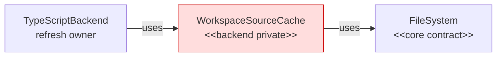
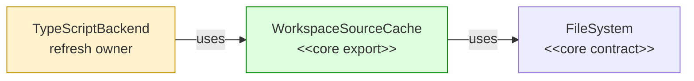

# #123 Move workspace source caching to core

base main  head agent/daemon-architecture-refactor-part-01-source-cache

## Context

Daemon workers and future hosts need source-byte caching without depending on the TypeScript backend. Moving ownership must preserve current snapshot-replacement behavior, including selection refreshes evicting omitted bytes.

## Shape

Before — TypeScript owned the reusable cache:



After — core owns the cache and TypeScript consumes its export:



Legend: green = added; red = removed; yellow = changed.

## Where it lives

```text
.
├── ** .github/PULL_REQUEST_TEMPLATE.md               # defines context/shape-based PR descriptions
├── apps/cli/test/integration/commands/overview/
│   └── ** overview-command.test.ts                   # guards selected-file isolation across 4,000 siblings
├── packages/
│   ├── core/src/
│   │   ├── ** index.ts                               # exports the cache
│   │   └── workspace/
│   │       ├── ~~ workspace-source-cache.ts          # moved from packages/backend-typescript/src/typescript-backend/
│   │       └── ++ workspace-source-cache.test.ts     # locks replacement and delegation
│   └── backend-typescript/
│       ├── src/typescript-backend/
│       │   └── ** typescript-backend.ts              # consumes the core cache
│       └── test/integration/
│           └── ** typescript-backend.test.ts         # locks selection eviction
└── plans/005/
    └── ** daemon-follow-ups-functional-spec.md       # defers selection-aware retention
```

## Public surface

Added:

```ts
export class WorkspaceSourceCache implements FileSystem {
  constructor(fileSystem: FileSystem);
  refresh(snapshot: WorkspaceSnapshot): void;
  readFile(absPath: string): Promise<string>;
  readFileSync(absPath: string): string;
  exists(absPath: string): Promise<boolean>;
  listDir(absPath: string): Promise<readonly string[]>;
  isDirectory(absPath: string): Promise<boolean>;
  metadata(absPath: string): Promise<FileMetadata>;
  existsSync(absPath: string): boolean;
  listDirSync(absPath: string): readonly string[];
  isDirectorySync(absPath: string): boolean;
  metadataSync(absPath: string): FileMetadata;
}
```

## Decisions

- Chose core ownership over TypeScript-backend ownership, because daemon workers and future hosts need the cache without importing TypeScript code.
- Chose snapshot replacement over coverage-aware merging, because this refactor preserves current selection-eviction behavior and defers retention changes.
- Chose a `FileSystem` facade over cache-specific reads, because existing TypeScript services already consume filesystem injection.

## Look here

- `packages/core/src/workspace/workspace-source-cache.ts:10`
- `packages/backend-typescript/src/typescript-backend/typescript-backend.ts:79`
- `apps/cli/test/integration/commands/overview/overview-command.test.ts:224`


## Commits
- eded8cdc8b Characterize backend selection replacement
- e1339da273 Characterize overview selection isolation
- b1f46e6ae6 Add core source-cache replacement
- a4e39edabe Guard cached source path replacement
- 4519202dc5 Invalidate changed cached revisions
- 3556a9cd66 Guard unchanged cached revisions
- 4d17681b46 Share cached synchronous source reads
- 15dda7bec9 Delegate uncached filesystem operations
- f9b705cf03 Use core WorkspaceSourceCache in TypeScript
- 4f37b9c216 Record selection-aware source-cache follow-up
- 78dd77de23 Update pull request template
