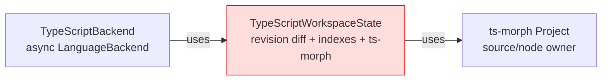
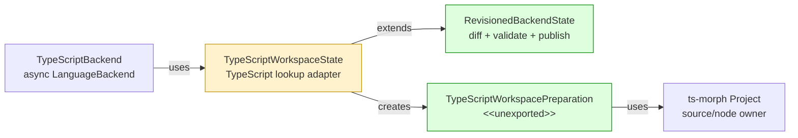

# #124 Publish revisioned backend state transactionally

base agent/daemon-architecture-refactor-part-01-source-cache  head agent/daemon-architecture-refactor-part-02-transactional-backend-state

## Context

The daemon architecture spec assigns reusable revision comparison, prepared-file indexing, and publication to core, but TypeScript still owned them after #123 moved source caching. This layer moves those mechanics into core while preserving selection retention, TypeScript source/node identity, and `LanguageBackend` results and errors.

## Shape

Before — TypeScript state mixed portable indexes with toolchain mutation:



After — core publishes portable candidate state; TypeScript supplies one mutation transaction:



Legend: green = added ownership; red = removed ownership; yellow = changed responsibility.

## Where it lives

```text
.
└── packages/
    ├── core/src/
    │   ├── ** index.ts
    │   └── backend/
    │       ├── ++ revisioned-backend-state.ts       # owns revision/index transactions
    │       └── ++ revisioned-backend-state.test.ts  # fake incremental/full backends
    └── backend-typescript/src/
        ├── ** index.ts                               # removes backend-owned revision exports
        ├── ** ... 4 query/index consumer files      # await on-demand preparation
        └── typescript-backend/
            ├── ** typescript-backend.ts              # awaits state publication
            ├── ** typescript-workspace-state.ts      # owns ts-morph mutation journal
            └── ** ... 2 colocated tests              # async adoption and rollback boundaries
```

## Public surface

Added to `@symnav/core`:

```ts
export interface RevisionedBackendPreparedFile<PreparedDetails> {
  readonly file: WorkspaceFile;
  readonly entries: OverviewFileEntries;
  readonly details: PreparedDetails;
}

export type RevisionedBackendFileChange<PreparedDetails> =
  | { readonly kind: "added"; readonly file: WorkspaceFile }
  | {
      readonly kind: "changed";
      readonly file: WorkspaceFile;
      readonly previous: RevisionedBackendPreparedFile<PreparedDetails>;
    };

export interface RevisionedBackendPreparationRequest<PreparedDetails> {
  readonly coverage: BackendRefreshCoverage;
  readonly changes: readonly RevisionedBackendFileChange<PreparedDetails>[];
  readonly removedFiles: readonly RevisionedBackendPreparedFile<PreparedDetails>[];
  readonly effectiveFiles: readonly WorkspaceFile[];
}

export abstract class RevisionedBackendPreparation<PreparedDetails> {
  abstract prepare(): Promise<readonly RevisionedBackendPreparedFile<PreparedDetails>[]>;
  abstract commit(): Promise<void>;
  abstract rollback(): Promise<void>;
}

export interface IndexedBackendDeclaration {
  readonly declaration: SymbolOverviewNode;
  readonly file: ResolvedPath;
}

export abstract class RevisionedBackendState<PreparedDetails> {
  protected constructor(fileSystem: FileSystem);
  refresh(files: readonly WorkspaceFile[], coverage?: BackendRefreshCoverage): Promise<BackendRefreshSummary>;
  ensureFiles(files: readonly ResolvedPath[]): Promise<void>;
  fileEntries(file: ResolvedPath): Promise<OverviewFileEntries>;
  declarations(files: readonly ResolvedPath[]): Promise<readonly SymbolOverviewNode[]>;
  diagnostics(file: ResolvedPath): readonly NavigationDiagnostic[];
  declarationsIn(relativePath: string): readonly SymbolOverviewNode[] | undefined;
  declarationForIdentity(identity: SymbolIdentity): IndexedBackendDeclaration | undefined;
  currentFileCount(): number;
  protected preparedFile(relativePath: string): RevisionedBackendPreparedFile<PreparedDetails> | undefined;
  protected preparedFiles(): readonly RevisionedBackendPreparedFile<PreparedDetails>[];
  protected relativePathForAbsolute(absolutePath: string): string | undefined;
  protected abstract createPreparation(request: RevisionedBackendPreparationRequest<PreparedDetails>): RevisionedBackendPreparation<PreparedDetails>;
}
```

Changed in `@symnav/backend-typescript`:

```ts
export class TypeScriptWorkspaceState extends RevisionedBackendState<TypeScriptPreparedFileDetails> {
  // before: fileEntries(file: ResolvedPath, diagnostics?: DiagnosticSink): OverviewFileEntries
  fileEntries(file: ResolvedPath, diagnostics?: DiagnosticSink): Promise<OverviewFileEntries>;
}
```

Removed from `@symnav/backend-typescript` root:

```ts
type PreparedFileIndex;
type PreparedFileRevision;
type TypeScriptFileRevision;
```

## Decisions

- Chose an incremental overlay candidate over requiring complete preparation output, because another language backend may prepare only changed files.
- Chose candidate validation before subclass commit over post-commit validation, because malformed output must leave portable and toolchain state unpublished.
- Chose one-file selection transactions for `ensureFiles` over one aggregate transaction, because existing behavior retains earlier progress when a later file fails.
- Chose a TypeScript-owned mutation journal over core mutation callbacks, because source files and node restoration are `ts-morph` concerns.
- Chose reversible path staging before source removal over recreating removed sources, because published lookups retain exact `SourceFile` handles.

## Look here

- `packages/core/src/backend/revisioned-backend-state.ts:65`
- `packages/core/src/backend/revisioned-backend-state.ts:181`
- `packages/backend-typescript/src/typescript-backend/typescript-workspace-state.ts:159`


## Commits
- b0fa20d750 Define revisioned backend state contracts
- 294ca79f66 Diff revisioned backend files
- 0ae50165bd Validate revisioned backend candidates
- a1a9a2a9aa Roll back failed backend preparations
- 144f774616 Accept full backend preparation results
- f142e0bb23 Ensure missing backend files sequentially
- 4a70bcc87c Adopt revisioned TypeScript state preparation
- 23edd420ba Preserve sequential TypeScript preparation progress
- cf0107c1fe Verify TypeScript source mutation rollback
- 9643fac8f3 Make obsolete TypeScript removals transactional
