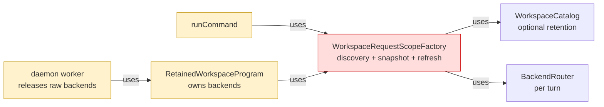
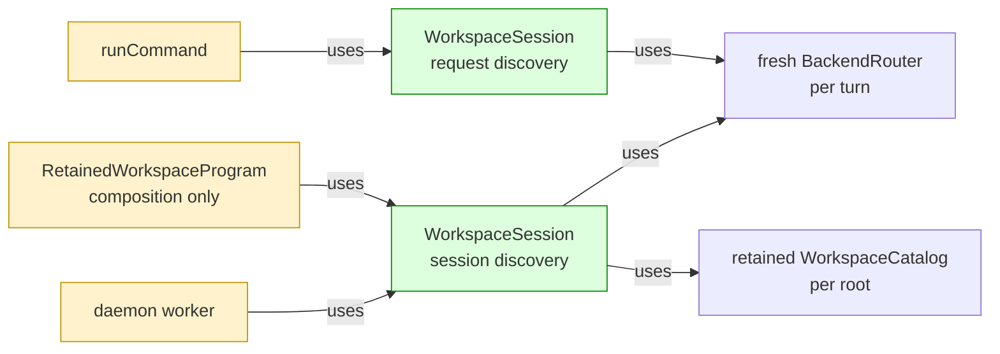

# #128 Retain workspaces through core sessions

base agent/daemon-architecture-refactor-part-04-query-cache-lifecycle  head agent/daemon-architecture-refactor-part-05-workspace-session

## Context

The [daemon architecture spec](https://github.com/mohasarc/symnav/blob/main/plans/005/daemon-architecture-functional-spec.md) assigns language-independent workspace retention and backend lifetime to core. Building on #127, this layer removes CLI-owned request scopes while preserving cold discovery, retained daemon turns, selection isolation, command ordering, and output behavior.

## Shape

Before — CLI-owned scopes split workspace preparation from worker resource lifetime:



After — core sessions own request and retained preparation through one lifecycle boundary:



Legend: green = added ownership; red = removed ownership; yellow = changed responsibility; default = pre-existing and unchanged.

## Where it lives

```text
.
├── packages/core/src/
│   ├── ** index.ts
│   └── workspace/
│       ├── ++ workspace-session.ts       # owns discovery, preparation, routing, and release
│       └── ++ workspace-session.test.ts  # locks retention and lifecycle contracts
└── apps/cli/
    ├── src/
    │   ├── ** command.ts                           # preserves discovery and validation order
    │   ├── ** cli-program-executor.ts              # accepts an injected session
    │   ├── ** program-dependencies.ts              # replaces scope factory dependency
    │   ├── daemon/
    │   │   ├── ** retained-workspace-program.ts  # composes one retained session
    │   │   └── ** daemon-navigation-worker-entry.ts
    │   ├── -- workspace-request-scope.ts           # superseded CLI ownership
    │   └── -- workspace-request-scope.test.ts
    └── test/integration/commands/
        └── ** ... 3 files  # session injection and retained-selection coverage
```

## Public surface

Added to `@symnav/core`:

```ts
export type WorkspaceDiscoveryRetention = "request" | "session";
export type WorkspaceSnapshotSelector = (
  workspace: Workspace,
  router: BackendRouter,
) => Promise<WorkspaceSnapshot>;
export type WorkspacePreparation =
  | { readonly coverage: "workspace" }
  | { readonly coverage: "selection"; readonly selectSnapshot: WorkspaceSnapshotSelector };
export interface PreparedWorkspaceScope {
  readonly workspace: Workspace;
  readonly snapshot: WorkspaceSnapshot;
  readonly router: BackendRouter;
  readonly refresh: BackendRefreshSummary;
}
export class WorkspaceSession {
  constructor(options: {
    readonly fileSystem: FileSystem;
    readonly backends: readonly LanguageBackend[];
    readonly discoveryRetention: WorkspaceDiscoveryRetention;
  });
  prepare(startDirectory: string, preparation?: WorkspacePreparation): Promise<PreparedWorkspaceScope>;
  openWorkspace(startDirectory: string, coverage: BackendRefreshCoverage): Promise<Workspace>;
  prepareWorkspace(workspace: Workspace, preparation: WorkspacePreparation): Promise<PreparedWorkspaceScope>;
  releaseTransientResources(): Promise<void>;
}
```

Changed in CLI composition:

```ts
// before: scopeFactory?: WorkspaceRequestScopeFactory
readonly workspaceSession?: WorkspaceSession;

// before: constructor(dependencies, scopeFactory?, outputOptions?)
constructor(
  dependencies: ProgramDependencies,
  workspaceSession?: WorkspaceSession,
  outputOptions?: OrderedCommandOutputOptions,
);
```

## Decisions

- Chose explicit request/session discovery retention over one cached strategy, because cold commands must not retain a catalog while daemon turns must reuse unchanged file identity.
- Chose fresh selection discovery over retained-catalog reconciliation, because a selected file must not enumerate or fail on unrelated retained siblings.
- Chose a copied backend array and fresh router per turn over a persistent router, because backend order is session state while routing results are turn state.
- Chose explicit workspace opening before validation and preparation after validation over one combined call, because existing error and source-read ordering is observable.
- Chose repeatable concurrent release over permanent session closure, because backend cleanup must retain state and retry every backend on later calls.

## Look here

- `packages/core/src/workspace/workspace-session.ts:32`
- `apps/cli/src/command.ts:59`
- `apps/cli/src/daemon/retained-workspace-program.ts:6`


## Commits
- 4da5bf21e6 Define workspace session contracts
- 5b6ab20896 Add the workspace session boundary
- de7b0d90c6 Specify request and retained workspace turns
- dee58943a9 Prepare request and retained workspace turns
- 99cbd3a581 Specify selection discovery and coverage
- cc2bbd7e3f Prepare selection-scoped workspace turns
- 678ee343ab Specify workspace session failure boundaries
- 76672237c8 Propagate workspace preparation failures
- 5411dd8691 Specify stable backend routing order
- d8b8c719c2 Stabilize backend routing order
- 06f9a977e8 Specify multiple-root session retention
- 90b09c0af8 Retain independent workspace roots
- 2d8ac0b2a6 Specify workspace session release lifecycle
- bb8b6404a6 Release workspace session resources concurrently
- 385ada10b7 Specify command workspace session injection
- 1818c93a30 Prepare commands through workspace sessions
- 08f697b98b Specify retained executor session reuse
- 65e58d0ed3 Retain one workspace session in daemon workers
- 03cc3f2d1b Characterize lazy help execution
- 144e1e7518 Characterize cold session construction
- ca0002b01f Migrate retained overview sessions
- ccad044c3a Remove CLI workspace scope ownership
