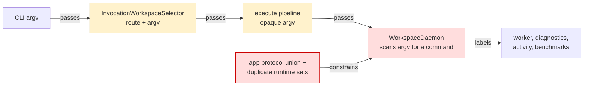
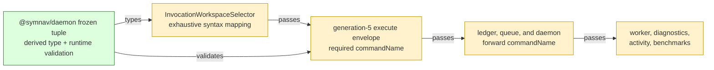

# #132 Own one daemon command vocabulary

base agent/daemon-architecture-refactor-part-08-daemon-policy-consumers  head agent/daemon-architecture-refactor-part-09-command-vocabulary

## Context

Command labels had four runtime owners, and daemon process code inferred operational identity by scanning opaque argv. A command-looking option value or target could therefore override the command selected by CLI syntax.

## Shape

Before — command identity was reconstructed after CLI routing:



After — CLI classifies once and every daemon boundary carries that identity:



Legend: green = added authority; red = removed authority or derivation; yellow = changed path.

- Argv normalization remains independent from command identity.
- Readiness still executes `--version` with telemetry disabled, now labeled explicitly as `version`.
- Generation-4 requests are rejected before execution, and generation-5 clients replace generation-4 daemons before readiness.

## Where it lives

```text
.
├── packages/daemon/
│   ├── src/
│   │   ├── ** daemon-command-name.ts              # owns tuple, validator, and readiness shape
│   │   ├── ++ daemon-command-name.test.ts         # locks values and runtime immutability
│   │   ├── ** host-contract.test.ts               # locks source, declarations, and exports
│   │   └── ** index.ts                            # exposes root value and type contracts
│   └── test/
│       └── ** public-import.test.ts                # verifies consumer-visible surface
└── apps/cli/
    ├── src/daemon/
    │   ├── ** invocation-workspace-selector.ts    # maps CLI syntax once
    │   ├── ** ... 14 production files             # carry identity through daemon boundaries
    │   └── ** ... 12 colocated test files          # lock mapping and propagation
    └── test/
        └── ** ... 9 files                         # preserve process, e2e, and benchmark behavior
```

Legend: `++` added, `**` changed, `~~` moved, `--` removed.

## Public surface

Added at the `@symnav/daemon` root:

```ts
export const DAEMON_COMMAND_NAMES: readonly ["overview", "resolve", "def", "refs", "context", "graph", "stats", "help", "version", "unknown"];
export interface DaemonReadinessProbe {
  readonly commandName: DaemonCommandName;
  readonly argv: readonly string[];
}
```

## Decisions

- Chose a frozen daemon-owned tuple over another app-local set, because runtime validation and the union must change together.
- Chose an exhaustive CLI record over deriving workspace routes from the full tuple, because help, version, control, and unknown are syntax routes rather than workspace commands.
- Chose `commandName` beside opaque argv over nesting or reparsing it, because argv normalization and operational labeling have different owners.
- Chose to include `commandName` in accepted-request compatibility over comparing argv alone, because retry attachment must preserve original operational identity.
- Chose a new protocol generation over optional or legacy command metadata, because either mixed-generation direction must take established compatibility handling before execution.

## Look here

- `apps/cli/src/daemon/invocation-workspace-selector.ts:6`
- `apps/cli/src/daemon/daemon-protocol.ts:7`
- `apps/cli/src/daemon/accepted-request-ledger.ts:209`


## Commits
- 7184bbd30c Specify the daemon command vocabulary
- 6898be7238 Define the daemon command vocabulary
- f729476715 Specify exhaustive CLI command mapping
- 790b58f449 Map CLI routes to daemon command names
- cf807d166b Specify explicit daemon command propagation
- 9dd51416a5 Propagate daemon command names explicitly
- bc0af5cf5d Advance daemon protocol for command metadata
- f5fcbfed84 Resolve command contract source URL portably
