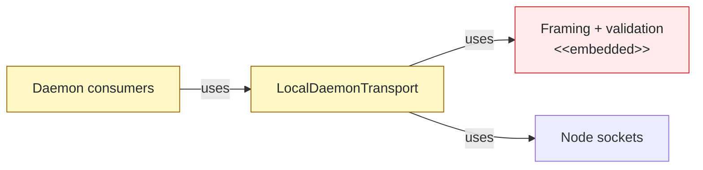
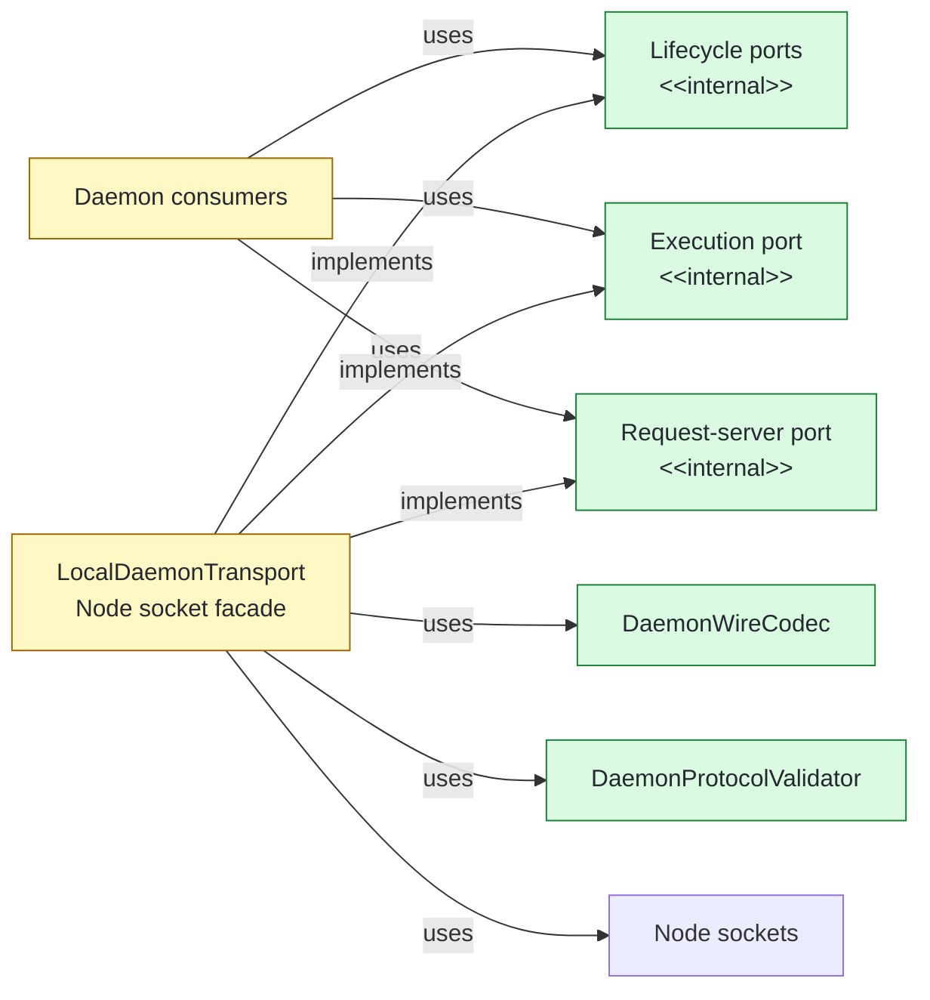

# #137 Isolate daemon transport framing and validation

base agent/daemon-architecture-refactor-part-13-lifecycle-renderer  head agent/daemon-architecture-refactor-part-14-transport-framing

## Context

The [daemon architecture contract](plans/005/daemon-architecture-functional-spec.md#included) calls for `LocalDaemonTransport` to split into codec, validator, client, and server responsibilities. One socket facade still owned wire framing, protocol validation, correlation, and every consumer-facing transport method.

## Shape

Before — consumers and protocol mechanics converged on one concrete transport:



After — consumers use operation-shaped ports while the facade delegates protocol concerns:



Legend: green = added boundary; red = removed embedded ownership; yellow = changed dependency or owner; default = unchanged.

## Where it lives

```text
.
└── apps/cli/src/daemon/
    ├── ++ daemon-transport.ts              # operation-shaped lifecycle, execution, socket, and server ports
    ├── ++ daemon-wire-codec.ts             # JSON and binary framing with independent capacity limits
    ├── ++ daemon-protocol-validator.ts      # exact schemas, response correlation, and retry consistency
    ├── ** local-daemon-transport.ts         # Node socket facade delegates framing and validation
    ├── -- daemon-result-chunk-codec.ts      # binary chunk framing moved into wire codec ownership
    └── ** ... 5 daemon consumers            # depend on the narrow ports they use
```

Legend: `++` added, `**` changed, `~~` moved, `--` removed.

## Decisions

- Chose operation-shaped transport interfaces over `LocalDaemonTransport` and consumer-local transport shapes, because lifecycle observation, execution, and request serving require different capabilities.
- Chose separate control and transfer decoders over one binary-aware decoder, because only execution transfer connections may interpret high-bit frames as result chunks.
- Chose response-kind-specific JSON limits over one control limit, because lifecycle responses retain ordinary JSON capacity while execution frames use the smaller execution-control cap.
- Chose to map `DaemonProtocolError` at the facade boundary over changing `DaemonTransportError`, because delivery, authentication, compatibility, and retry classifications must remain stable.
- Chose to absorb result-chunk header and digest validation into `DaemonWireCodec` over retaining a standalone chunk codec, because chunk integrity belongs to the binary frame format.

## Look here

- `apps/cli/src/daemon/daemon-transport.ts:15`
- `apps/cli/src/daemon/daemon-wire-codec.ts:30`
- `apps/cli/src/daemon/daemon-protocol-validator.ts:30`


## Commits
- 90f7e5820c Specify narrow daemon transport ports
- 749ed0b603 Depend on narrow daemon transport ports
- e219eeca17 Specify daemon wire framing
- aaf001643d Delegate daemon wire framing
- c0473870c4 Specify lifecycle response capacity
- 1c55e10dd4 Preserve lifecycle response capacity
- 4c9afef836 Specify daemon protocol validation
- 757c41a213 Delegate daemon protocol validation
