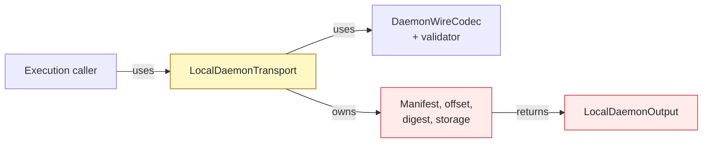
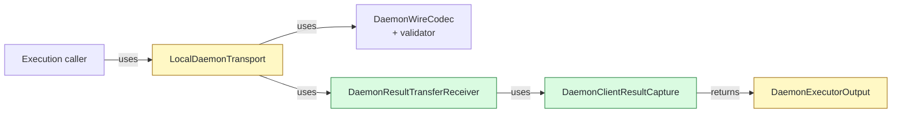

# #138 Receive resumable daemon result transfers

base agent/daemon-architecture-refactor-part-14-transport-framing  head agent/daemon-architecture-refactor-part-15

## Context

Phase 14 isolated daemon wire framing and validation, but `LocalDaemonTransport` still owned result manifests, durable resume offsets, digest checks, and client output storage. This PR separates those stateful responsibilities without changing wire bytes, retry classification, output bytes, or lifecycle behavior.

## Shape

Before — the socket facade retained every result-transfer concern:



After — one receiver survives reconnection while capture owns durable output:



Legend: green = added owner; red = removed embedded owner; yellow = changed responsibility or contract; default = unchanged.

## Where it lives

```text
.
└── apps/cli/
    ├── src/
    │   ├── ** command-execution-result.ts                 # replays the daemon executor output contract
    │   └── daemon/
    │       ├── ++ daemon-client-result-capture.ts         # durable inline/file capture and replay
    │       ├── ++ daemon-result-transfer-receiver.ts      # resumable manifest/chunk/end state
    │       ├── ** local-daemon-transport.ts               # delegates receipt and capture ownership
    │       ├── -- local-daemon-output.ts                  # replaced by daemon-scoped capture
    │       └── ** ... 2 dispatch contracts                # carry daemon executor results
    └── test/e2e/daemon/
        └── ** ... 2 parity suites                         # consume the opaque output contract
```

Legend: `++` added, `**` changed, `~~` moved, `--` removed.

## Decisions

- Chose daemon-scoped capture over extending CLI `OrderedCommandOutput`, because warm result storage must not depend on cold-command output internals.
- Chose to advance resume offsets after awaited append over advancing on frame receipt, because fetch must restart at the first record not durably stored.
- Chose one receiver across initial and fetch connections over rebuilding receipt state, because manifest identity, digest progress, and offsets must survive reconnection.
- Chose fresh wire decoders per connection over retaining decoder state, because framing state ends at the socket boundary while transfer state continues.
- Chose caller ownership after successful finish over receiver-owned cleanup, because replay and acknowledgement failures need one explicit disposal path.

## Look here

- `apps/cli/src/daemon/daemon-client-result-capture.ts:63`
- `apps/cli/src/daemon/daemon-result-transfer-receiver.ts:41`
- `apps/cli/src/daemon/local-daemon-transport.ts:263`


## Commits
- 5446679649 Define daemon client result capture contracts
- 50a305c3cd Specify daemon client result storage
- 2fb52b9653 Store daemon client results independently
- a5131e835a Specify daemon client result capacity
- 525e3f03e7 Bound daemon client result storage
- 9867153152 Specify daemon client result replay validation
- fd191155f7 Validate stored daemon client results
- 22225c82d6 Capture daemon transport results internally
- 9576779fb2 Specify resumable daemon result receipt
- 4c9720bf13 Receive resumable daemon result transfers
- 41a8115cc4 Delegate resumable result receipt
- 4e0dc1978c Budget twelve MiB transport test
