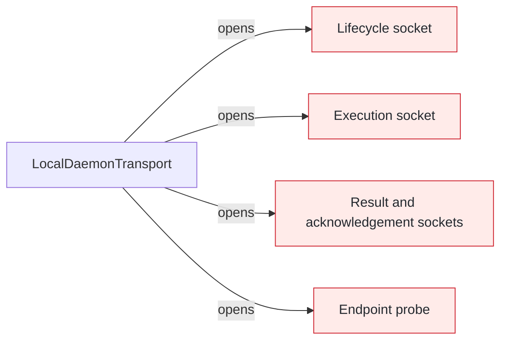
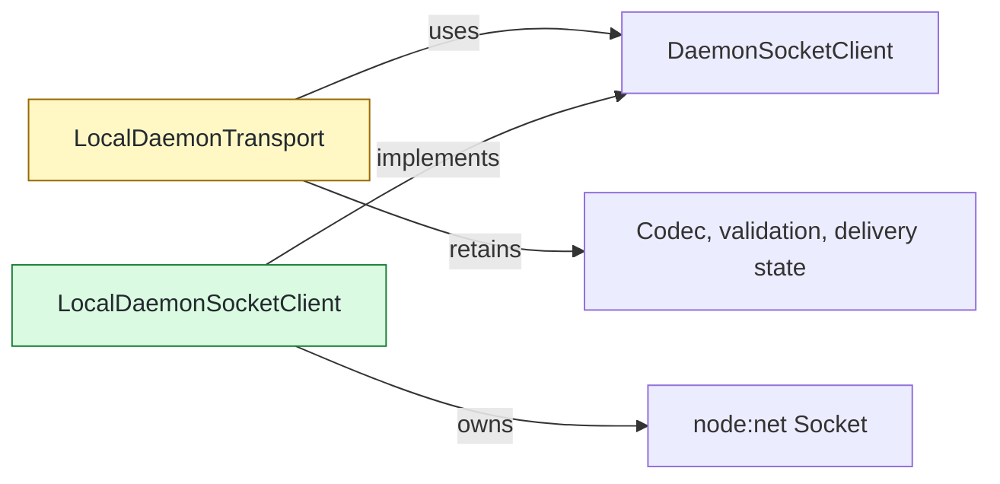

# #139 Route outbound daemon sockets through one client

base agent/daemon-architecture-refactor-part-15  head agent/daemon-architecture-refactor-part-16-socket-client

## Context

`LocalDaemonTransport` repeated Node socket connection, timeout, read-flow, write-backpressure, and closure mechanics across five outbound paths. One low-level client now owns those mechanics while protocol and delivery decisions remain in the transport façade.

## Shape

Before — each outbound exchange managed a raw socket:



After — all outbound paths consume one byte-connection port:



Legend: green = added; yellow = changed; red = removed; default = unchanged.

## Where it lives

```text
.
└── apps/cli/src/daemon/
    ├── ++ local-daemon-socket-client.ts                 # sole outbound Node socket owner
    ├── ++ local-daemon-socket-client.test.ts            # byte flow, timeout, backpressure, and closure
    ├── ++ local-daemon-transport-socket-client.test.ts  # delegation across five outbound paths
    ├── ** local-daemon-transport.ts                     # retains protocol and delivery semantics
    └── ** ... 2 transport test files                    # remove superseded private helper coverage
```

Legend: `++` added, `**` changed, `~~` moved, `--` removed.

## Public surface

```ts
export class LocalDaemonSocketClient implements DaemonSocketClient {
  connect(endpoint: string, timeoutMs?: number): Promise<DaemonSocketConnection>;
}
```

## Decisions

- Chose a pull-driven async iterator over forwarded `data` events, because consumer demand now controls socket resume and each delivered chunk pauses reads again.
- Chose a connection-owned FIFO over façade-owned drain handling, because frames must preserve write-call order across backpressure.
- Kept protocol decoding and delivery-state translation in `LocalDaemonTransport` over moving them into the socket client, because raw EOF and errors cannot classify request correlation or retry safety.
- Kept inbound server sockets in `LocalDaemonTransport` over extracting both directions together, because server binding and shutdown form the separate Phase 18 boundary.

## Look here

- `apps/cli/src/daemon/local-daemon-socket-client.ts:25`
- `apps/cli/src/daemon/local-daemon-socket-client.ts:51`
- `apps/cli/src/daemon/local-daemon-transport.ts:270`


## Commits
- 354f4dd760 Specify daemon socket byte connections
- 4408567f97 Connect daemon socket byte streams
- 005f07624f Specify pull-driven daemon socket reads
- 37df9db466 Pause daemon sockets between consumer reads
- 8a22b38e8c Specify ordered daemon socket writes
- 37ad54d6e3 Queue daemon socket writes through drain
- 43aac15d37 Specify daemon socket connection refusal
- 53dbc2cb7f Reject refused daemon socket connections
- 2cb84193aa Specify daemon socket connection timeouts
- 5d6df744e1 Enforce daemon socket connection timeouts
- a04b57be55 Specify daemon socket reset propagation
- a3b5983b79 Propagate daemon socket resets
- f3b654c29e Specify daemon socket write failures
- fa4e8cf265 Propagate daemon socket write failures
- 621ca6065c Specify daemon socket drain failures
- 6725e12faa Propagate daemon socket drain failures
- 38a4740f5c Specify idempotent daemon socket closure
- 6e77152f2f Make daemon socket closure idempotent
- ff2af30626 Specify lifecycle socket client delegation
- 6d1fc71125 Delegate daemon lifecycle sockets
- b60e50bf5c Specify execution socket client delegation
- a9d7eafa25 Delegate daemon execution sockets
- fc1f586b3c Specify result socket client delegation
- 40d5e063b5 Delegate daemon result sockets
- e0d5d691a7 Specify endpoint probe socket delegation
- 678dae9a74 Delegate daemon endpoint probes
- 29a747e95f Remove raw daemon client socket mechanics
