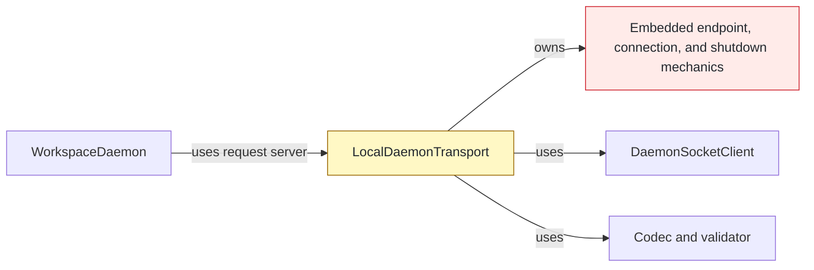
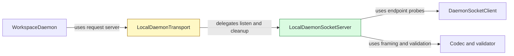

# #141 Route inbound daemon sockets through one server

base agent/daemon-architecture-refactor-part-17-lifecycle-client  head agent/daemon-architecture-refactor-part-18

## Context

`LocalDaemonTransport` still owned inbound endpoint, connection, delivery, and shutdown mechanics alongside outbound protocol clients. This part gives inbound serving one owner before accepted-execution recovery moves in the next stack layer.

## Shape

Before — the transport façade embedded inbound socket mechanics:



After — the façade delegates inbound serving to a dedicated server:



Legend: green = added; yellow = changed; red = removed; default = unchanged.

## Where it lives

```text
.
└── apps/cli/src/daemon/
    ├── ++ local-daemon-socket-server.ts       # owns endpoint, connection, send, and shutdown mechanics
    ├── ++ local-daemon-socket-server.test.ts  # locks server behavior and concurrent shutdown
    ├── ** local-daemon-transport.ts           # composes and delegates to socket server
    └── ** local-daemon-transport.test.ts      # retains transport-level integration coverage
```

Legend: `++` added, `**` changed, `~~` moved, `--` removed.

## Public surface

```ts
export class LocalDaemonSocketServer implements DaemonRequestServer {
  constructor(options: LocalDaemonSocketServerOptions);
  listen(endpoint: string, handler: DaemonRequestHandler): Promise<DaemonServer>;
  removeUnavailableEndpoint(endpoint: string): Promise<boolean>;
}
```

## Decisions

- Chose a dedicated socket-server owner over retaining inbound mechanics in the transport façade, because endpoint, connection, delivery, and shutdown behavior form one boundary.
- Chose the injected `DaemonSocketClient` over a second outbound connection path, because endpoint probes must use the existing mechanism and response timeout.
- Chose independent per-connection response and write chains over a server-wide queue, because one connection must preserve request and background-send order without coupling clients.
- Chose one cached shutdown promise over independent close operations, because concurrent graceful and forced callers must share settlement while force escalates an in-progress drain.

## Look here

- `apps/cli/src/daemon/local-daemon-socket-server.ts:31`
- `apps/cli/src/daemon/local-daemon-socket-server.ts:50`
- `apps/cli/src/daemon/local-daemon-socket-server.ts:91`


## Commits
- d4e962b0d2 Characterize daemon endpoint ownership
- 29b8913df8 Characterize serial daemon requests
- 7362f0923c Characterize ordered daemon server sends
- f7075b83b8 Characterize daemon socket backpressure
- 33c6b525aa Characterize daemon connection close listeners
- fadb37acec Characterize daemon connection isolation
- 7ba10447cc Characterize graceful daemon server shutdown
- 906fbdea59 Specify concurrent daemon server shutdown
- 6e5b0400c6 Share concurrent daemon server shutdown
- e08798f755 Assign daemon socket server ownership
- 0526978ca8 Extract daemon socket server
- f382defe65 Delegate daemon endpoint cleanup
- 5b71d1f25f Delegate daemon socket serving
