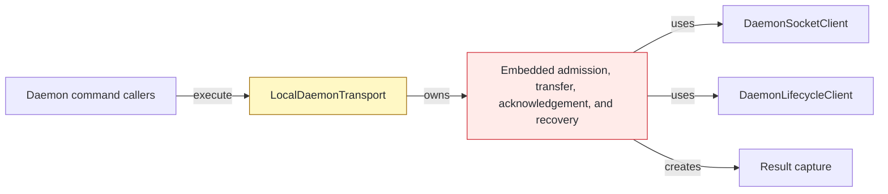
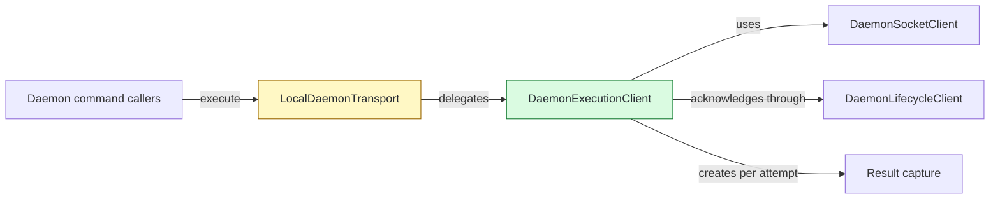

# #142 Preserve accepted execution recovery in one client

base agent/daemon-architecture-refactor-part-18  head agent/daemon-architecture-refactor-part-19

## Context

Outbound execution still lived in `LocalDaemonTransport` after lifecycle and socket mechanics gained dedicated owners. Accepted work requires independent recovery budgets for result fetches within an attempt and identical-request reattachments across attempts.

## Shape

Before — the transport façade embedded the execution state machine:



After — the façade delegates the complete state machine to one execution client:



Legend: green = added; yellow = changed; red = removed; default = unchanged.

## Where it lives

```text
.
└── apps/cli/src/daemon/
    ├── ++ daemon-execution-client.ts               # owns outbound execution and accepted recovery
    ├── ++ daemon-execution-client.test.ts          # locks direct ownership and identical-request recovery
    ├── ** local-daemon-transport.ts                # composes and delegates to execution client
    └── ** local-daemon-transport-execution.test.ts # retains transport-level delivery oracles
```

Legend: `++` added, `**` changed, `~~` moved, `--` removed.

## Public surface

```ts
export class DaemonExecutionClient implements DaemonExecutionRequester {
  constructor(options: DaemonExecutionClientOptions);
  execute(endpoint: string, request: DaemonExecuteRequest): Promise<DaemonExecutionReceipt>;
}
```

## Decisions

- Chose a dedicated execution client over a generic response chain, because admission, accepted completion, transfer, acknowledgement, and recovery share one state machine.
- Chose a fresh output capture per execute attempt over reusing interrupted capture state, because duplicate-request reattachment starts a new delivery while result fetch resumes the current delivery.
- Chose independent numeric policy counters over boolean recovery flags, because fetch resumes and accepted reattachments have separate configurable budgets.
- Chose the lifecycle client's acknowledgement-only surface over widening `DaemonLifecycleRequester`, because only result completion needs acknowledgement.
- Chose an internal fetch-ended error over changing the public exhausted-fetch failure, because final exhaustion must retain accepted-corruption behavior without replaying execution.

## Look here

- `apps/cli/src/daemon/daemon-execution-client.ts:46`
- `apps/cli/src/daemon/daemon-execution-client.ts:75`
- `apps/cli/src/daemon/daemon-execution-client.ts:300`


## Commits
- 7eb8dd4ce8 Characterize execution admission deadlines
- 30c4b5474f Specify result fetch resume budgets
- f1e1d4842e Honor repeated result fetch resumes
- 6acb1fb1a3 Characterize execution reattachment budgets
- 149f4b6a04 Characterize failed execution reattachment
- 5419a881e3 Characterize isolated execution reattachment
- 9330f32b5b Characterize execution output disposal
- 7d972ae215 Assign daemon execution client ownership
- 815bfc9d64 Extract one-attempt daemon execution
- ea64fe2dff Specify accepted execution recovery ownership
- 2c8829f23c Own accepted execution recovery
- 6939ec682a Delegate daemon execution exchanges
- 76eaea78b1 Specify exhausted result fetch failure
- 40f9069211 Preserve exhausted result fetch failures
- 40dc23233f Specify original accepted-close failure
- 5e9ee2752b Retain original accepted-close failure
