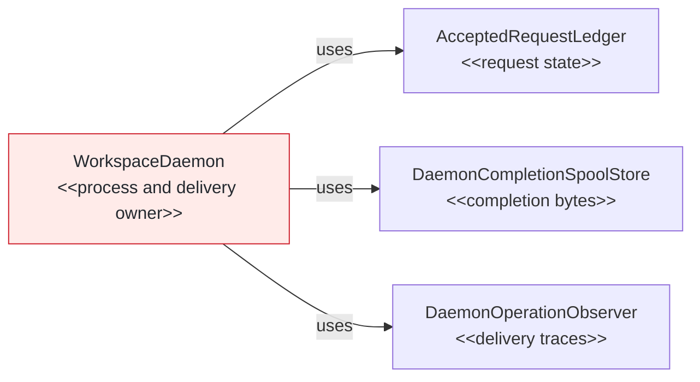
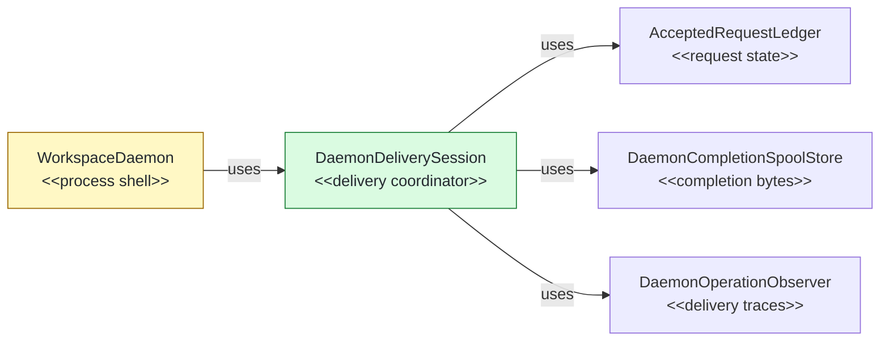

# #146 Own daemon completion delivery in one session

base agent/daemon-architecture-refactor-part-22  head agent/daemon-architecture-refactor-part-23

## Context

Implements Phase 23 of the daemon architecture plan. This stack layer follows worker-generation PR #145 and isolates completion delivery before accepted-execution extraction. Exact local CI parity passed 2,409 tests with eight expected skips; focused delivery, process, real Unix-socket, and mutation checks preserve protocol and lifecycle behavior.

## Shape

Before — `WorkspaceDaemon` coordinates completion delivery directly:



After — one session coordinates delivery over the existing data owners:



Legend: green = added; red = removed; yellow = changed; unfilled = pre-existing and unchanged.

## Where it lives

```text
.
└── apps/cli/src/daemon/
    ├── ++ daemon-delivery-session.ts       # owns delivery coordination over injected state owners
    ├── ++ daemon-delivery-session.test.ts  # locks transfer, retention, barrier, and cleanup behavior
    ├── ** workspace-daemon.ts               # composes the session and delegates delivery behavior
    └── ** workspace-daemon-requests.test.ts # preserves process-level delivery and shutdown ordering
```

Legend: `++` added, `**` changed, `~~` moved, `--` removed.

## Public surface

Added:

```ts
export interface DaemonDiagnosticRecorder {
  record(event: DaemonDiagnosticEvent): void;
}
export interface DaemonCompletionWriter {
  append(record: DaemonSequencedOutputRecord): Promise<void>;
  finish(exitCode: number): Promise<CompletionSpoolManifest>;
  dispose(): Promise<void>;
}
export interface DaemonDeliverySnapshot {
  readonly spoolBytes: number;
  readonly hasUnacknowledgedCompletions: boolean;
}
export interface DaemonDeliveryAttachment {
  readonly requestId: string;
  readonly acceptedAt: number;
  readonly queuePosition: number;
}
export interface AcceptedExecutionJournal {
  readonly hasUnacknowledgedCompletions: boolean;
  entryFor(requestId: string): AcceptedRequestEntry | undefined;
  subscribe(requestId: string, subscriber: AcceptedRequestSubscriber): () => void;
  invalidateCompletion(requestId: string, code: DaemonExecutionFailureCode, completedAt: number): void;
  acknowledge(requestId: string): void;
  terminateDelivery(requestId: string): boolean;
  isDeliveryTerminated(requestId: string): boolean;
}
export type AuthenticatedDaemonResultFetchRequest = DaemonResultFetchRequest;
export type AuthenticatedDaemonResultAcknowledgement = DaemonResultAcknowledgement;
export type DaemonResultAcknowledged = Extract<DaemonResponse, { readonly kind: "result-acknowledged" }>;
export interface DaemonDeliverySessionOptions {
  readonly coordinates: Pick<DaemonIdentityCoordinates, "instanceId" | "processToken">;
  readonly journal: AcceptedExecutionJournal;
  readonly spoolStore: DaemonCompletionSpoolStore;
  readonly observer: DaemonOperationObserver;
  readonly diagnostics: DaemonDiagnosticRecorder;
  readonly clock: DaemonClock;
  readonly policy: Pick<DaemonPolicyValues, "delivery" | "diagnostics" | "shutdown">;
}
export class DaemonDeliverySession {
  constructor(options: DaemonDeliverySessionOptions);
  get snapshot(): DaemonDeliverySnapshot;
  beginAcceptedTrace(requestId: string, command: DaemonCommandName, queuePosition: number, workerGeneration: number): DaemonOperationTrace;
  createCompletion(requestId: string): Promise<DaemonCompletionWriter>;
  attach(attachment: DaemonDeliveryAttachment, send: DaemonServerSend): Promise<void>;
  fetch(request: AuthenticatedDaemonResultFetchRequest, send: DaemonServerSend): Promise<void>;
  acknowledge(request: AuthenticatedDaemonResultAcknowledgement): Promise<DaemonResultAcknowledged>;
  trackedCompletion(requestId: string): Promise<void> | undefined;
  waitForCompletionAcknowledgements(): Promise<void>;
  completeRetainedTraces(): void;
  cleanupInstance(): Promise<void>;
}
```

## Decisions

- Chose one injected delivery session over process-shell delivery fields, because attachment, transfer, acknowledgement, and trace lifecycles form one coordination boundary.
- Chose narrow ledger and spool ports over moving their data into the session, because accepted-request state and completion bytes already have authoritative owners.
- Chose the latest per-request delivery promise over aggregating duplicate attachments, because queue completion must wait for the current stream without creating another request registry.
- Chose retention-fenced trace handles over raw observer handles, because evicted or expired traces must ignore late diagnostics.
- Chose physical cleanup before logical acknowledgement over conditional journal acknowledgement, because cleanup failure remains diagnostic and must not withhold protocol success.

## Look here

- `apps/cli/src/daemon/daemon-delivery-session.ts:189`
- `apps/cli/src/daemon/daemon-delivery-session.ts:256`
- `apps/cli/src/daemon/daemon-delivery-session.ts:281`


## Commits
- 143416954a Define daemon delivery session contracts
- 1063d7c8e4 Specify delivery completion writers
- 42eae47804 Own delivery completion writers
- a23b07b580 Specify delivery attachment streams
- d742199e88 Own delivery attachment streams
- 4a968bc6fc Specify tracked completion delivery barriers
- b763ccb530 Expose tracked completion delivery barriers
- 3f7266e9db Specify resumable completion fetches
- 1eda8a9449 Resume retained completion fetches
- 6eb44f1698 Specify completion acknowledgements
- 7e30e44a35 Own completion acknowledgements
- ac20aaf133 Specify retained delivery traces
- 3a7454a4fa Retain disconnected delivery traces
- b99655a927 Specify delivery acknowledgement waiting
- 0ee9ce520f Wait for delivery acknowledgements
- 1daa7a24a7 Specify delivery instance cleanup
- ed915bc450 Clean delivery instance spools
- 9e5280154e Fence expired delivery traces
- 51893d8aef Delegate daemon delivery ownership
- c0157a46a6 Lock latest delivery process barriers
- f79ba36278 Lock worker-before-spool shutdown ordering
