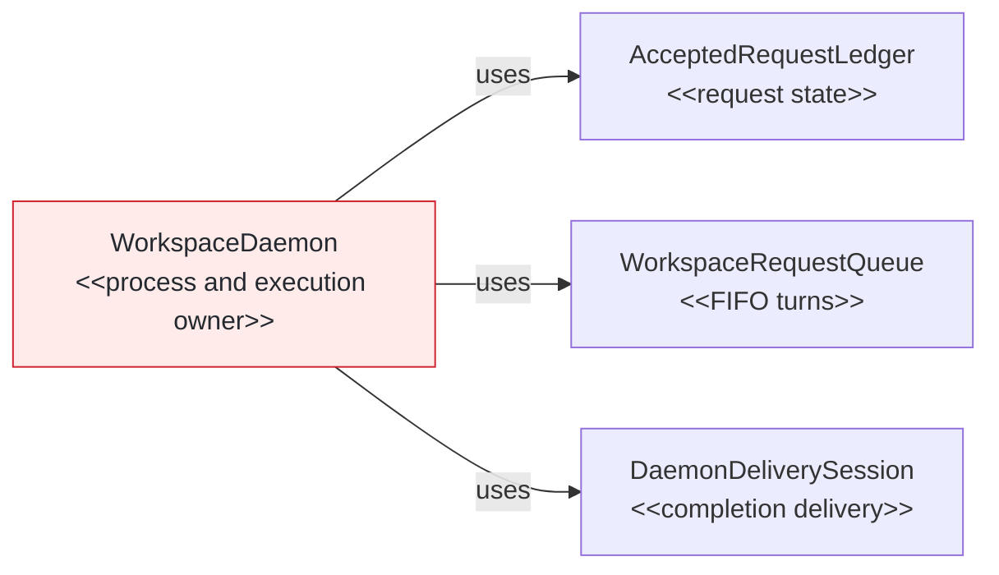
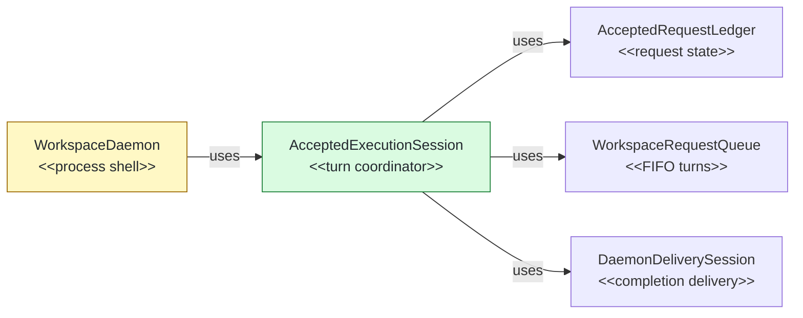

# #147 Serialize accepted daemon execution in one session

base agent/daemon-architecture-refactor-part-23  head agent/daemon-architecture-refactor-part-24

## Context

Implements Phase 24 of the daemon architecture plan. This stack layer follows delivery-session PR #146 and isolates accepted execution before Phase 25 replaces the residual process coordinator. Exact local CI parity passed 2,414 tests with eight expected skips; focused session, transport, parity, scale, stop, commit-replay, and mutation checks preserve protocol, timing, and lifecycle behavior.

## Shape

Before — `WorkspaceDaemon` coordinates accepted execution directly:



After — one session coordinates accepted turns over existing owners:



Legend: green = added; red = removed; yellow = changed; unfilled = pre-existing and unchanged.

## Where it lives

```text
.
└── apps/cli/src/daemon/
    ├── ++ accepted-execution-session-contracts.ts # defines injected session ports and snapshots
    ├── ++ accepted-execution-session.ts           # owns admission-to-turn serialization
    ├── ++ accepted-execution-session.test.ts      # locks timing, barriers, failures, and duplicates
    ├── ** accepted-request-ledger.ts               # retains immutable acceptance metadata
    └── ** workspace-daemon.ts                      # composes and delegates to the session
```

Legend: `++` added, `**` changed, `~~` moved, `--` removed.

## Public surface

Added internal coordination surface:

```ts
export class AcceptedExecutionSession {
  constructor(options: AcceptedExecutionSessionOptions);
  get snapshot(): AcceptedExecutionSnapshot;
  compatibilityFor(request: DaemonExecuteRequest): AcceptedRequestCompatibility;
  accept(request: AuthenticatedDaemonExecuteRequest): AcceptedExecutionAdmission;
  status(requestId: string): DaemonExecutionStatus;
  markActiveResourceInterrupted(cause: DaemonWorkerReplacementCause): void;
  scheduleAtTurnBoundary(operation: () => Promise<void>): Promise<void>;
  drain(): Promise<void>;
  close(): void;
}
```

Changed ledger entry surface:

```ts
export interface AcceptedRequestEntry {
  readonly acceptedAt: number;
  readonly queuePosition: number;
  readonly state: AcceptedRequestState;
}
```

No package export, CLI command, protocol shape, option, or environment surface changes.

## Decisions

- Chose immutable acceptance metadata on each ledger entry over a parallel process map, because queued, running, terminal, and acknowledged states share one original acceptance identity.
- Chose an injected session over moving ledger, queue, delivery, worker, resource, lifetime, or shutdown state, because each dependency remains authoritative for its own mechanism.
- Chose a narrow process-lifecycle port over exposing the process shell, because execution needs only shutdown classification, workspace presence, and post-delivery deletion transition.
- Chose turn-boundary sampling inside each queued operation over post-hoc process scheduling, because sampling must gate the next FIFO turn after success or failure.
- Chose duplicate attachment over acceptance replay, because request identity remains daemon-lifetime idempotent without another trace, queue turn, clock read, or lifetime reset.

## Look here

- `apps/cli/src/daemon/accepted-execution-session.ts:44`
- `apps/cli/src/daemon/accepted-execution-session.ts:93`
- `apps/cli/src/daemon/workspace-daemon.ts:193`


## Commits
- 4143208490 Specify immutable request acceptance metadata
- 5866d66772 Retain acceptance metadata on ledger entries
- 9e4a8251c9 Specify accepted execution session ownership
- 626697aa57 Define accepted execution session contracts
- 6282cd65e0 Own accepted execution turns in one session
- ba53c8e166 Delegate accepted execution from workspace daemon
