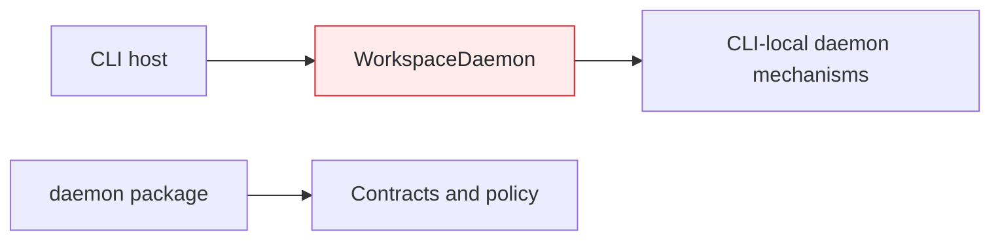
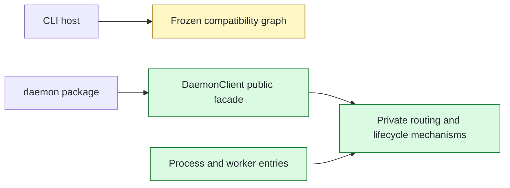

# #148 Own daemon mechanisms behind DaemonClient

base agent/daemon-architecture-refactor-part-24  head agent/daemon-architecture-refactor-part-25

## Context

Daemon process ownership still lived in CLI-local mechanisms, and hosts needed registry, transport, startup, and lifecycle knowledge to compose daemon execution. This group establishes the package-owned process and client boundary while leaving the active CLI consumer switch to the next PR.

## Shape

Before — CLI-local mechanisms own process coordination and expose their composition burden to the host:



After — package entries and a public client compose package-local mechanisms; the shipped CLI still follows its frozen compatibility graph:



Legend: green = added; red = removed; yellow = changed; unfilled = pre-existing and unchanged.

## Where it lives

```text
.
├── apps/cli/src/daemon/
│   ├── ~~ daemon-process-coordinator.ts # renamed from workspace-daemon.ts; owns process lifecycle
│   ├── ** daemon-clock.ts               # owns wall and monotonic time sources
│   ├── ** daemon-registry.ts            # owns startup-lock equality
│   └── ** ... 9 files                   # coordinated compatibility mechanisms, then frozen
├── packages/daemon/
│   ├── ** package.json                  # exposes real process and worker entry subpaths
│   ├── src/
│   │   ├── ++ client/ ... 8 files       # public facade and private routing/runtime composition
│   │   ├── ++ delivery/, diagnostics/, execution/, lifecycle/
│   │   ├── ++ process/, registry/, resources/, transport/, worker/ # package mechanism owners
│   │   ├── ~~ ... 37 test files         # moved from apps/cli/src/daemon/
│   │   ├── ++ process-entry.ts
│   │   ├── ++ worker-entry.ts
│   │   └── ** index.ts                  # exports the host-facing client surface
│   └── ++ test/ ... 24 files            # generic executor and built-entry integration fixtures
├── meta-tests/src/
│   └── ++ daemon-compatibility-copy.test.ts # freezes 38 app-local production copies
└── plans/005/
    └── ** daemon-follow-ups-functional-spec.md # records deferred idle-accounting changes
```

## Public surface

```ts
export type {
  DaemonClientExecuteRequest,
  DaemonClientExecuteResult,
  DaemonClientOptions,
  DaemonControlRequest,
} from "./client/daemon-client-contracts.js";
export { DaemonClient } from "./client/daemon-client.js";

export class DaemonClient {
  constructor(options: DaemonClientOptions);
  execute(request: DaemonClientExecuteRequest): Promise<DaemonClientExecuteResult>;
  control(
    request: Extract<DaemonControlRequest, { readonly action: "start" }>,
  ): Promise<DaemonStartResult>;
  control(
    request: Extract<DaemonControlRequest, { readonly action: "status" }>,
  ): Promise<readonly RunningDaemonStatus[]>;
  control(
    request: Extract<DaemonControlRequest, { readonly action: "stop" }>,
  ): Promise<DaemonStopResult>;
}
```

## Decisions

- Chose a Node-free public façade with a dynamically loaded internal runtime over exposing Node-backed mechanisms, because host declarations must not acquire Node ambient dependencies.
- Chose ordered lazy routing guards over eager registry and transport observation, because the first routing decision must prevent every later side effect.
- Chose package staging with a frozen CLI compatibility graph over switching production consumers during relocation, because mechanism ownership and host invocation coordination need separate review boundaries.
- Chose package-owned result capture and controlled failure outputs over host-provided storage or output factories, because warm transfer cleanup and replay safety belong to the daemon client.
- Chose to preserve acceptance-based idle timing over correcting it during extraction, because readiness- and completion-based lifetime changes are explicitly deferred behavior.

## Look here

- `packages/daemon/src/process/process-coordinator.ts:84`
- `packages/daemon/src/client/daemon-client-runtime.ts:139`
- `packages/daemon/src/client/daemon-client.ts:20`


## Commits
- 5fb83c449d Specify daemon lifetime clock ownership
- 61fa2d70f8 Give daemon lifetime its wall clock
- aec3f7c02a Specify registry startup ownership authority
- c3796a6509 Centralize registry startup ownership checks
- 7e860218e5 Rename workspace daemon as process coordinator
- 3d25c347f1 Specify process request authentication order
- 7fd93d33c1 Specify validated process coordinate adoption
- 0a3d57c6f6 Adopt validated process coordinates
- bdaff55dc8 Specify daemon clock source ownership
- f6f942ef7a Route daemon timing through its clock
- 516cb9b91c Characterize process callback composition
- 25ddbe22d1 Specify canonical startup ownership authority
- b46872384d Centralize all startup ownership decisions
- 4a0b280649 Specify narrow startup ownership coordinates
- f2bda0b61f Stage daemon mechanism compatibility copies
- 8a21dd5b42 Organize daemon mechanisms by ownership
- 36ef14651a Add daemon package executable entries
- b855f6be93 Prove built daemon entry resolution
- e0425f842d Retire flat daemon staging copies
- ed3baa7f10 Relocate daemon mechanism ownership tests
- 501c5b5e76 Retire app-owned daemon mechanism tests
- 68fbaace0b Keep executor fixture package-independent
- 6629b30f87 Conform daemon staging tests to lint rules
- dad9676fee Specify exhaustive daemon entry exports
- e1dc8725f4 Prove built daemon process entry execution
- 0f31a619e8 Restore CLI executor version rejection oracle
- 70c7bea75c Specify ordered daemon routing decisions
- d870366477 Own ordered daemon routing decisions
- cd94bd488a Define daemon client host contracts
- 2c7a421783 Specify daemon client execution ownership
- 18e2f4ade3 Route execution through DaemonClient
- ea52cfbb9b Specify daemon client lifecycle control
- c41d2e2007 Own daemon lifecycle composition in DaemonClient
- 6762c7f819 Specify host-owned daemon readiness probe
- a29be148b5 Route host readiness probes through startup
- f2a9d157c9 Compose warm result capture in DaemonClient
- f6030ed6f1 Expose the Node-free DaemonClient facade
- bca036f0ad Lock the public DaemonClient boundary
- 32152f1da9 Represent disabled daemon routing
- 4b414b3751 Complete daemon client routing characterization
- 3cb6005925 Specify missing warm output handling
- 73c0f1c8aa Lock daemon control overload return types
- 80d4afe0c2 Specify portable daemon compatibility hashing
- cef673008d Normalize daemon compatibility source line endings
- 20838f8dbf Specify Windows process entry cleanup ownership
