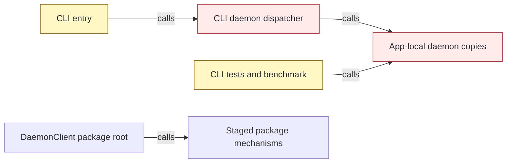
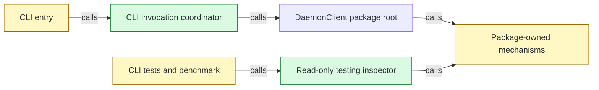

# #149 Enforce physical daemon package ownership

base agent/daemon-architecture-refactor-part-25  head agent/daemon-architecture-refactor-part-28

## Context

[PR #148](https://github.com/mohasarc/symnav/pull/148) establishes the package `DaemonClient` and stages daemon mechanisms, but the shipped CLI and external test consumers still retain app-local ownership paths. This PR makes `@symnav/daemon` the sole mechanism owner while preserving command output, telemetry, execution modes, and lifecycle behavior.

## Shape

Before — CLI runtime and external tests still cross the app-local daemon boundary:



After — CLI coordinates invocations through the package root, and tests observe package state through a read-only subpath:



Legend: green = added; red = removed; yellow = changed; unfilled = pre-existing and unchanged.

- Atomic frozen install, build, 2,696 tests with 8 expected skips, lint, and typecheck pass at the exact head.
- Explicit cold and warm suites each pass 355 tests with 8 expected skips.
- Scale-1 daemon benchmark passes parity, freshness, responsiveness, continuity, telemetry, resource, and spool-cleanup gates.

## Where it lives

```text
.
├── apps/cli/
│   ├── src/
│   │   ├── ++ cli-invocation-coordinator.ts       # owns local/control/workspace routing
│   │   ├── ~~ invocation-workspace-selector.ts   # moved from src/daemon/
│   │   ├── ** cli.ts                              # composes one public daemon client
│   │   ├── ** commands/daemon/register-daemon-command.ts # calls public lifecycle controls
│   │   └── -- daemon/ ... 45 files                # removes app-owned mechanism copies
│   └── ** test/ ... 34 files                      # uses public behavior or testing inspector
├── packages/daemon/
│   ├── ** package.json                            # exposes exactly four package paths
│   ├── ++ src/testing/ ... 3 files                # read-only state inspection boundary
│   ├── ** src/transport/ ... 16 files             # replaces compatibility facade
│   ├── ++ test/actors/daemon-accepted-caller.ts   # package-owned accepted caller
│   └── ~~ test/actors/ ... 6 files                # moved from apps/cli/test/helpers/
├── meta-tests/src/
│   ├── ++ cli-daemon-reachability.test.ts         # locks production import graph
│   ├── ++ daemon-storage-boundary.test.ts         # locks testing storage boundary
│   └── ** ... 3 files                             # locks exports, deletion, and lint rules
├── ** AGENTS.md                                   # records final package ownership
└── ** plans/000/symnav-stages.md                  # records completed architecture milestone
```

## Public surface

```ts
export class DaemonTestingInspector {
  constructor(canonicalStateDirectory: string);
  listInstances(): readonly DaemonTestingInstance[];
  hasStateArtifacts(): boolean;
  readDiagnostics(canonicalWorkspaceRoot: string, cursor?: number): DaemonTestingDiagnosticPage;
  completionSpoolUsage(canonicalWorkspaceRoot: string): DaemonTestingSpoolUsage;
}

// Removed from DaemonPolicy:
static fromSerialized(value: unknown): DaemonPolicy;
toSerialized(): Readonly<SerializedDaemonPolicy>;
```

## Decisions

- Chose a CLI invocation coordinator over the app-local daemon dispatcher, because argv classification and workspace discovery remain host responsibilities while execution belongs behind `DaemonClient`.
- Chose a read-only testing inspector over exposing registry, diagnostic, or spool paths, because external assertions need observability without storage or mutation authority.
- Chose package-owned actors with an injected executor URL over package tests naming CLI build artifacts, because daemon tests must not depend on app layout.
- Chose focused package transport composition over retaining `LocalDaemonTransport`, because lifecycle, execution, result transfer, and socket owners now have one package boundary.
- Chose exact compiler-backed import, export, clock, and storage inventories over regex or compatibility aliases, because ordinary TypeScript syntax must not bypass final ownership rules.

## Look here

- `apps/cli/src/cli-invocation-coordinator.ts:17`
- `packages/daemon/src/testing/daemon-testing-inspector.ts:35`
- `meta-tests/src/daemon-storage-boundary.test.ts:215`


## Commits
- e09553a826 Specify CLI invocation coordination
- 65371fbba3 Move invocation selection into CLI
- da4261619d Route CLI invocations through DaemonClient
- 2f914dada4 Specify public daemon lifecycle commands
- 49ab7c9457 Delegate daemon commands to DaemonClient
- ab417b0980 Lock top-level daemon composition
- 75c9a72d5a Lock the reachable CLI daemon boundary
- 803c02bbcb Specify relative daemon control cwd
- ffa0bb284d Normalize daemon control cwd
- cbcebf52c3 Align CLI coordinator boundary
- 9945d596c0 Exercise diagnostics through package daemon entry
- 6d81d76fa7 Satisfy CLI test lint contracts
- 5b940bd0e2 Specify daemon import syntax boundary
- 17b00cd237 Enforce daemon import syntax boundary
- 0a38145da6 Specify syntax-complete daemon import detection
- e5f99828c0 Parse TypeScript imports for daemon boundaries
- 054424b3f5 Specify read-only daemon testing inspection
- d7f60b07fd Expose read-only daemon testing inspection
- 6e441e4b4d Specify test-only daemon inspector imports
- 9e80c3d365 Restrict daemon inspector to tests
- be272702a9 Inspect daemon e2e state through testing API
- 20559201af Inspect daemon benchmark state through testing API
- d04aa0f7a6 Own test process cleanup outside daemon mechanisms
- 0afd69187d Specify rotated diagnostic inspection order
- fb6d864d3a Inspect rotated daemon diagnostics chronologically
- 86761bd645 Inspect daemon isolation through testing API
- a567e24453 Move daemon state actors into daemon package
- 9e31259fa8 Move controlled daemon actor into daemon package
- 9284116a4b Use package-owned daemon parity actors
- 3b739006ef Inspect persistent pressure through public status
- d698b1a55d Internalize daemon policy serialization
- 9f4886435a Remove CLI-owned daemon mechanisms
- ff2888997b Replace daemon transport compatibility facade
- 4d9755a425 Lock final daemon package surface
- a92afc1a96 Handle invalid inspector state paths
- e72f3b1090 Format daemon testing lint cases
- fdc718dc8f Specify invalid daemon inspector state reads
- d017990547 Normalize invalid daemon inspector state reads
- 4ed1de0052 Specify exhaustive daemon export inventory
- a7d46afd33 Inventory every TypeScript export form
- 0ab7e9d011 Lock daemon source and declaration exports
- ff98339742 Lock emitted daemon policy surface
- ac8fd26789 Specify equivalent daemon clock sources
- b6761ee46e Detect syntax-aware daemon clock sources
- 2e06c2aa97 Specify adversarial daemon peer integration
- 0ff9276304 Run adversarial peers through daemon client
- 7e3dca4b03 Format invalid daemon inspector cases
- 8976d7409f Specify import-equals daemon reachability
- 7db908eb98 Parse import-equals daemon dependencies
- e49515135b Specify import-equals export inventory
- 3af983dfec Inventory import-equals exports
- 3b9a572f4e Specify every inspector filesystem failure
- b56a4ea1d8 Classify inspector artifact read failures
- 7235fff84c Specify semantic daemon clock sources
- 63fdc22746 Resolve daemon clock identifiers lexically
- 5a5198db54 Specify package test executor independence
- aea44a091f Inject controlled daemon executor URL
- 1eb3916559 Specify runtime import-equals exports
- 7ab16df4fa Classify import-equals exports semantically
- 3d32eb0eec Specify import-equals daemon clock aliases
- 6b6632726c Resolve import-equals daemon clock aliases
- b54aeca64d Specify external daemon storage boundary
- 65bdd226ee Inspect telemetry daemon state through testing API
- 64aea4d5fb Document final daemon package ownership
- 6881738854 Specify dynamic daemon clock imports
- 21cb6cfda6 Reject dynamic daemon clock imports
- 279b629d84 Specify computed daemon clock members
- fc3dc695bc Classify computed daemon clock members
- 7730a9feb5 Specify platform daemon path builders
- 68a6240a80 Classify platform daemon path builders
- 1d76592bbe Specify contextual daemon storage paths
- a592cb32a4 Classify contextual daemon storage paths
- 8ddb833b3e Specify aliased daemon clock sources
- 40c8ab9dad Resolve aliased daemon clock sources
- 44080a7563 Specify semantic daemon storage access
- bcfc89488f Resolve semantic daemon storage access
- 4f2ab33c17 Specify callable daemon wall clocks
- fe36df025e Classify callable daemon wall clocks
- 25b93bac45 Specify dynamic daemon storage access
- 69e1cd07c1 Classify dynamic daemon storage access
- 0049b66053 Specify invoked daemon wall clocks
- ec5e4b7547 Classify invoked daemon wall clocks
- 0ac6d1da71 Specify promised daemon storage access
- b8a09975a5 Classify promised daemon storage access
- 748529679b Specify default dynamic daemon storage access
- ea6c6321a6 Classify default dynamic daemon storage access
- e71da400a1 Specify callback-body daemon storage access
- 5cbc1cde6f Classify callback-body daemon storage access
- c7f36b1b49 Specify aliased callback daemon storage access
- 673208bc0b Resolve aliased callback daemon storage access
- 66f3c9053f Use native paths in CLI reachability gate
- eb512e8ea7 Read daemon clock inventory from file URLs
- 1599252152 Align daemon test workspace path dialect
- d07002357d Track disconnected daemon actor directly
